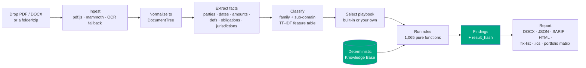
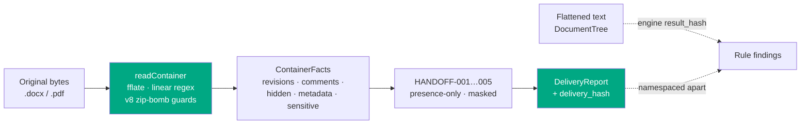
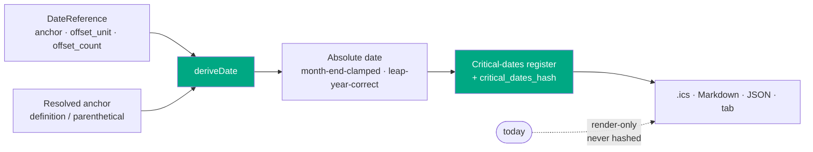
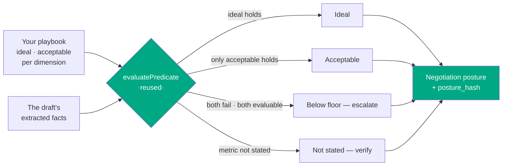
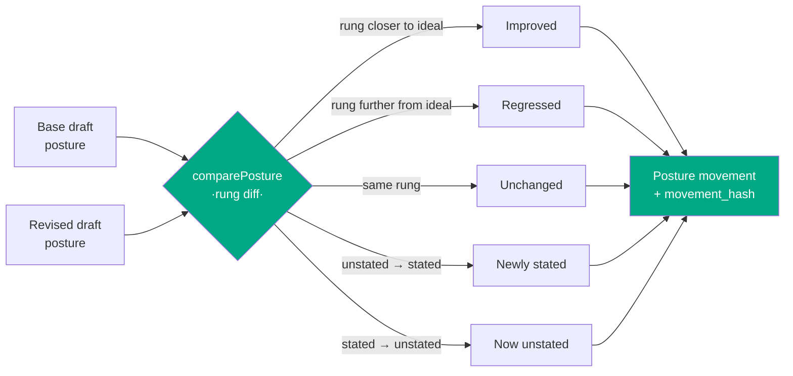
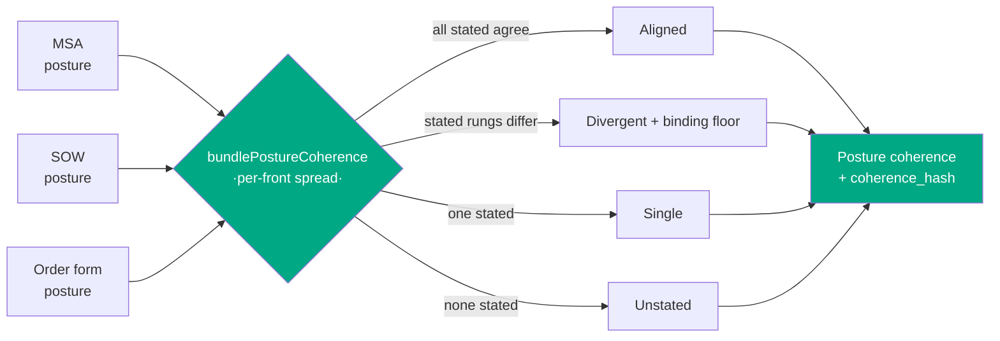
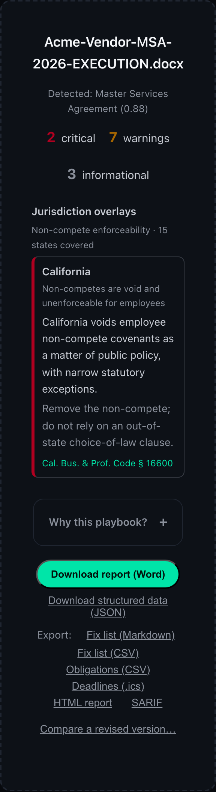
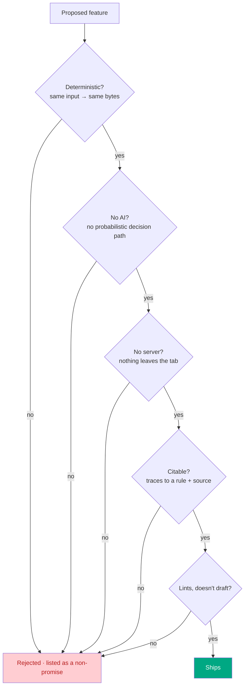
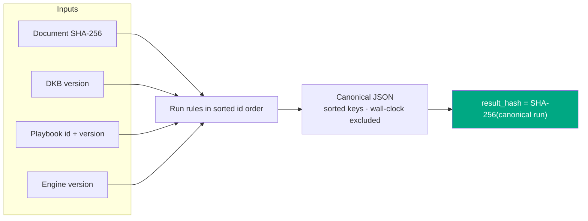
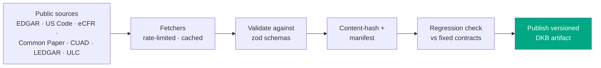

# Vaulytica

> The free, deterministic, runs-entirely-in-your-browser contract checker. A linter for legal documents. No login, no API key, no telemetry, no server. Drop in a contract, get back a Word document you can cite. That is the entire product.

**Vaulytica is the second pair of eyes you can cite.**

`1,065 deterministic rules` · `20 cross-document checks` · `5 pre-disclosure checks` · `3 execution-readiness reconciliations` · `5 derived-deadline families` · `16 document sub-domains` · `35 state-law overlays` · `9 export formats` · `0 servers` · `0 AI` · `3,226 passing tests` · `v9.24.0` · `MIT`


---

## The one idea

Every other contract tool leans on a language model. The output is fluent, confident, and **different every time you run it** — a senior partner cannot sign off on it, an auditor cannot trace it, a client cannot reproduce it.

Vaulytica is the opposite. It is a **pure function**:

```
report = engine(documents, DKB, playbook)
```

Same document + same engine version + same Deterministic Knowledge Base version → **byte-identical report on any machine, at any time.** The report carries a `result_hash` so you can prove it. Every finding traces to a numbered rule and a pinned public source. Nothing leaves the browser tab — open DevTools and watch the network panel go quiet.

## How it works (end to end)



Everything in this diagram runs in the tab. The DKB is a static, versioned, content-hashed JSON artifact served alongside the page; the engine is a synchronous pure function over it. The **same pipeline** runs headless from the [`vaulytica analyze` CLI](#v8--reach-the-linter-in-the-workflow) — proven byte-identical to the browser run.

## What you can drop in — ingest cheat sheet

Vaulytica takes the documents a real review actually arrives as — and handles every one of them in the tab. Each input is normalized to the same `DocumentTree` the engine reads, and the source bytes are **SHA-256 hashed (deterministically, before parsing)** so a report is always reproducible from the exact file you dropped.

| Input | How it's handled | Notes |
|---|---|---|
| **Digital PDF** | pdf.js text-layer extraction; headings inferred from font-size jumps + bold runs | the common case |
| **Scanned / image-only PDF** | OCR fallback — tesseract.js (English), lazy-loaded only when the text layer is near-empty, each page rasterized at ~200 DPI | the ~8 MB engine stays out of the main bundle; some structure is lost and the report says so |
| **DOCX** | mammoth, structure-preserving (headings, lists, tables → `DocumentTree`) | richest structure signal |
| **Pasted text** | normalized directly | no file needed |
| **Folder or `.zip`** | every file ingested, then the **cross-document consistency** pass runs | `.zip` unpacked client-side via fflate (MIT, same-origin) |

Two or more documents trigger **bundle mode**: per-document reports *plus* a portfolio risk matrix and cross-document checks (conflicting governing law, indemnity-cap stacking, defined-term drift across the set). A **composite document** — an MSA with a data-processing exhibit, say — is scanned with **every** family it clearly contains, not just its primary match, so a present family is never silently skipped; this holds whether the document is dropped alone or inside a folder. Nothing is uploaded — the file, and any playbook you load, never leaves the browser tab.

## What it checks — rule cheat sheet

The **always-on launch set** is 115 rules across ten categories that apply to any agreement (the original v1 set of 112 plus v9 Thrust B's three execution-readiness reconciliations):

| Category | Rules | Catches (examples) |
|---|---|---|
| Structural | 19 | missing signature block, unfilled `[placeholders]`, broken cross-refs, used-but-undefined terms; **v9:** a declared party with no signature line (`STRUCT-017`), a referenced exhibit not attached (`STRUCT-018`), a recited notarization with no notary block (`STRUCT-019`) |
| Risk allocation | 17 | uncapped liability, indemnity without a cap, one-way fee-shifting, missing limitation of liability |
| Choice & venue | 12 | no governing law, venue/law mismatch, out-of-state law on a CA employee, class-action waiver |
| Temporal | 12 | impossible dates, auto-renewal with a short notice window, survival silent on confidentiality/IP |
| Financial | 9 | word-vs-numeral amount mismatch, usurious late fees, currency drift |
| Termination | 9 | termination asymmetry, no effect-of-termination clause, termination tied to payment |
| IP & data | 10 | no IP ownership clause, AI/model-training rights over customer data, cross-border transfer w/o safeguard |
| Obligations | 9 | sole-discretion language, MAC clause, residuals clause swallowing confidentiality |
| Dark patterns | 9 | unilateral amendment by posting, hidden auto-renewal, browsewrap acceptance |
| Personnel | 9 | stay-or-pay/training-repayment clauses, IC misclassification signals, overlong non-solicits |

On top of that, **v3 (+220 rules)** adds compliance-grade rule sets and **v4 (+730 rules)** adds 16 specialized sub-domains. The full **1,065-rule** catalog runs live, family-gated so a plain NDA is not flagged for missing GDPR clauses.

Those 1,065 are all **single-document** rules. Dropping a folder or `.zip` additionally runs **20 cross-document consistency rules** — defects no single-document scan can see because they live in the *relationship between* documents:

| Cross-doc check | Catches |
|---|---|
| `CROSS-JURIS` · `CROSS-PRECEDENCE` | conflicting governing law / order-of-precedence across an MSA and its exhibits |
| `CROSS-INDEMNITY` · `CROSS-SURVIVAL` | indemnity caps that stack, survival periods that disagree |
| `CROSS-DEFTERM` · `CROSS-PARTY` | a term defined one way in the MSA and another in the SOW; party-name drift |
| `CROSS-AMOUNT` · `CROSS-DATE` · `CROSS-MISSING` | fee/date conflicts between documents; a referenced companion doc that isn't in the set |
| `CC-001`…`CC-007` | BAA ↔ MSA ↔ DPA scope consistency (e.g. a BAA purpose broader than the MSA permits) |

## Clean to send — the pre-disclosure scan (v9 Thrust A)

The malpractice headline is rarely a missing indemnity cap. It is a redline sent with **opposing counsel's comments still attached**, a "final" Word file whose **metadata names the prior client** it was templated from, or a **tracked change** that reveals a number the sender meant to bury. Vaulytica was blind to all of these by construction — its DOCX ingest runs `mammoth.convertToHtml`, whose whole job is to *flatten* a document to clean prose: it resolves tracked changes to their accepted state, drops the comment store, and ignores `docProps`. The facts you most need a second pair of eyes on were the facts the engine deleted on the way in.

v9 opens a **second read surface over the original container bytes** — the `.docx`/`.pdf` exactly as you dropped it — and recovers what the flattening threw away. It is uniquely enabled by the no-server posture: the one document you must *never* upload to a cloud scrubber (privileged, unredacted, comment-laden) is exactly the one this checks, **in the tab**.



| Check | Catches | Severity | Cites |
|---|---|---|---|
| `HANDOFF-001` | residual **tracked changes** (`w:ins`/`w:del`/`w:move*`) — count, author, location | critical | the revision element |
| `HANDOFF-002` | live **comments / reviewer markup** (`word/comments.xml`; PDF sticky notes + text markup — highlight/underline/strikeout/squiggly) — author, excerpt | critical | the comment / annotation |
| `HANDOFF-003` | **hidden / non-printing** content (`w:vanish`, deleted-but-retained text) | warning | the recovered span |
| `HANDOFF-004` | **authoring metadata** (`core.xml`/`app.xml`, PDF Info) — flags a `Company`/`Template` naming an entity **absent from the parties** (cross-matter leak) | info → critical | the metadata field |
| `HANDOFF-005` | **sensitive-data patterns** — SSN (structural), EIN, card (**Luhn**), routing (**ABA**), DOB, email/phone | warning → critical | the **masked** span |

Three invariants make it safe to point at your most sensitive file:

- **Presence-only, never a clean bill.** A scan that matches nothing has found *nothing it can match*, not *nothing there*. The report says "found N items of these types" — it never says "this document is clean / safe to send."
- **Masking is a hard invariant.** No `HANDOFF-005` finding, in any format, ever contains an unmasked value: `***-**-6789`, not the SSN. The report that *warns about* exposed PII must not itself reproduce it. A test greps every serialized finding to prove it.
- **It reports, it never removes.** v9 tells you a tracked change is at §4.2; deleting it stays your deliberate act in Word. It never strips, accepts, redacts, or renders a legal conclusion ("validly executed", "privilege waived") — the same lint-not-draft line v4 drew.

**Zero engine churn.** The `HANDOFF-*` findings carry their own `delivery_hash` over the container facts, **namespaced apart from** the engine `result_hash`. A text-only or metadata-clean document produces an empty report and re-baselines no golden. Run it from the CLI with `--delivery`, read the `delivery` block in the JSON, or see the "Clean to send?" card in the tab.

## Ready to sign — execution-readiness reconciliation (v9 Thrust B)

"Has a signature block" is not "ready to sign." The deal-killer is subtler: a four-party agreement with three signature lines, an "Exhibit C" referenced but never attached, a recital of "sworn before me, a Notary Public" on a document that ships with no notary block. v9 deepens the `STRUCT-*` family from *detection* to *reconciliation* — every check is internal-consistency only, and **reports the gap, never "validly executed."**

| Check | Reconciles | Precision discipline |
|---|---|---|
| `STRUCT-017` | declared parties ↔ signature-block lines | Fires only on a clearly multi-party-labeled block (`≥2` parties named) that omits a further declared **corporate** party — dropping the defined-term / functional-role phantoms (`"Confidential Information"`, `"Receiving Party"`) the extractor sometimes fabricates. **0 false positives** over the 341-fixture corpus. |
| `STRUCT-018` | every Exhibit / Schedule / Annex / Appendix / Attachment reference ↔ a present heading or title line | The consolidated reconciliation view, distinct from `STRUCT-016`'s incorporation-risk lens. |
| `STRUCT-019` | a recited notary / witness formality ↔ a fillable jurat / witness block | The recital must be an explicit obligation and the block clearly absent; never asserts notarization is legally *required*. |

These are the only three always-on rules v9 adds (launch set **112 → 115**). A **Closing Checklist** ([`src/report/closing-checklist.ts`](src/report/closing-checklist.ts)) then consolidates the readiness findings (`STRUCT-003`/`011`/`013`/`017`/`018`/`019`) and the send-readiness handoff items (`HANDOFF-001`/`002`) into one ordered, grouped artifact: a "□ Party D has no signature line · □ Exhibit C referenced, not attached · □ 2 tracked changes remain" list you can work down before closing — as Markdown and CSV, a JSON `closing_checklist` block, a CLI `--checklist` flag, and a tab "Ready to sign?" view. It is a render-side projection of findings the engine already produced, so it moves no `result_hash`.

## Tracked to its dates — the computed critical-dates register (v9 Thrust C)

The extractor already pulls "sixty (60) days prior to the Renewal Date." v9 adds the step that joins it to a resolved anchor and writes the answer on a calendar: `Renewal Date = 2025-12-31` → **give notice by 2025-11-01**, deterministically, the same on every machine, forever.



- **`deriveDate(reference, anchor)`** is pure calendar arithmetic — `anchor ± N {days|weeks|months|years}`, with `Jan 31 + 1 month = Feb 28` clamping and leap-year handling proven by property tests. It reads **no clock**. An undated anchor or a business-day count (no holiday calendar is asserted) yields an **unresolved** "verify manually" item, never a guess.
- **`DATE-001…005`** classify each deadline — auto-renewal notice, cure window, opt-out window, survival end, notice-period — with the responsible party drawn from the obligations extractor.
- The **register** carries its own `critical_dates_hash`, a JSON `critical_dates` block, a deepened `.ics` (render-only DISPLAY alarm on notice/opt-out/cure rows), a Markdown register, a CLI `--critical-dates` flag, and a tab "Your calendar, computed" view.

**The wall-clock trap, closed.** Only the *absolute* computed date enters the register or its hash. Anything relative to *today* — "due in 12 days", "overdue", soonest-first — is render-only. A metamorphic gate re-runs the same document under two different "today" values and asserts a byte-identical register, hash, `.ics`, and Markdown, so a later edit cannot leak an elapsed value into a hashed artifact and quietly break reproducibility.

### Cheat sheet — where each v9 surface renders

All three "Last Look" surfaces render in **every** format the report speaks, not just JSON. Each renders only when non-empty, so a clean document produces a byte-identical v8-era report — render-side, zero `result_hash` churn ([`src/report/v9-surfaces.ts`](src/report/v9-surfaces.ts)).

| Surface | JSON | DOCX | HTML | SARIF | Markdown | CSV | `.ics` | tab | CLI flag |
|---|:-:|:-:|:-:|:-:|:-:|:-:|:-:|:-:|:--|
| **Clean to Send** (`HANDOFF-001…005`) | `delivery` | § section | § section | first-class results | — | — | — | "Clean to send?" | `--delivery` |
| **Ready to Sign** (closing checklist) | `closing_checklist` | § section | § section | — *(projection of existing results)* | ✓ | ✓ | — | "Ready to sign?" | `--checklist` |
| **Tracked to Its Dates** (register) | `critical_dates` | § section | § section | `DATE-*` note results | ✓ | — | ✓ | "Your calendar, computed" | `--critical-dates` |

In SARIF the handoff findings cite the *container* (no text offset → no `region`, a `kind: "container"` logical location), and the derived deadlines surface at `note` level anchored to their source section — both carry their own hash (`delivery_hash` / `critical_dates_hash`) as a `partialFingerprint` so a CI consumer dedupes them across runs. The closing checklist is a pure projection of findings already in the run, so it is *not* re-emitted as SARIF results (that would double-count).

## Negotiation posture — your ladder, scored against the draft (v10)

A real negotiation is not binary. A team holds an **ideal** position, an **acceptable** floor, and a **walk-away** below which they escalate. v6's bring-your-own-playbook gave a single bit — compliant or not — which throws away the thing a negotiator most needs: *where on my ladder does this draft sit?* v10 deepens the v6 axis to answer exactly that.

A custom playbook can carry `negotiation_positions`: one entry per negotiable dimension, each an `ideal` and an `acceptable` predicate drawn from the **same** bounded DSL the custom rules already use (`numeric_threshold`, `governing_law_in`, `clause_present`, …), plus optional per-tier guidance. The engine classifies which rung the draft meets — **deterministically, with the very same predicate evaluator**, so there is no new fuzzy logic and the v6 false-positive surface does not reappear.



```json
"negotiation_positions": [{
  "dimension": "Liability cap",
  "ideal":      { "kind": "numeric_threshold", "metric": "liability_cap_multiple", "comparator": "gte", "value": 12 },
  "acceptable": { "kind": "numeric_threshold", "metric": "liability_cap_multiple", "comparator": "gte", "value": 6 },
  "guidance": { "acceptable": "6x is our floor.", "walk_away": "Below 6x — escalate." }
}]
```

An 8× cap → **acceptable** ("room to push toward 12×"); a 3× cap → **below floor** ("escalate"); no cap stated → **not stated** (honestly unevaluable, *never* a false walk-away — the floor reports only when both tiers are evaluable and both fail). The posture is **advisory**: it reports where the draft sits on *your own* ladder, never that a term is legally adequate, enforceable, or market. It carries its own `posture_hash`, namespaced apart from the engine `result_hash` (additive — a run with no positions yields no posture and moves no golden), and renders in the JSON report (`negotiation_posture`), the DOCX and HTML reports, and a mobile-safe "Negotiation posture" card in the tab.

**Worked artifacts (v10 Thrust B).** Beyond the in-report section, the posture ships as the negotiator's actual worksheet:

- a standalone, print-clean **negotiation sheet** that regroups the positions by *action* — **escalate** (below floor) · **push here** (at floor) · **verify** (not stated) · **hold** (ideal), most-urgent first — a one-pager you work down before a call;
- a **Markdown** table and a formula-injection-guarded **CSV** to drop in a ticket or a spreadsheet;
- a headless **CLI** mode: `vaulytica analyze contract.docx --playbook-file team.json --posture` prints `Negotiation posture: 0 ideal, 1 acceptable, 2 below floor, 0 not stated` and emits the `negotiation_posture` JSON — the same deterministic classification, in CI or a folder sweep.

**Dimension breadth (v10 Thrust C).** A position can now assert on more of the contract, each dimension **measure-first** — wired only behind an extractor fixture proving the extraction is reliable, never guessed:

- four new `numeric_threshold` metrics — `cure_period_days` and `auto_renewal_notice_days` (temporal), `indemnity_cap_amount` and `uptime_sla_percent` (financial) — flowing through the same `extractMetricValues` path the v6 metrics use;
- a `clause_mutual` predicate — *is the indemnity / termination / confidentiality clause **mutual** or one-way?* — that reuses the v6 clause locator and adds a bounded, deterministic reciprocity-marker scan (no model): a located clause with no "each party" / "both parties" / "mutual" language reports **one-way**; an absent clause is honestly unevaluable, never a false "one-way."

Full design: [`spec-v10`](docs/spec-v10.md).

## Posture movement — your ladder, tracked round-over-round (v11)

A negotiation is a *sequence* of drafts. v10 scores the latest one; v11 answers the question a negotiator carries between rounds: *when the counterparty sends a counter, which way did each front move?* Drop the revised draft into the version-comparison flow (or pass both to the CLI) and `comparePosture` diffs the two postures — both classified against the **same** ladder — into a per-dimension transition:

| Movement | Meaning | Example |
|---|---|---|
| **improved** | both drafts state it; the revised rung is closer to ideal | below floor → acceptable |
| **regressed** | both state it; the revised rung is worse | ideal → acceptable |
| **unchanged** | the same rung on both (including both *not stated*) | acceptable → acceptable |
| **newly-stated** | unstated before, on the ladder now | not stated → below floor |
| **now-unstated** | on the ladder before, absent now | acceptable → not stated |



`unevaluable` is deliberately **unranked** — "not stated" is never compared as better or worse than a stated rung, so a counter that *adds* a below-floor term reads as **newly-stated**, never a false *regression*. The movement is advisory and carries its own `movement_hash`, namespaced apart from the comparison `result_hash` (additive — a comparison with no positions yields no movement and moves no golden). It renders as a `posture_movement` JSON block, a mobile-safe "Posture movement" card in the comparison-complete tab, a color-coded **"Posture Movement" section in the Word comparison report**, and a headless CLI mode:

```bash
vaulytica compare base.docx revised.docx --playbook-file team.json --posture
# → a "Negotiation posture movement" table: dimension · movement · base rung → revised rung

# gate a PR on it: exit non-zero if any front moved to a strictly worse rung
vaulytica compare base.docx revised.docx --playbook-file team.json --posture --fail-on-regression
```

`--fail-on-regression` makes the advisory movement a hard CI gate, exactly as `--fail-on <sev>` does for newly-introduced findings: it exits non-zero (code 2) when any dimension **regressed** to a worse rung. Honest by construction — `now-unstated` (a term dropped off the ladder) is reported but never trips the gate, since a dropped front is not a rung regression. Full design: [`spec-v11`](docs/spec-v11.md).

## Posture coherence — your ladder, held across the whole deal (v12)

A deal is rarely one document — it is a **package**: an MSA, a SOW, an order form, a DPA. The liability cap you won in the MSA can be quietly re-capped in the order form; your Delaware governing-law clause can be contradicted by a Texas one in the SOW. Each document, read alone, looks fine — and its v10 posture *is* fine. The risk lives in the gap **between** them, and in a package the **weakest** document usually governs your exposure. v12 scores one v10 posture per document — all against the **same** ladder — and reports, per front, how the package holds together:

| Coherence | Meaning | Example |
|---|---|---|
| **aligned** | ≥2 documents state it on the *same* rung | cap ideal in MSA *and* SOW |
| **divergent** | ≥2 documents state it on *different* rungs | cap ideal in MSA, below floor in order form |
| **single** | exactly one document states it; the rest are silent | indemnity only in the MSA |
| **unstated** | no document states it | (silence — never a divergence) |



For every front some document states, v12 names the **binding floor** — the weakest stated rung and the document carrying it — the cap that actually governs when the order form undercuts the MSA. `unevaluable` stays **unranked**: an unstated front is never a false divergence and never lowers the floor (the §3 honesty contract). The coherence is advisory and carries its own `coherence_hash`, namespaced apart from every document's `result_hash` and the bundle fingerprint (additive — a run with no positions, or over a single document, yields no coherence and moves no golden). It runs headless over a bundle:

```bash
# analyze the whole package against one team ladder; the coherence prints after the per-doc lines
vaulytica analyze ./deal-package/ --playbook-file team.json --posture
# → Cross-document posture coherence: N aligned, M divergent, … + a ⚠ line per divergent front
#   ⚠ Governing law: divergent (msa.docx=ideal, order.docx=below-acceptable); binding floor below-acceptable in order.docx.

# gate a PR on it: exit non-zero if any front diverges across the package
vaulytica analyze ./deal-package/ --playbook-file team.json --posture --fail-on-divergence
```

`--fail-on-divergence` makes the coherence a hard CI gate (code 2 when any front is **divergent**), exactly as `--fail-on-regression` gates the version axis. Honest by construction — a front only one document states (`single`) or none state (`unstated`) is reported but never trips the gate, since silence is not a disagreement.

The coherence is not headless-only: drop a deal package into the **browser** with a team playbook active and the bundle-complete view renders a mobile-safe **"Posture coherence" card** — one card per front, the rung spread across the documents, the binding floor named, color-coded by coherence — and the consolidated **Word bundle report** carries a trailing **"Posture Coherence" section** (Front · Coherence · per-document rung · binding floor). Both are additive: a bundle with no active posture playbook renders neither, so every existing bundle report is byte-unchanged. In the bundle the playbook contributes *only* its posture positions — each document's per-document findings are still driven by its own matched playbook. Full design: [`spec-v12`](docs/spec-v12.md).

## Posture movement across the deal — round over round (v13)

A real negotiation is a **sequence of packages**, not one package. Round one is an MSA plus an order form; round two is the revised pair. The deal lead's actual question is the composition of two axes you already have: *between rounds, did the binding floor on each front — the rung that actually governs my exposure — get better or worse, and did any front the package agreed on quietly fracture?* v11 can't see it (it diffs **one** document). v12 can't see it (it scores **one** round). Only the diff of two v12 coherences can. v13 is the fourth corner of the posture matrix:

|  | single version | across versions |
|---|---|---|
| **single document** | v10 — posture (snapshot) | v11 — posture movement |
| **across documents** | v12 — posture coherence | **v13 — coherence movement** |

The bottom-right cell — a bundle *across versions* — is where the deal lead lives, so it kept deepening: v14/v15 let it gate from a saved, ladder-pinned baseline instead of re-analyzing the prior round; v16 made it diff two saved artifacts with **no documents** on either side; and v17 generalizes "two rounds" to **N**, reporting each front's trajectory across the whole negotiation (the *trajectory of the coherence* — what v11's trajectory is to v10's snapshot). v18 reads that same N-round sequence on the *other* axis v13 always carried beside the floor — the fracture/reconcile path — so a package that splits mid-deal and re-merges is caught even when its floor never moved. See [Saved coherence baselines](#saved-coherence-baselines--gate-without-the-prior-rounds-documents-v14) below.

[`compareCoherence(base, revised)`](src/report/coherence-movement.ts) is a **pure diff of two v12 coherences** — both computed against the **same** ladder — matched per front by **dimension** (never by document, so a `msa-v1.docx` → `msa-v2.docx` rename or an added DPA never confuses it). For each front it reports two things:

- **binding-floor movement** (the headline, the well-ordered, gateable signal): `improved · regressed · unchanged · newly-stated · now-unstated` — reusing v11's exact `TIER_RANK`, applied to the weakest stated rung across the package.
- **coherence shift** (advisory context): `fractured` (a front the package agreed on now diverges) · `reconciled` (a divergent front no longer diverges) · `realigned` (the stating set changed without crossing the line) · `unchanged`.

It carries its own `movement_hash`, namespaced apart from every `result_hash`, `posture_hash`, and `coherence_hash` (additive — a run with no baseline yields no movement and moves no golden). `unevaluable` stays **unranked**: a floor transition touching an unstated side is `newly-stated`/`now-unstated`, never a false regression (the §3 honesty contract, carried across the composed axis). It runs headless — diff a revised package against a baseline round:

```sh
# how did the package's binding floor move between two rounds?
vaulytica analyze ./round-2/ --playbook-file team.json --posture --baseline ./round-1/
# → Cross-document posture movement (vs. baseline): binding floor: N improved, M regressed, …
#   ⚠ Liability cap: binding floor ↓ regressed (acceptable → below-acceptable).

# make a regressed binding floor a hard CI gate (exit 2)
vaulytica analyze ./round-2/ --playbook-file team.json --posture --baseline ./round-1/ --fail-on-coherence-regression
```

`--fail-on-coherence-regression` makes the floor movement a hard CI gate (code 2 when any front's binding floor moves to a strictly worse **stated** rung), exactly as `--fail-on-regression` gates the single-document version axis and `--fail-on-divergence` gates the single-round cross-document axis. Honest by construction — a front that dropped off the ladder entirely (`now-unstated`) is reported but never trips the gate, since a dropped front is not a rung regression. It also runs **in the browser**: analyze a bundle with a positions-bearing playbook, then use the **"Compare a revised round…"** affordance on the result — drop the revised round's files and the tab re-scores them against the same ladder, renders a mobile-safe per-front movement card (the binding-floor direction on the left border, the fractured/reconciled shift inline), and offers a two-round Word deliverable with a color-coded **"Posture Movement (Across the Package)"** section. All three thrusts shipped (engine + headless + gate, browser card, DOCX). Full design: [`spec-v13`](docs/spec-v13.md).

## Saved coherence baselines — gate without the prior round's documents (v14)

v13 re-analyzes the baseline package on **every** run, which means round one's documents — the executed MSA, the counterparty's first order form, a DPA under NDA — must sit in the CI runner next to round two's, every run, forever. But the gate does not need round one's *documents*; it needs round one's *coherence* — the handful of per-front rungs the v12 engine already distilled from them. v14 lets round one **emit its coherence once** as a small, fingerprinted JSON artifact, and lets round two **gate against that artifact** without ever seeing round one's documents again. The diff is the same pure `compareCoherence` — only the *source* of the baseline coherence changes.

```sh
# Round one — emit the coherence artifact (archive it; kilobytes, no clause text):
vaulytica analyze ./round-1/ --playbook-file team.json --posture \
  --emit-coherence round1.coherence.json

# Round two — gate against the artifact, with no round-one documents on disk:
vaulytica analyze ./round-2/ --playbook-file team.json --posture \
  --baseline-coherence round1.coherence.json --fail-on-coherence-regression
```

The artifact carries the `coherence_hash`. On load, `--baseline-coherence` **re-derives the hash from the artifact's own dimensions** and rejects any mismatch — a corrupted, truncated, or hand-edited baseline is a hard, legible error (`coherence_hash mismatch …`), never a silent gate input. The number a CI dashboard shows is provably the number the prior round produced. `--baseline-coherence` is mutually exclusive with v13's re-analyzing `--baseline`; `--fail-on-coherence-regression` accepts either source, and the exit-2 regressed-binding-floor gate is unchanged. Headless-only by design (the artifact is a CI concern; the browser already does the in-session two-round comparison above) and fully additive — with neither flag set the CLI is byte-identical to v13. Full design: [`spec-v14`](docs/spec-v14.md).

**The ladder pin (v15).** The integrity hash proves the *bytes* were not altered, but `compareCoherence` matches fronts by dimension label, and two rungs are only comparable if they sit on the **same ladder** — the same `ideal`/`acceptable` predicates defining what "ideal" and "acceptable" *mean*. Gate round two against a baseline emitted under a *different* playbook and you get a regression gate driven by a movement over two unrelated ladders — a confident, wrong answer. v15 closes that hole: a newly emitted artifact is tagged `vaulytica.posture-coherence.v2` and carries a `ladder_hash` (a stable SHA-256 over the ladder's dimensions + `ideal`/`acceptable` predicates + referenced thresholds — per-tier guidance is excluded, so re-wording your talking-points never invalidates a baseline). `--baseline-coherence` computes this round's ladder hash and **refuses with exit 1** on a mismatch (`ladder mismatch — the artifact was computed against a different playbook ladder …`) instead of silently diffing nonsense; a pre-v15 unpinned `v1` artifact still loads, with a note that cross-ladder verification is unavailable. The `ladder_hash` is independent of `coherence_hash` (which still covers dimensions only), and omitting the pin emits a byte-identical `v1` — fully additive. Full design: [`spec-v15`](docs/spec-v15.md).

**Document-free movement (v16).** v14 removed round one's documents from the gate; round two still re-analyzed its own. The `compare-coherence` subcommand removes documents from **both** sides — archive each round's kilobyte coherence artifact, then diff two of them with no documents on either side. The use case is a dashboard or audit log that stores each round's coherence and shows the binding-floor delta from the archive alone — no clause text, no re-ingestion, no engine run.

```sh
# Each round, archive its coherence:
vaulytica analyze ./round-1/ --playbook-file team.json --posture --emit-coherence round1.coherence.json
vaulytica analyze ./round-2/ --playbook-file team.json --posture --emit-coherence round2.coherence.json

# Later — show/gate the round-over-round delta from the archive alone, no documents:
vaulytica compare-coherence round1.coherence.json round2.coherence.json --fail-on-coherence-regression
```

It is the same pure `compareCoherence` the `--baseline-coherence` path uses; both artifacts are hash-verified on load (a tampered side is a hard error, prefixed `base:`/`revised:`), and the v15 cross-ladder guard now runs **between the two artifacts** — two rounds pinned to different ladders are refused, not silently diffed. `--fail-on-coherence-regression` exits 2 on a regressed binding floor, the same gate contract `analyze` ships, now over two saved files. No new posture math and no new on-disk format: the movement stays *derived*, recomputed on demand from the two auditable, ladder-pinned inputs. Full design: [`spec-v16`](docs/spec-v16.md).

**Whole-deal trajectory (v17).** A `compare-coherence` diff answers "round 3 → round 4." It cannot answer the question a deal lead actually asks across a long negotiation: *did the cap's binding floor climb steadily, erode steadily, or whipsaw — dip below floor in round 3 and recover by round 5?* The `coherence-trend` subcommand walks **N ≥ 2** saved coherence artifacts, in round order, and reports per front the floor at every round, the **net** direction (round 1 → round N), and a **trajectory** classification:

```sh
# After archiving each round's kilobyte coherence artifact, read the whole arc from the archive alone:
vaulytica coherence-trend round1.coherence.json round2.coherence.json round3.coherence.json round4.coherence.json \
  --fail-on-coherence-regression
```

```
Coherence trajectory across 4 rounds:
  floor trajectory: 1 steady improvement, 0 steady regression, 1 whipsaw, 2 flat.
  net (round 1 → round 4): 2 improved, 0 regressed, 0 newly stated, 0 now unstated, 2 unchanged.
  ⚠ Liability cap: whipsaw (acceptable → below-acceptable → acceptable → ideal); net ↑ improved.
  • Governing law: steady-improvement (acceptable → ideal → ideal → ideal); net ↑ improved.
  trajectory_hash: c5a56ffb…
```

The whipsaw is the signal a pairwise diff *cannot* surface: that cap ended at `ideal` (net improved), so a first-vs-last diff reports it `unchanged`-or-better and waves it through — but it fell below floor in round 2, which `--fail-on-coherence-regression` catches because the gate fires on a floor that regressed at **any** step, not only at the endpoints (the faithful multi-round generalization of v13's predicate). Zero new posture math: it applies the same §3-honest floor classifier v11/v13 use to each consecutive pair, then reduces the per-step results to a trajectory; every artifact is hash-verified (errors prefixed `round N:`) and the cross-ladder guard runs across the **whole** sequence (any two rounds on different ladders are refused, naming both). The trajectory stays *derived* — no new on-disk format. Full design: [`spec-v17`](docs/spec-v17.md).

**Whole-deal agreement arc (v18).** The floor was never the only signal. Since v13, every cross-document movement has carried a *second* axis beside the floor: did the package **fracture** (documents that agreed now disagree) or **reconcile** (a divergent front closed up)? A bundle can hold its floor perfectly steady while quietly fracturing — two documents that both said "cap = 1×" now say "1×" and "2×," so the binding floor is unchanged but the package no longer speaks with one voice. The `coherence-shift-trend` subcommand reads the **same N artifacts** `coherence-trend` walks, on that agreement axis, and classifies each front's path — `steady-fracture` · `steady-reconcile` · `oscillating` · `stable`:

```sh
# Same archived artifacts, read on the fracture/reconcile axis instead of the floor:
vaulytica coherence-shift-trend round1.coherence.json round2.coherence.json round3.coherence.json \
  --fail-on-fracture
```

```
Coherence-shift trajectory across 3 rounds:
  shift trajectory: 0 steady fracture, 0 steady reconcile, 1 oscillating, 1 stable.
  net (round 1 → round 3): 0 fractured, 0 reconciled, 0 realigned, 2 unchanged.
  ⚠ Liability cap: oscillating (aligned → divergent → aligned); net unchanged.
  shift_trajectory_hash: 62322c2a…
```

`oscillating` is the fracture/reconcile analog of v17's whipsaw: that cap ended `aligned` again, so a first-vs-last diff reports it `unchanged` and waves it through — but it fractured in round 2, which `--fail-on-fracture` catches because the gate fires on a package that fractured at **any** step. Zero new posture math: it applies the same §3-honest fracture/reconcile classifier v13 uses (`classifyShift`, now exported) to each consecutive pair, then reduces; both trend commands share one `verifyCoherenceSequence` loader (parse + hash-verify + cross-ladder guard), so every artifact is hash-verified (errors prefixed `round N:`) and any two rounds on different ladders are refused (naming both). The shift trajectory stays *derived* — no new on-disk format. Full design: [`spec-v18`](docs/spec-v18.md).

**Whole-deal combined arc (v19).** v17 reads the archive on the floor axis; v18 reads it on the agreement axis. But v13 — the two-round movement both descend from — never split them: it reports the floor movement *and* the fracture/reconcile shift per front, in one object, because a deal lead reconciling a package reads them together. *Did the cap erode, and did it also fracture? Did the floor hold while the package quietly split? Did anything at all go wrong on either axis?* The `coherence-arc` subcommand walks the **same N artifacts** once and joins both trajectories, with one combined gate:

```sh
# Same archived artifacts — both axes in one report, one deal-level gate:
vaulytica coherence-arc round1.coherence.json round2.coherence.json round3.coherence.json \
  --fail-on-regression-or-fracture
```

```
Coherence arc across 3 rounds (floor + shift):
  floor trajectory: 0 steady improvement, 0 steady regression, 1 whipsaw, 1 flat.
  net floor (round 1 → round 3): 0 improved, 0 regressed, 0 newly stated, 0 now unstated, 2 unchanged.
  shift trajectory: 0 steady fracture, 0 steady reconcile, 1 oscillating, 1 stable.
  net shift (round 1 → round 3): 0 fractured, 0 reconciled, 0 realigned, 2 unchanged.
  ⚠ Liability cap: floor whipsaw (ideal → acceptable → ideal); coherence oscillating (aligned → divergent → aligned); net floor unchanged, net shift unchanged.
  trajectory_hash: 119aa55c…
  shift_trajectory_hash: 62322c2a…
  arc_hash: f16823d2…
```

`--fail-on-regression-or-fracture` is the single deal-level verdict — it trips when the floor regressed at **any** step **or** the package fractured at **any** step (exactly `trajectoryRegressed || shiftTrajectoryFractured`), computed from **one** read of the artifacts instead of `||`-ing two commands' exit codes. **Zero new posture math:** `compareCoherenceArc` runs the two existing pure trajectory functions and joins their per-front results positionally on `dimension` — and carries the two component fingerprints **verbatim** (`trajectory_hash` / `shift_trajectory_hash`, byte-identical to what `coherence-trend` and `coherence-shift-trend` emit on the same inputs) plus its own `arc_hash`, so the combined report is provably exactly the join of the two single-axis commands. It is a *separate* command, not a flag on `coherence-trend` — each of the three commands keeps exactly one gate and one hash; no existing source file's behavior changes. The arc stays *derived* — no new on-disk format. Full design: [`spec-v19`](docs/spec-v19.md).

**Whole-deal exposure / low-water mark (v20).** v17–v19 all read the archive on the *movement* axis — how the floor and the coherence kind *changed*. That axis has one structural blind spot: a front sitting at `below-acceptable` in **every** round never *moves*, so `coherence-trend` calls it `flat`, the summary omits it, and `--fail-on-coherence-regression` never fires (a floor only "regresses" when it changes to a *worse* rung — one born at the bottom never did). Yet it is the most exposed front in the deal. The `coherence-exposure` subcommand reads the **same N artifacts** on the orthogonal *level* axis — not "which way did it move" but "how low did it ever get":

```sh
# Same archived artifacts — the worst binding floor of the whole deal, with a level gate:
vaulytica coherence-exposure round1.coherence.json round2.coherence.json round3.coherence.json \
  --fail-on-exposure
```

```
Coherence exposure across 3 rounds (worst binding floor):
  worst floor reached: 0 ideal, 1 acceptable, 1 below floor, 0 never stated.
  exposed fronts (ever below floor): 1.
  ⚠ Liability cap: worst below floor, first at round 2 (acceptable → below-acceptable → below-acceptable).
  exposure_hash: 7b3e90a4…
```

`--fail-on-exposure` is the *level* counterpart to v17's *movement* gate: where `--fail-on-coherence-regression` fires only on a floor that *changed* to a worse rung, this fires on a floor that *sat* below the team's acceptable floor at **any** round — so a front pinned at `below-acceptable` for the whole deal, invisible to every movement command, trips it. **Near-zero new posture math:** `compareCoherenceExposure` takes a per-front minimum over the same `TIER_RANK` v11/v13 use, over the binding floor v12 already derives, through the same `verifyCoherenceSequence` loader the three trend commands share — and carries its own namespaced `exposure_hash`. Honest by construction: a front no document ever states is `unstated`, counted but never flagged (silence is not below-floor). It is a *separate* command, not a flag on `coherence-trend`; the exposure stays *derived* (no new on-disk format) and **no existing source file's behavior changes**. Full design: [`spec-v20`](docs/spec-v20.md).

**Exposure persistence / current standing (v21).** v20's low-water mark is a single worst *point* — and a point has no memory of *time*. A front that dipped to `below-acceptable` in round 2 and **recovered** to `acceptable` by round 4 reports the same `worst_floor`/`exposed` as a front **still** below floor in the latest round; `--fail-on-exposure` fires on both, *forever* (the worst point never changes once it has happened), so a team that *fixed* a dip can't make the gate go green. That is a missing **axis**, not a bug: the *duration* dimension of the same below-floor data. The `coherence-persistence` subcommand reads the **same N artifacts** for how *long* each front sat below the floor and whether it is *still* down:

```sh
# Same archived artifacts — below-floor duration + current standing, with a gate that CLEARS on recovery:
vaulytica coherence-persistence round1.coherence.json round2.coherence.json round3.coherence.json \
  --fail-on-open-exposure
```

```
Coherence exposure persistence across 3 rounds (below-floor duration & current standing):
  0 open (still below floor), 1 resolved (recovered), 1 never below floor, 0 never stated.
  open fronts (below floor now): 0.
  ✓ Liability cap: resolved — was below floor round 2, now back above floor at round 3 (ideal → below-acceptable → acceptable).
  persistence_hash: 2f0dcdb4…
```

`--fail-on-open-exposure` is the *current-standing* counterpart to v20's *ever* gate: where `--fail-on-exposure` fires on a floor that was below acceptable at **any** round (and stays red after a recovery), this fires **only** on a front below floor *now* — its latest *stated* floor is below acceptable — so a resolved dip **clears** the gate and an open wound trips it. Each front is classed `open` (still down) / `resolved` (recovered) / `none` (never below floor) / `unstated` (never stated), with `rounds_below` and the down-span for triage. **Near-zero new posture math:** `computeCoherencePersistence` scans the same binding floor v12 derives for the `below-acceptable` rung v10 defines, through the same `verifyCoherenceSequence` loader the four trend/exposure commands share — and carries its own namespaced `persistence_hash`. Honest by construction: current standing reads the latest *stated* round, so silence after an exposure keeps the last *known* standing — neither an invented recovery nor a fresh exposure. It is a *separate* command, not a flag on `coherence-exposure`; the persistence stays *derived* (no new on-disk format) and **no existing source file's behavior changes**. Full design: [`spec-v21`](docs/spec-v21.md).

**Exposure breadth / per-round deal standing (v22).** v17–v21 all read the archive **down the front axis** — fix a front, walk the rounds (which way it moved / how low it got / how long it was down). None reads it **down the round axis** — fix a round, walk the fronts. So from the archive you can answer "is the Cap front still below floor?" (v21) but not "how many fronts were below floor in round 3, and was that the worst the package ever looked?" — to learn it from v20/v21 you must read every per-front row and re-tabulate the `floors[]` columns by hand. That is a missing **axis**: the transpose of v20/v21. The `coherence-breadth` subcommand reads the **same N artifacts** per round, not per front:

```bash
vaulytica coherence-breadth round1.coherence.json round2.coherence.json round3.coherence.json \
  --fail-on-widening-exposure
```

```
Coherence exposure breadth across 3 rounds (fronts below floor per round):
  exposure widened (1 → 3 fronts below floor).
  worst round: round 3 (3 fronts below floor at once).
  round 1: 1 of 3 stated fronts below floor (Cap).
  round 2: 2 of 3 stated fronts below floor (Cap, Risk).
  round 3: 3 of 3 stated fronts below floor (Cap, Indemnity, Risk).
  breadth_hash: c97c8ef6…
```

`--fail-on-widening-exposure` is the *aggregate-trend* counterpart to the per-front gates: where `--fail-on-exposure` fires on a single front *ever* below floor and `--fail-on-open-exposure` on a single front *still* below floor, this fires on the whole package having **broadened** — the latest round has strictly more fronts below floor than the first — so a *narrowing* deal clears it even while individual fronts stay open. It needs no tuning (it compares the two endpoint counts); the report also names the deal's **worst round** (most fronts below floor at once). **Near-zero new posture math:** `computeCoherenceBreadth` counts the same `below-acceptable` rung v10 defines, over the binding floor v12 derives, through the same `verifyCoherenceSequence` loader the five trend/exposure/persistence commands share — and carries its own namespaced `breadth_hash`. Honest by construction: an unstated front is never counted as below floor (`stated_fronts` gives the denominator). Unlike v20's monotone `exposed_count`, the per-round count rises *and falls*, which is what makes the worst round and the trend visible. It is a *separate* command, not a flag; the breadth stays *derived* (no new on-disk format) and **no existing source file's behavior changes**. Full design: [`spec-v22`](docs/spec-v22.md).

**Exposure recurrence / per-front below-floor episodes (v23).** v21's `rounds_below` is a **sum** — it adds every below-floor round and forgets their *shape*. A front whose binding floor reads `below → below → below` (one steady descent) and one that reads `below → acceptable → below` (it fell, **recovered**, and fell **again**) both report `rounds_below = 2` and `persistence = open`: same duration, same standing, same gate. Yet the second is a concession won back and lost — churn the first does not have. v17 (`unchanged` net), v20 (same worst point), and v22 (blind to *which* front recurred) cannot tell them apart either. That is a missing **axis**: not *how low* (v20), not *how long* (v21), not *how broad* (v22), but **how many separate times** a front fell below floor. The `coherence-recurrence` subcommand reads the **same N artifacts** per front and counts the maximal contiguous below-floor **episodes**:

```bash
vaulytica coherence-recurrence round1.coherence.json round2.coherence.json round3.coherence.json \
  --fail-on-recurring-exposure
```

```
Coherence exposure recurrence across 3 rounds (separate below-floor episodes per front):
  1 recurring (recovered & relapsed), 0 single episode, 0 never below floor, 0 never stated.
  recurring fronts (fell below floor in ≥2 separate episodes): 1.
  ⚠ Cap: recurring — below floor in 2 separate episodes (round 1, round 3), over 2 of 3 rounds (below-acceptable → acceptable → below-acceptable).
  recurrence_hash: adecec28…
```

`--fail-on-recurring-exposure` is the *churn* counterpart to the level/standing gates: where `--fail-on-exposure` fires on a front *ever* below floor and `--fail-on-open-exposure` on a front *still* below floor, this fires on a front that went below floor, **recovered, and went below floor again** (`below_runs ≥ 2`) — even after its latest stated floor has since recovered, so it catches the unstable front the other side keeps re-opening. A clean single descent never trips it. It needs no tuning (two episodes *is* recurrence). **§3 honesty:** silence does not split an episode — `below → unstated → below` is **one** episode (the v21 contract that silence keeps the last known standing); only a *stated* recovery splits one. **Near-zero new posture math:** `computeCoherenceRecurrence` is a per-front run-length scan of the same `floors[]` v21 builds, through the same shared loader — carrying its own namespaced `recurrence_hash`. It is a *separate* command, not a flag; the recurrence stays *derived* (no new on-disk format) and **no existing source file's behavior changes**. Full design: [`spec-v23`](docs/spec-v23.md).

**Exposure volatility / per-front floor crossings (v24).** v23's `below_runs` counts only the **entries** into below-floor — it is blind to the **recoveries** between them. A front whose binding floor reads `below → below → below` (it never moved) and one that reads `acceptable → below → acceptable` (it fell once and **cleanly recovered**) both report `below_runs = 1` and `recurrence = single`: same episode count, same gate. Yet the second *crossed the floor twice* (down, then up) and the first never crossed it at all. v21 calls the first `open` and the second `resolved` (the current *standing*, not the *movement*); v20 calls both `exposed`; v17 nets the second `unchanged`. That is a missing **axis**: not *how many separate times* a front fell (v23), but **how many times its standing flipped across the floor**, recoveries included. The `coherence-volatility` subcommand reads the **same N artifacts** per front and counts the **floor crossings**:

```bash
vaulytica coherence-volatility round1.coherence.json round2.coherence.json round3.coherence.json \
  --fail-on-volatile-exposure
```

```
Coherence exposure volatility across 3 rounds (floor crossings per front):
  1 volatile (standing reversed across floor), 0 monotone (one crossing), 1 stable (never crossed), 0 never stated.
  volatile fronts (standing crossed the floor ≥2 times): 1.
  ⚠ Term: volatile — its standing crossed the floor 2 times (acceptable → below-acceptable → acceptable).
  volatility_hash: 0e08ed25…
```

`--fail-on-volatile-exposure` is the *instability* counterpart to the churn/standing gates: where `--fail-on-recurring-exposure` fires on a front below floor in ≥ 2 *episodes* (entries), this fires on a front whose standing **crossed the floor ≥ 2 times** (entries **and** recoveries) — so a front that fell once and *cleanly recovered* (two crossings, a `single` episode to v23) trips it, while a front that fell once and *stayed down* (zero crossings) does not. It needs no tuning (two crossings *is* a reversal). **Distinct from v17's whipsaw:** an above-floor jitter like `acceptable → ideal → acceptable` is a whipsaw to v17 but `stable` (zero floor crossings) to v24 — volatility isolates instability that risks the floor from rung jitter that never crosses it. **§3 honesty:** silence does not count as a crossing — `below → unstated → below` is **zero** crossings (silence keeps the last known standing); a stated recovery after silence (`below → unstated → acceptable`) is **one**. **Near-zero new posture math:** `computeCoherenceVolatility` is a per-front crossing scan of the same `floors[]` v23 builds, through the same shared loader — carrying its own namespaced `volatility_hash`. It is a *separate* command, not a flag; the volatility stays *derived* (no new on-disk format) and **no existing source file's behavior changes**. Full design: [`spec-v24`](docs/spec-v24.md).

**Exposure synchrony / per-round floor crossings (v25).** v24 counts each front's floor crossings *across the whole deal* — a per-front sum. v22 counts the fronts *below floor each round* — a per-round level. Neither says *how many fronts crossed the floor in the **same step***. A **coordinated lurch** (Cap *and* Term both fall in round 1→2) and a **staggered drift** (Cap falls in 1→2, Term in 2→3) are indistinguishable to v24 — two single-crossing fronts each, *neither* `volatile`, gate clears — yet the first is a package that lurched in one round and the second is incremental drift. That is a missing **axis**: the per-step **transpose** of v24's crossing count. The `coherence-synchrony` subcommand re-buckets the **same** floor crossings — by step instead of by front:

```bash
vaulytica coherence-synchrony round1.coherence.json round2.coherence.json round3.coherence.json \
  --fail-on-synchronized-exposure
```

```
Coherence exposure synchrony across 3 rounds (fronts crossing the floor per step):
  peak step: round 1→2 (2 fronts crossed the floor at once).
  synchronized steps (≥2 fronts crossing at once): 1 of 2.
  ⚠ round 1→2: 2 fronts crossed (Cap, Term).
  · round 2→3: 1 front crossed (Cap).
  synchrony_hash: f31fc908…
```

`--fail-on-synchronized-exposure` is the *co-movement* counterpart to the per-front and breadth gates: where `--fail-on-volatile-exposure` fires on a single front crossing the floor ≥ 2 times *across the deal*, this fires on a single *step* where **≥ 2 fronts crossed together** — so a deal with no volatile front still trips it if two fronts crossed in one round, while a deal whose crossings fell on different steps does not. It needs no tuning (two fronts at once *is* a coordinated shift). **The transpose identity:** the sum of every step's `crossing_fronts` equals v24's grand crossing total (`total_crossings`) — v24 slices the crossings by front, v25 by step. **§3 honesty:** silence does not count as a crossing, and a crossing across a silent gap is attributed to the step that *reveals* the new standing, never the silent step. **Distinct from v17's whipsaw:** an above-floor jitter (`acceptable → ideal → acceptable`) is all-`quiet` to v25. **Near-zero new posture math:** `computeCoherenceSynchrony` re-buckets the same `floors[]` crossings v24 scans, through the same shared loader — carrying its own namespaced `synchrony_hash`. It is a *separate* command, not a flag; the synchrony stays *derived* (no new on-disk format) and **no existing source file's behavior changes**. Full design: [`spec-v25`](docs/spec-v25.md).

**Exposure settling / latest floor crossing (v26).** v24 counts each front's floor crossings *across the deal*; v25 counts the fronts that crossed *in each step*. Both reduce the crossings to a **count** — and a count throws away *when the last crossing happened*. An **early cross** (a front falls in round 1→2, then holds steady for five more rounds — the package *settled early*) and a **late cross** (a front falls only in the **final** round) are indistinguishable to v24 (one monotone front each) and v25 (one isolated step each, gate clears) — yet the second is a deal still crossing the floor at signing. That is a missing **axis**: the *time-of-last-movement* dimension of the same crossing data. The `coherence-settling` subcommand reads the **same** floor crossings for the **index** of the last one:

```bash
vaulytica coherence-settling round1.coherence.json round2.coherence.json round3.coherence.json \
  --fail-on-unsettled-exposure
```

```
Coherence exposure settling across 3 rounds (when the package last crossed the floor):
  settling: UNSETTLED — the floor was last crossed in round 2→3, the final transition (still moving at the close).
  active steps (a front crossed the floor): 1 of 2; quiet tail: 0.
  · round 1→2: 0 fronts crossed (—).
  • round 2→3: 1 front crossed (Cap).
  settling_hash: 7bec5911…
```

`--fail-on-unsettled-exposure` is the *time-of-last-movement* counterpart to the count gates: where `--fail-on-volatile-exposure` fires on a front crossing ≥ 2 times and `--fail-on-synchronized-exposure` fires on ≥ 2 fronts crossing in one step, this fires on the single fact that the **last** crossing fell on the **final** step — so a deal that crossed early then held steady clears it (even if a step was volatile or synchronized), while a deal that crossed only in the final round trips it (even though no front is volatile and no step synchronized). It needs no tuning (a crossing in the final round *is* an unsettled close). **The reduction identity:** `total_crossings` equals v24's grand total and v25's per-step sum — v26 reads the same crossings for *where the last one falls*. **§3 honesty:** a final round left entirely unstated reveals no crossing, so the close is `settled` (silence at the close is stability, not movement). **Distinct from v21's duration:** a front stuck below floor for all N rounds has a large `rounds_below` but *zero* crossings (it never moved) → `settled` to v26. **Distinct from v17's whipsaw:** an above-floor jitter (`acceptable → ideal → acceptable`) crosses the floor zero times → no settling round, `settled`. **Near-zero new posture math:** `computeCoherenceSettling` locates the latest of the same `floors[]` crossings v24/v25 scan, through the same shared loader — carrying its own namespaced `settling_hash`. It is a *separate* command, not a flag; the settling stays *derived* (no new on-disk format) and **no existing source file's behavior changes**. Full design: [`spec-v26`](docs/spec-v26.md).

**Exposure onset / first floor crossing (v27).** v26 reads the **last** floor crossing (`settling_round`) — and the latest throws away *when the first crossing happened*. An **early onset** (a front falls in round 1→2 *and* again in the final round — the package degraded *from the opening*) and a **clean lead-in** (a front falls in round 4→5 *and* again in the final round — three steady rounds held first) are **indistinguishable to v26** (same `settling_round`, same `unsettled`) — yet the first started with no grace period. The first and last crossing indices are independent the moment a deal crosses the floor more than once. That is a missing **axis**: the *time-of-first-movement* mirror of v26. The `coherence-onset` subcommand reads the **same** floor crossings for the **index** of the first one:

```bash
vaulytica coherence-onset round1.coherence.json round2.coherence.json round3.coherence.json \
  --fail-on-early-onset-exposure
```

```
Coherence exposure onset across 3 rounds (when the package first crossed the floor):
  onset: at round 3 — the floor was first crossed in round 2→3, after 1 steady step of clean lead-in.
  active steps (a front crossed the floor): 1 of 2; clean lead-in: 1.
  · round 1→2: 0 fronts crossed (—).
  • round 2→3: 1 front crossed (Cap).
  onset_hash: 7bec5911…
```

`--fail-on-early-onset-exposure` is the *time-of-first-movement* counterpart to v26's last-move gate: where `--fail-on-unsettled-exposure` fires on the **last** crossing falling on the **final** step, this fires on the single fact that the **first** crossing fell on the **opening** step — so a deal that held a clean lead-in then crossed late clears it (even if it ends unsettled), while a deal that crossed in the opening round trips it (even though no front is volatile and no step synchronized). It needs no tuning (a crossing in the opening round *is* an early onset). **The reduction identity:** `total_crossings` equals v24's grand total and v25/v26's per-step sum — v27 reads the same crossings for *where the first one falls*. **§3 honesty:** an opening round left entirely unstated reveals no crossing, so the lead-in stays honest (silence at the open is not an onset). **Distinct from v26:** mirror reductions of the same crossings, coinciding only when a deal crosses the floor exactly once; v27 separates two deals v26 reports identically. **Near-zero new posture math:** `computeCoherenceOnset` locates the earliest of the same `floors[]` crossings v24/v25/v26 scan, through the same shared loader — carrying its own namespaced `onset_hash`. It is a *separate* command, not a flag; the onset stays *derived* (no new on-disk format) and **no existing source file's behavior changes**. Full design: [`spec-v27`](docs/spec-v27.md).

> **The posture archive, on nine orthogonal axes.** The N-round coherence archive is now read nine different ways, each a separate command with one gate and one namespaced hash: **MOVEMENT** (`coherence-trend` v17 / `coherence-shift-trend` v18 / `coherence-arc` v19 — *which way* a front moved), **LEVEL** (`coherence-exposure` v20 — *how low* a front ever got), **TIME** (`coherence-persistence` v21 — *how long* a front was down, and is it still), **BREADTH** (`coherence-breadth` v22 — the per-round *level* transpose: *how many* fronts were down each round), **RECURRENCE** (`coherence-recurrence` v23 — *how many separate times* a front fell), **VOLATILITY** (`coherence-volatility` v24 — *how many times* a front's standing crossed the floor, recoveries included), **SYNCHRONY** (`coherence-synchrony` v25 — the per-step transpose of v24: *how many fronts crossed the floor together* in each round), **SETTLING** (`coherence-settling` v26 — *when* the package last crossed the floor, and whether it had settled by the close), and **ONSET** (`coherence-onset` v27 — the mirror of v26: *when* the package first crossed the floor, and whether it started clean). The same kilobyte artifacts, no documents, no re-analysis.

## What the result looks like



The drop zone transforms in place into a result card: severity counts (critical / warning / informational), the matched playbook with a "why," any jurisdiction overlays for the governing-law state, and one-click exports — the **Word report** you can cite, the structured **JSON** with its `result_hash`, **SARIF 2.1.0** for code-scanning/PR annotation, a self-contained **single-file HTML** report that prints clean to PDF, the **fix-list** (Markdown / CSV), the obligations ledger (CSV), and deadlines as an **`.ics` calendar**. As of v8 **every** one of those carries each finding's resolvable citation — the URL rides into the spreadsheet row, the SARIF result, and the calendar event, not just the Word doc.

Every view is verified to render with **no horizontal scroll from 320 px to 1280 px** — the shot at right is the live card at a 390 px phone width. The whole flow runs in the tab; open DevTools and the network panel stays empty.

<br clear="all" />

## What each version added

| Ver | Theme | Headline | Status |
|---|---|---|---|
| v1 | Linter | 112 rules, DOCX report, `result_hash`, browser-only | shipped |
| v3 | Regulated agreements | +220 rules (HIPAA, GDPR, 8 US state privacy laws, EU SCCs, UK IDTA), cross-doc consistency, compliance matrix, citation-pinned sources | shipped |
| v4 | Every operative document | +730 rules, 16 sub-domains, multi-doc bundles (folder/zip), document classifier | shipped |
| v5 | Ground Truth | accuracy & validation harness, measured recall/precision, rule-retirement discipline | **infrastructure built** (Steps 67/69/71/75/83): corpus scaffolding, gold-annotation schema + Cohen's κ, `npm run accuracy` harness + reproducible scoreboard, legal-basis ledger + `tier` field. Numbers + sign-offs await a human-gated real corpus, attorney annotation, and legal review (Steps 68/70/76/77). |
| v6 | Workflow | version comparison · bring-your-own-playbook · findings-to-action exports · model-clause references · portfolio matrix · depth (classifier, cross-doc families, jurisdiction overlays) | **complete · 6.0.0** (Steps 87–102; only Step 98 extraction-recall deferred behind v5) |
| v7 | Depth & Proof | extraction recall · 3 new cross-doc families · mixed-text-layer OCR + per-word confidence · report provenance/exec-summary · **and** the missing test *kinds*: coverage + property + metamorphic + parity + schema-fuzz + report-structure + **mutation** + responsiveness gates | **substantially done · 7.0.0** (Steps 103–108, 110, 113–126; [`spec-v7`](docs/spec-v7.md) · [`docs/v7/`](docs/v7/README.md)). Deferred — all v5-/attorney-gated: 109 (routing measured against the real corpus), 111 (per-state overlay data), 112 (golden-churn + citable sources). |
| v8 | Hardening & Reach | (A) input-boundary guards + fuzz gate so the engine *survives* hostile input · (B) inline-everywhere/honest citations across every format · (C) SARIF, a headless CLI, a single-file HTML report, a playbook diff, a reproducibility verifier — the linter in the workflow · (D) clause-level redline for version comparison · (E) a GitHub Action + publish-ready `vaulytica` binary | **complete · 8.0.0** (Steps 127–147 + the Part-XVIII redline + the distribution surface; [`spec-v8`](docs/spec-v8.md) · [`docs/v8/`](docs/v8/README.md)). Deferred — attorney-gated publication dates, scheduled (not per-commit) citation reachability, the act of `npm publish` (maintainer credentials). |
| v9 | The Last Look | **(A) Clean to Send** — a pre-disclosure scan over the *original container bytes*: tracked changes, comments, hidden content, cross-matter metadata, masked sensitive-data patterns (`HANDOFF-001…005`) with their own `delivery_hash` · **(B) Ready to Sign** — execution-readiness reconciliation (`STRUCT-017` signatures, `STRUCT-018` attachments, `STRUCT-019` recited formalities) + a Closing Checklist export · **(C) Tracked to Its Dates** — `deriveDate` calendar arithmetic → `DATE-001…005` + a `critical_dates` register with the wall-clock kept out of the hash | **Complete · 9.0.0** (Steps 148–165; [`spec-v9`](docs/spec-v9.md) · [`docs/v9/`](docs/v9/README.md)). |
| v10 | Negotiation Posture | **(A) Tiered-position ladder** — a custom playbook can carry `negotiation_positions` (an `ideal`/`acceptable` pair per dimension, drawn from the v6 predicate DSL); the engine reports which rung the draft meets — ideal · acceptable · below-floor · not-stated — with a `posture_hash` outside the `result_hash` · **(B) Posture report & export** — a standalone action-grouped negotiation **sheet**, a Markdown/CSV posture export, and a headless CLI `--posture` mode (`--playbook-file`) · **(C) Dimension breadth** — four new `numeric_threshold` metrics (`cure_period_days`, `auto_renewal_notice_days`, `indemnity_cap_amount`, `uptime_sla_percent`) and a `clause_mutual` predicate, each measure-first (extractor fixtures before wiring) | **complete · 9.3.0** (Steps 166–175; [`spec-v10`](docs/spec-v10.md)). |
| v11 | Negotiation Posture Movement | **(A) Movement engine & surfaces** — `comparePosture` diffs two v10 postures and reports, per dimension, how the rung *moved* between a base draft and a revised one — **improved · regressed · unchanged · newly-stated · now-unstated** — with a `movement_hash` outside the comparison `result_hash`; surfaced as a `posture_movement` JSON block, a mobile-safe "Posture movement" comparison-complete card, and a headless `compare --playbook-file <path> --posture` mode. `unevaluable` stays unranked, so "not stated" is never a false regression · **(B) Word comparison-report section** — a color-coded "Posture Movement" section in the DOCX comparison deliverable (`buildComparisonDocx`, trailing optional arg; omitted when no movement, so no golden moves) · **(C) CI regression gate** — `compare --posture --fail-on-regression` exits non-zero when any front regressed to a worse rung (`now-unstated` reported but never trips it) | **complete · 9.6.0** (Steps 176–180; [`spec-v11`](docs/spec-v11.md)). |
| v12 | Cross-Document Posture Coherence | **(A) Coherence engine & headless surface** — `bundlePostureCoherence` scores one v10 posture per document (all against the same ladder) and reports, per front, whether the package is **aligned · divergent · single · unstated**, plus the **binding floor** (the weakest stated rung + the document carrying it); reuses v11's `TIER_RANK`, carries a `coherence_hash` outside every `result_hash`. Surfaced in `analyze --posture` over a bundle (a "Cross-document posture coherence" summary) and gated by `analyze --posture --fail-on-divergence` (exit 2 when any front diverges; `single`/`unstated` never trip it). `unevaluable` stays unranked, so silence is never a false divergence · **(B) Browser-UI coherence card** — the bundle pipeline computes a per-document posture (against one team ladder) and the bundle-complete view renders a mobile-safe `pc-*` "Posture coherence" card (per-front rung spread + binding floor); the per-document engine run is untouched · **(C) Consolidated-DOCX section** — `buildBundleDocxReport` renders a trailing color-coded "Posture Coherence" table, omitted when no positions are supplied so every bundle golden is byte-unchanged | **complete · 9.8.0** (Steps 181–186; [`spec-v12`](docs/spec-v12.md)). |
| v13 | Cross-Document Posture Movement | **(A) Movement engine & headless surface** — `compareCoherence` diffs two v12 coherences (a deal package at a **base** round and a **revised** round, same ladder) and reports, per front (matched by dimension, not by document), how the **binding floor** moved — **improved · regressed · unchanged · newly-stated · now-unstated** — and how the coherence kind shifted — **fractured · reconciled · realigned · unchanged**; reuses v11's `TIER_RANK`, carries a `movement_hash` outside every `result_hash`/`posture_hash`/`coherence_hash`. Surfaced in `analyze --posture --baseline <bundle>` (a "Cross-document posture movement" summary) and gated by `--fail-on-coherence-regression` (exit 2 when any front's binding floor regressed to a worse stated rung; `now-unstated` never trips it). The fourth corner of the posture matrix (across docs × across versions) · **(B) Browser-UI two-round card** — a "Compare a revised round…" affordance on the bundle result (shown only when the round produced a coherence) re-scores the revised round against the same playbook and renders a mobile-safe per-front movement card (binding-floor direction on the left border, fractured/reconciled shift inline; vertical-scroll-only 320–1280px, WCAG 2 AA both themes) · **(C) DOCX movement section** — a color-coded "Posture Movement (Across the Package)" table in the two-round Word deliverable (additive; omitted when no baseline, so no golden moves) + a structured movement JSON | **complete · 9.10.0** (Steps 187–191; [`spec-v13`](docs/spec-v13.md)). |
| v14 | Saved Coherence Baselines | **(A) The artifact (engine)** — `buildPostureCoherenceJson` serializes a v12 coherence to stable JSON tagged `vaulytica.posture-coherence.v1` (the `coherence_hash` + every per-front, per-document rung, in the pinned order); `parsePostureCoherenceJson` is the verifying inverse — it **re-derives the hash from the artifact's own dimensions** and rejects any mismatch (a corrupted/hand-edited baseline is a hard error, never a silent gate input), recomputing `counts` from the verified dimensions. One `coherenceHash` helper stamps and verifies · **(B) Emit & consume (headless)** — `analyze --posture --emit-coherence <path>` writes the round's coherence; `--baseline-coherence <coherence.json>` diffs against a saved, verified coherence instead of re-analyzing a baseline bundle (mutually exclusive with `--baseline`); `--fail-on-coherence-regression` accepts either source. Gate round two without round one's documents on disk. Headless-only by design; fully additive (neither flag set ⇒ byte-identical to v13) | **complete · 9.11.0** (Steps 192–193; [`spec-v14`](docs/spec-v14.md)). |
| v15 | Ladder-Pinned Coherence Baselines | **(A) Ladder fingerprint (engine)** — `ladderHash(playbook)` is a stable SHA-256 over exactly what determines a tier (each position's `dimension` + `ideal`/`acceptable` predicates + referenced `thresholds`; per-tier guidance excluded, so re-wording talking-points never invalidates a baseline); `null` for a playbook with no positions · **(B) Pinned artifact + cross-ladder guard (headless)** — a `vaulytica.posture-coherence.v2` artifact carries a `ladder_hash` (independent of `coherence_hash`); `--emit-coherence` pins the ladder automatically; `--baseline-coherence` **refuses with exit 1** when the artifact's ladder hash ≠ this round's (`ladder mismatch …`), turning a confident-wrong cross-ladder gate into a hard stop. A pre-v15 unpinned `v1` artifact still loads with a note. Omitting the pin emits a byte-identical `v1` — fully additive | **complete · 9.12.0** (Steps 194–195; [`spec-v15`](docs/spec-v15.md)). |
| v16 | Document-Free Coherence Movement | **`compare-coherence` subcommand** — diffs two saved coherence artifacts (`compare-coherence base.coherence.json revised.coherence.json`) with **no documents on either side**, removing the last re-analysis from the round-over-round gate (v13 needed both rounds' docs, v14 only round two's, v16 none). The pure `compareCoherenceArtifacts` verifies both artifacts (the v14 integrity hash, errors prefixed `base:`/`revised:`), runs the v15 cross-ladder guard **between the two pins** (refuses a different-ladder diff), then the same pure `compareCoherence` and renders markdown or movement JSON; `--fail-on-coherence-regression` exits 2 on a regressed binding floor. Keeps the movement *derived* (no new on-disk format) from two auditable, ladder-pinned inputs. Purely additive — a new subcommand, every existing command/golden unchanged | **complete · 9.13.0** (Step 196; [`spec-v16`](docs/spec-v16.md)). |
| v17 | Document-Free Coherence Trajectory | **`coherence-trend` subcommand** — walks **N ≥ 2** saved coherence artifacts in round order (`coherence-trend r1.json r2.json r3.json …`) and reports, per front, the binding floor at every round, the **net** movement (round 1 → round N), and a **trajectory** — `steady-improvement` · `steady-regression` · `whipsaw` · `flat`. The whipsaw (a below-floor dip that recovered) is the signal a pairwise diff hides: it reads `unchanged` first-vs-last, but `--fail-on-coherence-regression` still trips because the gate fires on a floor that regressed at **any** step (the faithful multi-round generalization of v13's predicate). Zero new posture math — the pure `compareCoherenceTrajectory` applies the shared v11/v13 `classifyFloorMovement` to each consecutive pair, then reduces; every artifact is hash-verified (errors prefixed `round N:`) and the cross-ladder guard runs across the whole sequence (any two differing pins refused, naming both). Trajectory stays *derived* — no new on-disk format. Purely additive — a new subcommand + one pure module, every existing command/golden unchanged | **complete · 9.14.0** (Step 197; [`spec-v17`](docs/spec-v17.md)). |
| v18 | Document-Free Coherence-Shift Trajectory | **`coherence-shift-trend` subcommand** — reads the same **N ≥ 2** saved coherence artifacts as `coherence-trend`, but on the fracture/reconcile axis instead of the floor (`coherence-shift-trend r1.json r2.json r3.json …`), reporting per front the coherence kind at every round, the **net** shift (round 1 → round N), and a **shift trajectory** — `steady-fracture` · `steady-reconcile` · `oscillating` · `stable`. The oscillation (a fracture that re-merged) is the agreement-axis analog of v17's whipsaw: it reads `unchanged` first-vs-last, but `--fail-on-fracture` still trips because the gate fires on a package that fractured at **any** step. Zero new posture math — the pure `compareCoherenceShiftTrajectory` applies the shared v13 `classifyShift` to each consecutive pair, then reduces; both trend commands share one `verifyCoherenceSequence` loader (hash-verify + cross-ladder guard). Shift trajectory stays *derived* — no new on-disk format. Purely additive — a new subcommand + one pure module + a behavior-preserving loader extraction, every existing command/golden unchanged | **complete · 9.15.0** (Step 198; [`spec-v18`](docs/spec-v18.md)). |
| v19 | Document-Free Combined Posture Arc | **`coherence-arc` subcommand** — walks the **same N ≥ 2** saved coherence artifacts once (`coherence-arc r1.json r2.json r3.json …`) and joins both trajectories: per front, the binding-floor path (v17) **and** the fracture/reconcile path (v18), the v13 per-front combined view generalized to N rounds. One combined gate — `--fail-on-regression-or-fracture` trips when the floor regressed at **any** step **or** the package fractured at **any** step (= `trajectoryRegressed \|\| shiftTrajectoryFractured`), from one read instead of `\|\|`-ing two commands. Zero new posture math — the pure `compareCoherenceArc` runs the two existing trajectory functions and joins their per-front results positionally on `dimension`, carrying the two component hashes **verbatim** (byte-identical to the single-axis commands) plus a namespaced `arc_hash`, so the report is provably their join. A *separate* command, not a `coherence-trend --with-shift` flag (each of the three keeps one gate, one hash); arc stays *derived* — no new on-disk format. Purely additive — a new subcommand + one pure module, **no existing source file's behavior changes**, every existing command/golden unchanged | **complete · 9.16.0** (Step 199; [`spec-v19`](docs/spec-v19.md)). |
| v20 | Document-Free Posture Exposure | **`coherence-exposure` subcommand** — reads the **same N ≥ 2** saved coherence artifacts on the orthogonal *level* axis (not movement): per front, the **worst** binding floor reached across the whole deal (`coherence-exposure r1.json r2.json r3.json …`) — `ideal`/`acceptable`/`below-acceptable`/`unstated`, the round it first fell there, and an `exposed` flag. `--fail-on-exposure` gates on a front that ever sat below the acceptable floor at **any** round — the *level* counterpart to v17's *movement* gate, catching the front pinned at `below-acceptable` for the whole deal that never *regressed* (so `coherence-trend` calls it `flat` and every movement gate misses it). Near-zero new posture math — `compareCoherenceExposure` takes a per-front minimum over the shared `TIER_RANK` over v12's binding floor, through the shared `verifyCoherenceSequence` loader; honest by construction (an `unstated` front is counted but never flagged). A *separate* command, not a flag; exposure stays *derived* — no new on-disk format. Purely additive — a new subcommand + one pure module, **no existing source file's behavior changes**, every existing command/golden unchanged | **complete · 9.17.0** (Step 200; [`spec-v20`](docs/spec-v20.md)). |
| v21 | Document-Free Exposure Persistence | **`coherence-persistence` subcommand** — reads the **same N ≥ 2** saved coherence artifacts on the orthogonal *time* axis (v20 gives the worst *point*; v21 the *duration*): per front, how many rounds it sat below the floor (`rounds_below`), the down-span, and a `persistence` class — `open` (latest stated floor still below floor) / `resolved` (recovered) / `none` / `unstated` (`coherence-persistence r1.json r2.json r3.json …`). `--fail-on-open-exposure` gates on a front **still** below floor now — the *current-standing* counterpart to v20's *ever* gate, so a resolved dip **clears** it (where `--fail-on-exposure` stays red forever once a dip happened). Near-zero new posture math — `computeCoherencePersistence` scans v12's binding floor for v10's `below-acceptable` rung, through the shared `verifyCoherenceSequence` loader; honest by construction (current standing reads the latest *stated* round, so silence after an exposure keeps the last known standing). A *separate* command, not a flag; persistence stays *derived* — no new on-disk format. Purely additive — a new subcommand + one pure module, **no existing source file's behavior changes**, every existing command/golden unchanged | **complete · 9.18.0** (Step 201; [`spec-v21`](docs/spec-v21.md)). |
| v22 | Document-Free Exposure Breadth | **`coherence-breadth` subcommand** — reads the **same N ≥ 2** saved coherence artifacts on the transpose *per-round* axis (v20/v21 fix a front and walk the rounds; v22 fixes a round and walks the fronts): per round, how many fronts sat below the acceptable floor (`exposed_fronts` of `stated_fronts`, named) plus the deal's **worst round** and whether the package **widened** first→latest (`coherence-breadth r1.json r2.json r3.json …`). `--fail-on-widening-exposure` gates on the *aggregate trend* — the latest round has strictly more fronts below floor than the first — so a *narrowing* deal clears it even while individual fronts stay open (the per-front gates v20/v21 structurally cannot pose). Near-zero new posture math — `computeCoherenceBreadth` counts v10's `below-acceptable` rung over v12's binding floor, through the shared `verifyCoherenceSequence` loader; honest by construction (an unstated front is never counted; the per-round count rises *and falls*, unlike v20's monotone `exposed_count`). A *separate* command, not a flag; breadth stays *derived* — no new on-disk format. Purely additive — a new subcommand + one pure module, **no existing source file's behavior changes**, every existing command/golden unchanged | **complete · 9.19.0** (Step 202; [`spec-v22`](docs/spec-v22.md)). |
| v23 | Document-Free Exposure Recurrence | **`coherence-recurrence` subcommand** — reads the **same N ≥ 2** saved coherence artifacts on the orthogonal *episode-count* axis (v21 sums below-floor rounds; v23 counts the *episodes* they form): per front, how many *separate* times it fell below the acceptable floor (`below_runs`) — one steady descent vs a recover-then-relapse — with each episode's round range and a `recurrence` class — `recurring` (≥ 2 episodes) / `single` / `none` / `unstated` (`coherence-recurrence r1.json r2.json r3.json …`). `--fail-on-recurring-exposure` gates on a front that went below floor, **recovered, and went below again** — the *churn* counterpart to v20's *ever* and v21's *still* gates, tripping even after the latest stated floor recovered (catching the front the other side keeps re-opening), where a clean single descent never trips it. Near-zero new posture math — `computeCoherenceRecurrence` is a per-front run-length scan of the same `floors[]` v21 builds for v10's `below-acceptable` rung over v12's binding floor, through the shared `verifyCoherenceSequence` loader; honest by construction (silence does **not** split an episode — only a *stated* recovery does, §3). A *separate* command, not a flag; recurrence stays *derived* — no new on-disk format. Purely additive — a new subcommand + one pure module, **no existing source file's behavior changes**, every existing command/golden unchanged | **complete · 9.20.0** (Step 203; [`spec-v23`](docs/spec-v23.md)). |
| v24 | Document-Free Exposure Volatility | **`coherence-volatility` subcommand** — reads the **same N ≥ 2** saved coherence artifacts on the orthogonal *crossing-count* axis (v23 counts entries into below-floor; v24 counts the floor *crossings* — falls **and** recoveries): per front, how many times its standing crossed the acceptable floor (`crossings`) and a `volatility` class — `volatile` (≥ 2 crossings — its standing reversed) / `monotone` (1) / `stable` (0, never crossed) / `unstated` (`coherence-volatility r1.json r2.json r3.json …`). `--fail-on-volatile-exposure` gates on a front whose standing **crossed the floor twice or more** — the *instability* counterpart to v23's *episode* and v21's *standing* gates: a front that fell once and *cleanly recovered* (two crossings, a `single` episode to v23) trips it, while a front that fell once and *stayed down* (zero crossings) does not. Distinct from v17's whipsaw — an above-floor jitter (`acceptable → ideal → acceptable`) is `stable` to v24. Near-zero new posture math — `computeCoherenceVolatility` is a per-front crossing scan of the same `floors[]` v23 builds for v10's `below-acceptable` rung over v12's binding floor, through the shared `verifyCoherenceSequence` loader; honest by construction (silence does **not** count as a crossing, §3). A *separate* command, not a flag; volatility stays *derived* — no new on-disk format. Purely additive — a new subcommand + one pure module, **no existing source file's behavior changes**, every existing command/golden unchanged | **complete · 9.21.0** (Step 204; [`spec-v24`](docs/spec-v24.md)). |
| v25 | Document-Free Exposure Synchrony | **`coherence-synchrony` subcommand** — reads the **same N ≥ 2** saved coherence artifacts on the per-step transpose of v24's crossing axis (v24 counts a front's crossings *across the deal*; v25 counts the fronts that crossed *in each step*): per round-transition, how many fronts crossed the acceptable floor at once (`crossing_fronts`, which fronts) and a `synchrony` class — `synchronized` (≥ 2 fronts crossed together) / `isolated` (1) / `quiet` (0) — plus the deal's **peak step** and `total_crossings` (equal by construction to v24's per-front sum) (`coherence-synchrony r1.json r2.json r3.json …`). `--fail-on-synchronized-exposure` gates on a single step where **two or more fronts crossed the floor together** — the *co-movement* counterpart to v24's per-front and v22's breadth gates: a **coordinated lurch** (two fronts crossing in one round) trips it even when no single front is volatile, while a **staggered drift** (two fronts crossing in different rounds — identical to v24) does not. Distinct from v17's whipsaw — an above-floor jitter (`acceptable → ideal → acceptable`) is all-`quiet` to v25. Near-zero new posture math — `computeCoherenceSynchrony` re-buckets the same `floors[]` crossings v24 scans (v10's `below-acceptable` rung over v12's binding floor), through the shared `verifyCoherenceSequence` loader; honest by construction (silence does **not** count as a crossing; a crossing across a silent gap lands on the *revealing* step, §3). A *separate* command, not a flag; synchrony stays *derived* — no new on-disk format. Purely additive — a new subcommand + one pure module, **no existing source file's behavior changes**, every existing command/golden unchanged | **complete · 9.22.0** (Step 205; [`spec-v25`](docs/spec-v25.md)). |
| v26 | Document-Free Exposure Settling | **`coherence-settling` subcommand** — reads the **same N ≥ 2** saved coherence artifacts on the orthogonal *time-of-last-movement* axis (v24 counts a front's crossings *across the deal*; v25 counts the fronts that crossed *in each step*; v26 locates *when* the last crossing fell): the deal's `settling_round` (the latest round-transition any front crossed the floor, `null` when none ever did), the `quiet_tail` of steady steps after it, the `active_count` of steps a front crossed, and `total_crossings` (equal by construction to v24's per-front sum and v25's per-step sum), with each transition marked `active`/`still` (`coherence-settling r1.json r2.json r3.json …`). `--fail-on-unsettled-exposure` gates on a deal whose **final transition crossed the floor** — still moving at the close — the *time* counterpart to v24's per-front and v25's per-step gates: an **early cross** then steady (settled) clears it even after a volatile or synchronized step, while a **late cross** in the final round (identical to v24/v25 as one monotone, isolated crossing) trips it. Distinct from v21's duration — a front stuck below floor for all N rounds (large `rounds_below`, zero crossings) is `settled`. Distinct from v17's whipsaw — an above-floor jitter (`acceptable → ideal → acceptable`) crosses the floor zero times → no settling round. Near-zero new posture math — `computeCoherenceSettling` locates the latest of the same `floors[]` crossings v24/v25 scan (v10's `below-acceptable` rung over v12's binding floor), through the shared `verifyCoherenceSequence` loader; honest by construction (a final round left unstated reveals no crossing → `settled`, §3). A *separate* command, not a flag; settling stays *derived* — no new on-disk format. Purely additive — a new subcommand + one pure module, **no existing source file's behavior changes**, every existing command/golden unchanged | **complete · 9.23.0** (Step 206; [`spec-v26`](docs/spec-v26.md)). |
| v27 | Document-Free Exposure Onset | **`coherence-onset` subcommand** — reads the **same N ≥ 2** saved coherence artifacts on the *time-of-first-movement* mirror of v26 (v26 locates *when the last crossing fell*; v27 locates *when the first one fell*): the deal's `onset_round` (the earliest round-transition any front crossed the floor, `null` when none ever did), the `lead_in` of steady steps before it, the `active_count` of steps a front crossed, and `total_crossings` (equal by construction to v24's per-front sum and v25/v26's per-step sum), with each transition marked `active`/`still` (`coherence-onset r1.json r2.json r3.json …`). `--fail-on-early-onset-exposure` gates on a deal whose **first transition crossed the floor** — already moving at the opening — the mirror of v26's last-move gate: an **early onset** (a crossing in the opening round) trips it even when it would end identically to a **clean lead-in** deal under v26, while a deal that held the floor then crossed late clears it (even one that ends unsettled). The first and last crossing indices are independent the moment a deal crosses the floor more than once, so v27 separates two deals v26 reports identically. Distinct from v17's whipsaw — an above-floor jitter (`acceptable → ideal → acceptable`) crosses the floor zero times → no onset round. Near-zero new posture math — `computeCoherenceOnset` locates the earliest of the same `floors[]` crossings v24/v25/v26 scan (v10's `below-acceptable` rung over v12's binding floor), through the shared `verifyCoherenceSequence` loader; honest by construction (an opening round left unstated reveals no crossing → lead-in stays honest, §3). A *separate* command, not a flag; onset stays *derived* — no new on-disk format. Purely additive — a new subcommand + one pure module, **no existing source file's behavior changes**, every existing command/golden unchanged | **complete · 9.24.0** (Step 207; [`spec-v27`](docs/spec-v27.md)). |

## v8 — hardening: a tool that cannot be made to hang

The suite proves the engine is *correct* on inputs an author wrote down (v7) and — once the corpus lands — *legally right* (v5). v8 Thrust A adds the third claim: it *survives garbage*. Every public entry point now has a **pure-function input guard** (a bound, never a timeout — a timeout would break determinism): a 50 MB document or a 20-million-character paste is rejected with a typed error before parsing; a 20,000-section-deep hostile tree is flattened iteratively instead of overflowing the stack; a **zip bomb** is rejected by cumulative-inflated-byte budget + compression ratio *before* fflate inflates it (and nested archives are refused outright); a fifty-digit amount, a 100,000-rule custom playbook, and a megabyte-long regex are all capped. A `fast-check` **fuzz boundary gate** then proves the property across the whole surface — every public function *returns or throws a typed error, never an uncaught crash, on any input* — the boundary analog of v7's metamorphic suite. All of it is zero-churn against the goldens (guards reject hostile inputs the goldens never contained).

## v8 — citations: verifiable from whatever artifact you're holding

A finding is *citable* only if you can follow it to the source from the artifact in your hand. Before v8 that was true of the Word doc and the JSON and **false** of the spreadsheet row (URL stripped to a bare name), the calendar event (no source), and a cited-by-team-policy rule (it rendered `"Policy 4.2 — "` with a dangling em-dash). v8 closes every gap and pins it with a gate:

- **Inline-everywhere.** The Markdown fix-list carries a `[source](url)` link; the CSV gains an `authority_url` column; the URL-less custom rule renders cleanly as `Policy 4.2 (cited — team policy)`. A **cross-format completeness meta-test** asserts that for every cited finding, the resolvable URL survives into **all** of DOCX, JSON, Markdown, CSV, SARIF, and HTML — a new output that cannot carry a citation does not ship.
- **Breadth.** `citationFamily()` recognizes the forms the DKB actually cites beyond US statutes — **EU/GDPR** (`Regulation (EU) 2016/679`), **standards** (`ISO/IEC 27001:2022`, `NIST SP 800-53 Rev. 5`), and **secondary sources** (Restatements, uniform acts) — rendering each conventionally. Only US-statutory forms take a Bluebook parenthetical year (EU/standards embed their own); **pinpoint subsections** like `45 C.F.R. § 164.410(a)(1)` are preserved, never truncated to the base section.
- **Honesty & wrapping.** A reader-facing **freshness signal** shows the retrieval date (and publication date when genuinely known — *never fabricated*; absent when unknown). It is the *date*, never a computed elapsed "age" — elapsed time depends on the clock and would break determinism. Long citation URLs **wrap** (DOCX run-splitting · HTML `overflow-wrap`) and are **never truncated** — a structure test asserts the full source + URL render.
- **Integrity tool.** A build-only [`tools/citation-check`](tools/citation-check/) sweeps every citation URL: well-formedness gates every commit (pure), reachability runs on a schedule (network). It is `src/`-isolated — a guard test asserts the browser bundle can never import it.

## v8 — reach: the linter in the workflow

The product is "a linter for legal documents," yet it spoke no linter format and had no headless entry point. v8 Thrust C spends the v7 parity proof (the Node pipeline is byte-identical to the browser) to put the same engine wherever the work happens:

- **SARIF 2.1.0** — each rule → a `reportingDescriptor` (with the citation as `helpUri`), each finding → a `result` (severity → level, section → location, `result_hash` + finding id → `partialFingerprints` so findings dedupe across runs). Annotate a pull request, populate a code-scanning dashboard. The output is gated by a `sarifConformanceViolations()` structural check (level enum, in-range `ruleIndex`, string fingerprints, absolute `helpUri`) — negative-tested, so a regression that would make GitHub reject the file fails the build.
- **Standalone HTML report** — a self-contained `.html` (all CSS inlined, **no script**, no external resource) that renders the full report with wrapped inline citations and prints clean to PDF from any browser. The archivable, emailable, diff-able counterpart to the DOCX — and mobile-responsive by construction.
- **Headless API + CLI** — a single dispatcher, `vaulytica analyze | diff | compare | compare-coherence | coherence-trend | coherence-shift-trend | coherence-arc | coherence-exposure | coherence-persistence | coherence-breadth | coherence-recurrence | coherence-volatility | coherence-synchrony | coherence-settling | coherence-onset | verify`, over the **same parity-proven pipeline**. `analyze <path|glob|dir> --format json,sarif,html,md,csv --fail-on critical` runs the engine in CI, a pre-commit hook, or a folder sweep, exiting non-zero when findings breach a threshold. The DKB ships with the tool, so it opens **no socket** — "nothing leaves your machine" holds headless too.
- **Playbook diff** — `vaulytica diff a.json b.json` (and the `diffPlaybooks(a, b)` API) gives custom-playbook authors version control for their team standard: which built-in rules were selected, which severity overrides moved, which custom rules were added/removed/edited, rendered as Markdown or JSON. `--exit-code` makes it a CI primitive (non-zero when the standard changed).
- **Reproducibility verifier** — `vaulytica verify report.json original.txt` (and `verifyReproducibility(savedReport, original)`) re-derives the `result_hash` and reports *what* diverged — the input, the engine, or the DKB — turning the determinism promise into a checkable audit receipt.
- **Export enhancements** — a bundle "everything" archive (per-document fix-list/CSV/ICS/JSON in one download) and a **clause-evidence coverage** surface that tells a reviewer which findings pin a verbatim quoted clause span vs. rest on a bare match.

Every Thrust-B change is render-side or additive (zero `result_hash` churn); every Thrust-C format is a deterministic rendering of the same run that inherits the full citation. Full write-up: [`docs/v8/`](docs/v8/README.md).

### CLI cheat sheet

One dispatcher, sixteen commands — `analyze`, `diff`, `compare`, `compare-coherence`, `coherence-trend`, `coherence-shift-trend`, `coherence-arc`, `coherence-exposure`, `coherence-persistence`, `coherence-breadth`, `coherence-recurrence`, `coherence-volatility`, `coherence-synchrony`, `coherence-settling`, `coherence-onset`, `verify` — over the parity-proven engine (`npm run cli -- <command>`):

```
# analyze: one file, print SARIF to stdout
npm run cli -- analyze contract.docx --format sarif

# analyze: sweep a deal folder, write HTML + JSON + fix-list per doc, gate CI on any critical
npm run cli -- analyze ./deal-room --format html,json,md --out ./out --fail-on critical

# analyze: run the v9 pre-disclosure scan too (tracked changes, comments, metadata, PII)
# — adds a `delivery` block to the JSON + a presence-only summary line per file
npm run cli -- analyze final-redline.docx --delivery --format json

# diff: structural diff of two custom playbooks (CI primitive — --exit-code fails on any change)
npm run cli -- diff team-standard-v1.json team-standard-v2.json --exit-code

# compare: version-compare two documents + emit the clause redline; fail CI if the
# revision introduced a critical finding (a redline gate on a pull request)
npm run cli -- compare base.docx revised.docx --fail-on critical

# compare + posture movement: how each negotiation front moved between two drafts
npm run cli -- compare base.docx revised.docx --playbook-file team.json --posture
# …and gate the PR on it: fail CI if any front regressed to a worse rung
npm run cli -- compare base.docx revised.docx --playbook-file team.json --posture --fail-on-regression

# analyze + posture coherence (v12): does the whole deal package hold one line per front?
npm run cli -- analyze ./deal-package/ --playbook-file team.json --posture
# …and gate the PR on it: fail CI if any front diverges across the documents
npm run cli -- analyze ./deal-package/ --playbook-file team.json --posture --fail-on-divergence

# analyze + posture movement (v13): how did the package's binding floor move between two rounds?
npm run cli -- analyze ./round-2/ --playbook-file team.json --posture --baseline ./round-1/
# …and gate the PR on it: fail CI if any front's binding floor regressed across rounds
npm run cli -- analyze ./round-2/ --playbook-file team.json --posture --baseline ./round-1/ --fail-on-coherence-regression

# saved coherence baseline (v14): emit round one's coherence once, then gate round two
# against the fingerprinted artifact — no round-one documents on disk
npm run cli -- analyze ./round-1/ --playbook-file team.json --posture --emit-coherence round1.coherence.json
npm run cli -- analyze ./round-2/ --playbook-file team.json --posture --baseline-coherence round1.coherence.json --fail-on-coherence-regression

# document-free movement (v16): diff two saved coherence artifacts, no documents on either side
npm run cli -- compare-coherence round1.coherence.json round2.coherence.json --fail-on-coherence-regression

# whole-deal trajectory (v17): walk N archived coherence artifacts and report each front's
# path across the negotiation (steady / whipsaw); the gate fires on a dip at ANY round
npm run cli -- coherence-trend round1.coherence.json round2.coherence.json round3.coherence.json --fail-on-coherence-regression

# whole-deal agreement arc (v18): same N artifacts, read on the fracture/reconcile axis instead
# of the floor; the gate fires on a package that fractured at ANY round (even if it re-merged)
npm run cli -- coherence-shift-trend round1.coherence.json round2.coherence.json round3.coherence.json --fail-on-fracture

# v19 — join both axes (floor + shift) into one whole-deal arc with one combined gate (no documents)
npm run cli -- coherence-arc round1.coherence.json round2.coherence.json round3.coherence.json --fail-on-regression-or-fracture

# v20 — the whole-deal worst binding floor (the LEVEL axis): how low did any front ever get?
npm run cli -- coherence-exposure round1.coherence.json round2.coherence.json round3.coherence.json --fail-on-exposure

# coherence-persistence: how long each front sat below floor + whether it is STILL down — a gate that clears on recovery (spec-v21)
npm run cli -- coherence-persistence round1.coherence.json round2.coherence.json round3.coherence.json --fail-on-open-exposure

# coherence-breadth: the transpose — per round, how many fronts are below floor + the worst round + did the deal widen? (spec-v22)
npm run cli -- coherence-breadth round1.coherence.json round2.coherence.json round3.coherence.json --fail-on-widening-exposure

# coherence-recurrence: how many SEPARATE times each front fell below floor — a gate on recover-then-relapse churn (spec-v23)
npm run cli -- coherence-recurrence round1.coherence.json round2.coherence.json round3.coherence.json --fail-on-recurring-exposure

# coherence-volatility: how many times each front's standing CROSSED the floor (falls AND recoveries) — a gate on instability (spec-v24)
npm run cli -- coherence-volatility round1.coherence.json round2.coherence.json round3.coherence.json --fail-on-volatile-exposure

# coherence-synchrony: how many fronts CROSSED the floor TOGETHER in each round (the per-step transpose of v24) — a gate on coordinated lurches (spec-v25)
npm run cli -- coherence-synchrony round1.coherence.json round2.coherence.json round3.coherence.json --fail-on-synchronized-exposure

# coherence-settling: WHEN the package last crossed the floor (the time axis) — a gate on a deal still moving at the close (spec-v26)
npm run cli -- coherence-settling round1.coherence.json round2.coherence.json round3.coherence.json --fail-on-unsettled-exposure

# coherence-onset: WHEN the package first crossed the floor (the mirror of v26) — a gate on a deal that degraded from the opening (spec-v27)
npm run cli -- coherence-onset round1.coherence.json round2.coherence.json round3.coherence.json --fail-on-early-onset-exposure

# verify: re-derive a saved report's result_hash from the original document (audit receipt)
npm run cli -- verify report.json original.txt

# build-only: check every citation URL is well-formed (per-commit) or reachable (scheduled)
npm run citation:check            # well-formedness
npm run citation:check -- --reachability   # + network sweep
```

`compare` prints a Markdown summary by default — a finding-delta table plus the inline word-level redline (`~~removed~~` / `**added**`) of every rewritten clause — or `--format json` for the machine-readable comparison (with `clause_diff`). It is the comparison feature, headless: a pull request can now be gated on "did this revision introduce new exposure?" with the redline attached as the artifact.

| Command | Purpose | Exit code |
|---|---|---|
| `analyze <path\|glob\|dir>` | run the engine headless, write `json,sarif,html,md,csv`; `--playbook-file <p> --posture` over a bundle adds cross-document posture coherence; `--fail-on-divergence` gates on it; `--baseline <bundle>` (or `--baseline-coherence <coherence.json>`, a saved artifact) adds cross-document posture *movement* vs. a prior round; `--emit-coherence <path>` writes the round's coherence artifact; `--fail-on-coherence-regression` gates on the movement | `2` when findings breach `--fail-on`, **or** (with `--fail-on-divergence`) when any posture front diverges across the bundle, **or** (with `--fail-on-coherence-regression`) when any front's binding floor regressed vs. the baseline |
| `diff <a.json> <b.json>` | structural diff of two custom playbooks (Markdown/JSON) | `1` with `--exit-code` when they differ |
| `compare <base> <revised>` | version-compare two documents + clause redline (Markdown/JSON); `--playbook-file <p> --posture` adds the posture movement; `--fail-on-regression` gates on it | `2` when the revision *introduced* a finding at/above `--fail-on`, **or** (with `--fail-on-regression`) when any posture front regressed |
| `compare-coherence <base.json> <revised.json>` | diff two saved coherence artifacts with **no documents** on either side (Markdown/JSON); both hash-verified + cross-ladder-guarded; `--fail-on-coherence-regression` gates on a regressed binding floor | `1` on a tampered artifact or a cross-ladder mismatch, **or** (with `--fail-on-coherence-regression`) `2` when the binding floor regressed |
| `coherence-trend <r1.json> <r2.json> [<r3…>]` | walk **N ≥ 2** saved coherence artifacts in round order and report each front's binding-floor trajectory across the whole negotiation — `steady-improvement`/`steady-regression`/`whipsaw`/`flat` + net direction (Markdown/JSON); all hash-verified + cross-ladder-guarded across the sequence; `--fail-on-coherence-regression` gates on a floor that regressed at **any** step | `1` on a tampered artifact, a cross-ladder mismatch, or fewer than two artifacts, **or** (with `--fail-on-coherence-regression`) `2` when the binding floor regressed at any round |
| `coherence-shift-trend <r1.json> <r2.json> [<r3…>]` | walk the **same N ≥ 2** artifacts on the fracture/reconcile axis and report each front's coherence-kind trajectory — `steady-fracture`/`steady-reconcile`/`oscillating`/`stable` + net direction (Markdown/JSON); shares `coherence-trend`'s hash-verify + cross-ladder guard; `--fail-on-fracture` gates on a package that fractured at **any** step | `1` on a tampered artifact, a cross-ladder mismatch, or fewer than two artifacts, **or** (with `--fail-on-fracture`) `2` when the package fractured at any round |
| `coherence-arc <r1.json> <r2.json> [<r3…>]` | walk the **same N ≥ 2** artifacts once and report each front's **combined** arc — both the binding-floor trajectory and the fracture/reconcile trajectory joined (the v13 per-front view over N rounds) + both nets and all three hashes (Markdown/JSON); shares the same hash-verify + cross-ladder guard; `--fail-on-regression-or-fracture` gates on a floor that regressed **or** a package that fractured at **any** step | `1` on a tampered artifact, a cross-ladder mismatch, or fewer than two artifacts, **or** (with `--fail-on-regression-or-fracture`) `2` when the floor regressed or the package fractured at any round |
| `coherence-exposure <r1.json> <r2.json> [<r3…>]` | walk the **same N ≥ 2** artifacts on the orthogonal *level* axis and report each front's **worst** binding floor across the deal (its low-water mark) — `ideal`/`acceptable`/`below-acceptable`/`unstated`, the round it first fell there, and an `exposed` flag (Markdown/JSON); shares the same hash-verify + cross-ladder guard; `--fail-on-exposure` gates on a front that ever sat below the acceptable floor (catching one pinned below floor all deal, which every *movement* gate calls `flat` and misses) | `1` on a tampered artifact, a cross-ladder mismatch, or fewer than two artifacts, **or** (with `--fail-on-exposure`) `2` when any front's binding floor was below acceptable at any round |
| `coherence-persistence <r1.json> <r2.json> [<r3…>]` | walk the **same N ≥ 2** artifacts on the orthogonal *time* axis and report each front's below-floor **duration** + **current standing** — `rounds_below`, the down-span, and a `persistence` class (`open`/`resolved`/`none`/`unstated`) (Markdown/JSON); shares the same hash-verify + cross-ladder guard; `--fail-on-open-exposure` gates only on a front **still** below floor now, so a resolved dip **clears** it (where v20's `--fail-on-exposure` stays red forever) | `1` on a tampered artifact, a cross-ladder mismatch, or fewer than two artifacts, **or** (with `--fail-on-open-exposure`) `2` when any front's latest stated binding floor is below acceptable |
| `coherence-breadth <r1.json> <r2.json> [<r3…>]` | walk the **same N ≥ 2** artifacts on the transpose *per-round* axis and report, per round, how many fronts sat below the acceptable floor (named), the deal's **worst round**, and whether the package **widened** first→latest (Markdown/JSON); shares the same hash-verify + cross-ladder guard; `--fail-on-widening-exposure` gates on the aggregate trend — the latest round has more fronts below floor than the first — so a *narrowing* deal clears it even while individual fronts stay open | `1` on a tampered artifact, a cross-ladder mismatch, or fewer than two artifacts, **or** (with `--fail-on-widening-exposure`) `2` when the latest round has strictly more fronts below floor than the first |
| `coherence-recurrence <r1.json> <r2.json> [<r3…>]` | walk the **same N ≥ 2** artifacts on the orthogonal *episode-count* axis and report each front's count of **separate** below-floor episodes (`below_runs`) — one steady descent vs a recover-then-relapse — with each episode's round range and a `recurrence` class (`recurring`/`single`/`none`/`unstated`) (Markdown/JSON); shares the same hash-verify + cross-ladder guard; `--fail-on-recurring-exposure` gates on a front that fell below floor, recovered, and fell **again** (≥ 2 episodes), tripping even after the latest floor recovered (silence does not split an episode — only a *stated* recovery does) | `1` on a tampered artifact, a cross-ladder mismatch, or fewer than two artifacts, **or** (with `--fail-on-recurring-exposure`) `2` when any front fell below acceptable in two or more separate episodes |
| `coherence-volatility <r1.json> <r2.json> [<r3…>]` | walk the **same N ≥ 2** artifacts on the orthogonal *crossing-count* axis and report each front's count of floor **crossings** (`crossings`, falls **and** recoveries) and a `volatility` class (`volatile`/`monotone`/`stable`/`unstated`) (Markdown/JSON); shares the same hash-verify + cross-ladder guard; `--fail-on-volatile-exposure` gates on a front whose standing crossed the floor **twice or more** — so a fell-and-cleanly-recovered front (a `single` episode to v23) trips it while a steadily-stuck front (zero crossings) does not (silence does not count as a crossing — §3) | `1` on a tampered artifact, a cross-ladder mismatch, or fewer than two artifacts, **or** (with `--fail-on-volatile-exposure`) `2` when any front's standing crossed the floor two or more times |
| `coherence-synchrony <r1.json> <r2.json> [<r3…>]` | walk the **same N ≥ 2** artifacts on the per-step *transpose* of the crossing axis and report, per round-transition, how many fronts crossed the floor **together** (`crossing_fronts`, which fronts) and a `synchrony` class (`synchronized`/`isolated`/`quiet`), plus the deal's **peak step** and `total_crossings` (= v24's per-front sum) (Markdown/JSON); shares the same hash-verify + cross-ladder guard; `--fail-on-synchronized-exposure` gates on a single step where **two or more fronts crossed at once** — so a coordinated lurch (two fronts in one round) trips it even when no single front is volatile, while a staggered drift (two fronts in different rounds) does not (a crossing across silence lands on the *revealing* step — §3) | `1` on a tampered artifact, a cross-ladder mismatch, or fewer than two artifacts, **or** (with `--fail-on-synchronized-exposure`) `2` when any single step crossed the floor with two or more fronts |
| `coherence-settling <r1.json> <r2.json> [<r3…>]` | walk the **same N ≥ 2** artifacts on the orthogonal *time-of-last-movement* axis and report the deal's `settling_round` (the latest round-transition any front crossed the floor, `null` when none did), the `quiet_tail` of steady steps after it, the `active_count`, and `total_crossings` (= v24's and v25's totals), each transition marked `active`/`still` (Markdown/JSON); shares the same hash-verify + cross-ladder guard; `--fail-on-unsettled-exposure` gates on a deal whose **final transition crossed the floor** (still moving at the close) — so an early cross then steady (settled) clears it while a late cross in the final round (identical to v24/v25 as one isolated crossing) trips it (a final round left unstated reveals no crossing → settled — §3) | `1` on a tampered artifact, a cross-ladder mismatch, or fewer than two artifacts, **or** (with `--fail-on-unsettled-exposure`) `2` when the floor was crossed in the final round |
| `coherence-onset <r1.json> <r2.json> [<r3…>]` | walk the **same N ≥ 2** artifacts on the *time-of-first-movement* mirror of v26 and report the deal's `onset_round` (the earliest round-transition any front crossed the floor, `null` when none did), the `lead_in` of steady steps before it, the `active_count`, and `total_crossings` (= v24's, v25's, and v26's totals), each transition marked `active`/`still` (Markdown/JSON); shares the same hash-verify + cross-ladder guard; `--fail-on-early-onset-exposure` gates on a deal whose **first transition crossed the floor** (already moving at the opening) — so a clean lead-in then a late cross clears it (even if it ends unsettled) while a crossing in the opening round trips it (separating two deals v26 reports identically; an opening round left unstated reveals no crossing → lead-in stays honest — §3) | `1` on a tampered artifact, a cross-ladder mismatch, or fewer than two artifacts, **or** (with `--fail-on-early-onset-exposure`) `2` when the floor was crossed in the opening round |
| `verify <report.json> <original>` | re-derive `result_hash`; report input/engine/DKB drift | `3` when not reproduced |

| `analyze` flag | Meaning |
|---|---|
| `--playbook <id>` | force a specific playbook instead of auto-matching |
| `--format <list>` | comma list of `json,sarif,html,md,csv` (default `json`) |
| `--out <dir>` | write one file per document per format (else stdout for a single file/format) |
| `--fail-on <sev>` | exit non-zero (code 2) when any finding is at or above `critical\|warning\|info` |
| `--playbook-file <p>` `--posture` | classify the playbook's `negotiation_positions` per document; over a bundle, also reports cross-document posture coherence (the binding floor + divergent fronts) |
| `--fail-on-divergence` | exit non-zero (code 2) when any posture front diverges across the bundle (requires `--posture`) |
| `--baseline <path\|glob\|dir>` | a prior round of the same deal package; reports cross-document posture *movement* — per front, how the binding floor moved and whether the package fractured/reconciled vs. the baseline (requires `--posture`) |
| `--baseline-coherence <coherence.json>` | a saved, fingerprinted coherence artifact (from `--emit-coherence`) as the baseline — gate round two without round one's documents on disk; rejected on a `coherence_hash` mismatch, and (for a v15 `v2` artifact) on a **ladder mismatch** — refusing to diff against a baseline emitted under a different playbook ladder (requires `--posture`; mutually exclusive with `--baseline`) |
| `--emit-coherence <path>` | write this round's cross-document coherence to a portable, hash-verified artifact for a later round to gate against; pins the playbook ladder (`ladder_hash`) so the consuming round can refuse a cross-ladder diff (requires `--posture`) |
| `--fail-on-coherence-regression` | exit non-zero (code 2) when any front's binding floor regressed to a worse stated rung vs. the baseline (requires `--baseline` or `--baseline-coherence`) |

### Drop it into CI — GitHub Action

The same engine ships as a **composite GitHub Action** ([`action.yml`](action.yml)) and a `vaulytica` **binary** ([`bin/vaulytica.mjs`](bin/vaulytica.mjs)), so a contract problem can annotate a pull request the way a code problem does. Analyze the repo's contracts and upload the findings to **code-scanning** as SARIF — or gate a redline:

```yaml
- uses: clay-good/vaulytica@v8
  with:
    command: analyze
    files: contracts/
    format: sarif
    out: vaulytica-out
    fail-on: critical          # the check fails on any critical finding
- uses: github/codeql-action/upload-sarif@v3
  with: { sarif_file: vaulytica-out }
```

The Action installs the engine in its own checkout (`tsx` is a runtime dep — no build step) and runs it against your files; the DKB ships with the tool, so **the analysis opens no socket** — nothing leaves the runner, just as nothing leaves the tab. The package is **publish-ready** (`bin` + `files` allow-list) but ships `private: true` so publishing is a deliberate maintainer step. Full recipes — the redline gate, the `npx vaulytica` CLI, and the npm-publish steps — in **[`docs/ci-integration.md`](docs/ci-integration.md)**.

## v6 — fit the shape of a review

v4 widened *what* Vaulytica reads. v6 makes it *useful in the workflow* — without adding a model, a server, or a probabilistic answer.

- **Version comparison** — drop a base and a revised document; get a deterministic finding-delta: *resolved / introduced / unchanged / carried-clean*, with a comparison hash. "This redline resolved 2 high-severity issues but introduced 1 critical." Paired with a **clause-level redline** (v8 Part XVIII): a deterministic paragraph-level text diff of the two documents — *which clauses were rewritten, added, or removed* — computed by an LCS alignment over the documents' own text (bounded, with a set-based fallback past the alignment ceiling). Each rewritten clause carries an **inline word-level redline** — a second token-LCS pass that marks the exact words struck and added, so a one-word edit reads as one word changed, not two whole paragraphs. The Word report renders it as a true inline redline (strikethrough removed, underline added); the comparison JSON (`clause_diff`) carries the `word_diff` segments for machine consumption; a one-line UI summary states the counts. It lives **outside** the comparison hash, so adding it churned no comparison golden. No generated language — a verbatim diff, never a suggested edit.
- **Bring-your-own playbook** — encode your team's positions (acceptable cap multiple, required clauses, forbidden terms) as a JSON playbook validated by a public schema, loaded **client-side only**, enforced alongside or instead of the built-ins. Custom-rule findings carry `source: custom-playbook` provenance and cite your own authority. Your standard never leaves the tab.
- **Findings to action** — export the fix-list (Markdown + CSV), the obligations ledger (CSV), and the deadlines as an **`.ics` calendar** with notice windows computed deterministically (`term end − notice period`). Ambiguous dates are listed "verify manually," never guessed.
- **Model-clause references** *(Steps 95–96, new)* — for findings whose rule has an associated public model clause, the rule card points to **what good looks like**: an attributed reference into Common Paper, Bonterms, or the EU SCCs, with source URL and license. It is a reference, never a generated redline — Vaulytica still does not draft. Coverage is published honestly; only rules with a genuine reference get one.
- **Portfolio risk matrix** *(Step 97, new)* — drop a deal folder; the bundle report gains a documents × key-checks grid (liability cap · auto-renewal · governing law · data-processing terms · breach-notice clause) plus rollups ("12 of 40 lack a capped liability clause"). A `portfolio_fingerprint` extends the bundle fingerprint; a grey `N/A` cell is an honest "rule did not run," never a wrong "Risk."
- **Depth** *(Steps 99–101)* — the sub-domain classifier's feature table was re-engineered against the labeled golden corpus, lifting top-1 accuracy from **70.7% → 100%** (75/75) and resolving the four named confusions (healthcare→privacy, ip-licensing→equity, settlement→commercial, compliance→employment) — still a hand-authored, inspectable table, no model. The cross-document consistency engine grew from 7 to **10 CROSS-\* families**, adding defined-term *usage* drift, indemnity-cap stacking, and confidentiality survival-period conflicts.
- **Jurisdiction overlays** *(Step 101, new)* — for the families where state law dominates the outcome, Vaulytica now surfaces the **state-law delta** for the governing-law state the document names. A California employment agreement's non-compete is flagged **void** (Cal. Bus. & Prof. § 16600); a New York residential lease carries its **1-month deposit cap, 14-day return** rule; a Texas promissory note carries its tiered usury ceilings. A *citable reference layer* (DOCX section + `jurisdiction_overlays` in JSON + a UI block), surfaced **outside** the `EngineRun` so no existing `result_hash` changes. Honest by construction: a governing-law state with no overlay is reported as a gap, never a silent clean pass.

#### State-law overlay cheat sheet

| Family | Topic | States covered | Posture range |
|---|---|---|---|
| Employment | non-compete enforceability | CA · ND · OK · MN · CO · WA · OR · MA · VA · IL · DC · NV · TX · FL · NY (15) | void → restricted → enforced |
| Residential lease | security-deposit cap & return | CA · NY · MA · NJ · DC · TX · FL · IL · WA · OR (10) | capped → no-cap-with-rules |
| Lending | usury / interest-rate cap | CA · NY · TX · FL · IL · DE · MA · PA · WA · CO (10) | informational reference |

Overlays gate on the matched family and the **governing-law** clause only (venue and arbitration-seat do not set substantive law), and the residential-deposit overlays attach to the *residential* lease playbook only — a commercial lease is correctly excluded. See [`docs/v6/jurisdiction-overlays.md`](docs/v6/jurisdiction-overlays.md).

### Design decision: why a feature table, not a model

The classifier is a hand-authored table of title keywords, distinguishing phrases, and negative features, scored with fixed weights (title 0.3, distinguishing 0.2, negative −0.1) and a per-domain normalization ceiling. Every classification is explainable ("matched: *licensor*, *royalty*; ceiling 1.4 → 0.71") and reproducible. The Step 99 gain came from adding phrases verified to appear **only** in their target sub-domain's fixtures — so each edit strictly helps its target and cannot regress another, a property a learned model cannot guarantee. The 100% figure is corpus-measured on 75 labeled fixtures (5 per sub-domain); the added phrases are genuine legal terms of art, so the lift generalizes, but a small labeled set is not the open world — the calibration test pins the acceptance floor so a future corpus change that breaks it fails loudly.

## v7 — Depth & Proof: more right, and provably so

v7 answers the two halves of *"is this thing actually right?"* in dependency order, without touching the five promises. Full write-up: [`docs/v7/`](docs/v7/README.md) and the [testing-architecture doc](docs/v7/testing-architecture.md).

**Thrust A — Depth** deepens the layers everything downstream reads:

- **Extraction recall** *(Steps 103–108)* — the extract layer now catches what it used to drop: **fiscal periods** ("FY2025-Q3") and **range deadlines** ("thirty to sixty days after…", both bounds kept), a broadened citable **anchor-alias** set; **range amounts** ("$100k to $200k" → a cap rule reads the upper bound), **per-unit qualifiers** ("$X per incident" ≠ an absolute cap), and a **deferred currency override**; party **alias/role chains** and **DBA** names and two-column signature blocks; **prohibitive/permissive modals** ("may not", "cannot" — previously invisible obligations), **nested triggers**, and **scope exclusions**; **definition-by-reference**, **scope-gated definitions**, and **circularity detection**; sub-reference and governing-law **fallback-precedence** capture. Every new field is optional and outside `result_hash`; the one intended behavior change (the new modals) shipped with a line-reviewed golden re-baseline.
- **Cross-document families** *(Step 110)* — the consistency engine grew 10 → **13 CROSS-\* families**: **termination-alignment** (a convenience-terminable master over a cause-only companion), **liability-cap carveout mismatch** (asymmetric uncapped exposure), and **payment-currency mismatch** across a bundle.
- **Ingest robustness** *(Step 113)* — a **per-page text-density** OCR trigger so a searchable cover over a scanned body no longer hides the body; **per-word confidence** `[uncertain]` markers + an ingest warning so a faxed scan never silently feeds a misread amount into a rule.
- **Report fidelity** *(Step 114)* — JSON **provenance** (DKB/engine/rule-taxonomy versions), a portfolio **executive summary** (rolled-up severity counts + per-document digest), and **`.ics` verify-manually events** for unresolved deadlines. All outside the run.

**Thrust B — Proof** adds the test *kinds* the suite lacked — **coverage gate, per-rule completeness, property-based (`fast-check`), metamorphic invariants, schema fuzz, report-structure validation, mutation testing (Stryker), Node↔browser parity, and responsiveness-as-a-test**. The standout:

- **Node↔browser parity** *(Step 120)* — a shared fixture driven through both the shipped browser pipeline and the Node accuracy harness must produce a **byte-identical `EngineRun`**, so a measured accuracy number provably describes shipped behavior.
- **Responsiveness- and accessibility-as-a-test** *(Step 125, extended)* — `scrollWidth ≤ clientWidth` at **320 / 390 / 768 / 1280 px** *and* a zero-violation **axe-core WCAG 2 AA** sweep (with `color-contrast` enabled, in **both** themes), turned into CI gates. The live-app spec pins the empty + complete states (and, for legacy reasons, runs only the dark theme with `color-contrast` disabled); companion specs close that gap deterministically via `page.setContent` (no server) over: **every** `DropzoneState` (empty · analyzing · complete · comparison · bundle · error, including the complete state's full overlay / chip / provenance content), the bring-your-own-playbook panel's error / loaded sub-states, the standalone HTML report, and the **full marketing landing page** — each in both themes, with overflow-*stressing* long filenames / ids. That exhaustive pass found and fixed real defects the short-fixture, dark-only, contrast-disabled live tests never exercised: long unbreakable filenames/ids overflowing `.dropzone-title` / `.dropzone-sub` / `.bundle-rejected-filename` / `.playbook-status` / the HTML report `<h1>` (no `overflow-wrap`); AA contrast failures (the light-theme `--muted`; **every link's brand-mint colour on the light surfaces** → a new `--link` token; the overlay citation link; the invalid-playbook **error message**, dark-red at ~2.7:1 on the dark surface → a themed `--critical`; a dimmed low-confidence number; the freshness label; the comparison DKB warning); a progressbar with no accessible name; and `aria-label` on a role-less panel `div`.

**Testing ≠ accuracy** stays explicit: Thrust B proves the engine does what each rule *says*; v5 proves each rule matches what a *lawyer* says. **Principled deferrals:** classifier live-routing (109) stays behind the v5 corpus; the 50-state overlay expansion (111) and deeper rule categories (112) are attorney-gated under the v5 honesty contract; Stryker mutation testing (123–124) belongs on a scheduled job.

## v5 — Ground Truth: making accuracy measured, not asserted

*Deterministic is not the same as correct.* A rule that fires identically every time can be reproducibly wrong. Every rule today passes a synthetic fixture authored by the same person who wrote the rule — a closed, self-confirming loop. v5 breaks it by measuring the engine against **real contracts it did not write**, graded by a credentialed attorney.

The **measurement machinery is built and unit-tested** (`tools/accuracy/`, run with `npm run accuracy`):


- **Reuses the real pipeline.** The harness runs the exact `ingest → extract → classify → engine` path the browser uses — a measured number reflects shipped behavior, not a test-only shortcut.
- **Honest by construction.** Gold silence on a fired rule scores as a false alarm (closed-world); a rule graded only on documents where annotators disagreed (Cohen's κ < 0.6) is flagged `unmeasured` and excluded from the headline, with the exclusion count published. Bootstrap placeholder docs never count toward a real number.
- **Reproducible.** The scoreboard is stamped `(corpus, dkb, engine)` and hashed with the same wall-clock-excluded discipline as `result_hash` — two machines produce a byte-identical scoreboard.
- **Privacy-preserved.** The corpus, annotations, and scoreboard live in `corpus/`, `tools/accuracy/`, and `docs/` — **never imported by `src/`** (a guard test asserts it), so not one byte ships in the deployed bundle. The user's document still never leaves the tab.

The committed scoreboard currently reports `status: empty` and publishes **no** precision/recall number — because there are zero real annotated documents yet. Sourcing license-clean real documents (EDGAR Ex-10 exhibits, CC0 template banks) and credentialed attorney annotation are human-gated steps that code cannot do; the harness produces a real number the moment they land. Publishing a number only when it is real is the entire point. See [`docs/v5/methodology.md`](docs/v5/methodology.md).

**Measurement says whether a rule matches a human; it does not say whether the rule's *legal premise* is sound.** The [legal-basis ledger](docs/legal-basis/README.md) closes that second gap: a per-rule record of the authority a rule rests on (statute/regulation + pinpoint + the DKB node that carries it) plus a credentialed attorney's sign-off — `verdict` (`sound` / `sound-but-narrow` / `disputed` / `unsound`, where `unsound` retires the rule) and `tier` (`established` black-letter law · `prevailing-practice` convention · `opinion` preference). The tier is an optional field on `Rule`/`Finding` so a finding grounded in a statute can read differently from one grounded in a drafting preference. It is **additive and currently dormant** — no rule is signed yet, so no finding carries a tier and `result_hash` is byte-unchanged; a machine-mirror test guarantees a surfaced tier can never be author-asserted (it must trace to a signed ledger entry that cites a real DKB node). The ledger is honestly empty until attorney review lands, the same posture the scoreboard takes.

## The posture filter — the gate every feature passes

A feature ships only if it answers **yes** to all five. This is the moat, and it is enforced per-PR:



## Determinism — why you can cite the result



The `executed_at` timestamp is set to `""` before hashing, so the only things that move the hash are the inputs and the rule outcomes. The v6 surfaces follow the same discipline: the comparison hash is `SHA-256(base_hash + revised_hash + canonical(delta))`; the portfolio fingerprint extends the bundle fingerprint with the canonical matrix; model-clause references and jurisdiction overlays live **outside** the `EngineRun`, so adding them changed no existing `result_hash`. See [`docs/determinism.md`](docs/determinism.md).

## Performance — the first-paint path is tiny on purpose

A "runs-entirely-in-your-browser" tool ships its whole engine to the client. The trap is obvious: a 1,065-rule engine plus a PDF parser plus a DOCX writer is megabytes of JavaScript, and if it all loads up front the page is slow to paint on the exact phones the product promises to serve. Vaulytica avoids this by splitting the bundle along the **interaction** that needs each piece — nothing parser- or engine-related is on the critical render path. The page paints from ~17 KB gz of self-contained HTML+CSS; everything heavy waits for the file drop.


| Chunk | gz | Loads when | Why it's deferred |
|---|---:|---|---|
| `index.html` (inline CSS) | 17.1 KB | first paint | the page renders from this alone — no JS needed to see content |
| `main` + `rolldown-runtime` | 12.3 KB | first paint (preloaded) | hydrates the drop zone; the *only* JS on the FCP path |
| `pipeline` (1,065 rules + extract/classify/engine) | 268 KB | file drop | you don't need the engine until there's a document to run it on |
| `vendor-pdfjs` | 146 KB | dropping a **PDF** | format-specific — a DOCX never loads it |
| `vendor-mammoth` | 126 KB | dropping a **DOCX** | format-specific — a PDF never loads it |
| `vendor-zod` + `vendor-decimal` | 32 KB | file drop | DKB validation + exact financial math, engine-only |
| `report` + `vendor-docx` | 149 KB | clicking **export** | you don't need the Word writer until you ask for the report |
| `vendor-tesseract` + `ocr` | 8 KB | a **scanned** (image-only) PDF | OCR fallback only; the ~8 MB language model is fetched lazily on top |

**The design decision.** Vite's `modulePreload` set is filtered so the heavy parser vendors are dropped from the `<link rel="modulepreload">` list in the built HTML — without that filter, the entry's lazy `import("./pipeline")` would drag all of pdfjs onto the first-paint path through Vite's shared preload helper. The built `index.html` preloads exactly two chunks: the entry and the runtime. **Zero vendor chunks leak onto the critical path** — verified in the build output, not just intended. Each heavy dependency is also its own named chunk, so a bump to one (say `docx`) leaves the immutable, year-cached `pdfjs` and `tesseract` chunks untouched for returning users.

**Enforced, not asserted.** CI runs Lighthouse on a throttled mobile profile (360 px, 4× CPU slowdown, ~1.6 Mbps) and **fails the build** below these floors, so the budget can't quietly regress:

| Metric | Budget | Metric | Budget |
|---|---|---|---|
| First Contentful Paint | ≤ 1.8 s | Performance score | ≥ 0.85 |
| Time to Interactive | ≤ 2.0 s | Accessibility score | ≥ 0.95 |
| Largest Contentful Paint | ≤ 2.0 s | Total Blocking Time | ≤ 200 ms |
| Cumulative Layout Shift | ≤ 0.1 | Best-practices / SEO | ≥ 0.90 |

See [`lighthouserc.json`](lighthouserc.json) and [`vite.config.ts`](vite.config.ts).

## What I do not do

- I do not give you legal advice. I am a software tool. If something here matters, hire a lawyer.
- I do not replace your judgment. I find mechanical things consistently. The hard calls are still yours.
- I do not use AI. Not a model, not a copilot, not "powered by." A probabilistic answer cannot be cited.
- I do not draft. I lint, compare, enforce, export, and *reference* public model language with attribution. I never write your clause.
- I do not see your data. There is no server. Your contract — and any playbook you load — never leaves the tab.

## Quick start

Requires **Node 22 LTS** (`.nvmrc` pins it; `nvm use` picks it up). Node 20 was the original target but reached end-of-life in April 2026.

```
git clone https://github.com/clay-good/vaulytica.git
cd vaulytica
npm install
npm run dev          # open the printed URL
```

## Build & verify

```
npm run build        # static site → dist/
npm run typecheck    # tsc --noEmit
npm run lint         # eslint
npm run test         # vitest — 3,051 tests, ~30s
npm run coverage     # vitest + V8 coverage, enforces the regression floor
npm run accuracy     # v5 Ground Truth harness → tools/accuracy/SCOREBOARD.md
npm run mutation     # Stryker mutation score (scoped to extractors; slow, off the per-push path)
npm run citation:check   # v8 build-only citation URL well-formedness (+ --reachability for the network sweep)
npm run cli -- analyze <path> --format sarif,html,json   # v8 headless CLI (also: diff, compare, compare-coherence, coherence-trend, coherence-shift-trend, coherence-arc, coherence-exposure, coherence-persistence, coherence-breadth, coherence-recurrence, coherence-volatility, coherence-synchrony, coherence-settling, coherence-onset, verify)
```

The CI gate (`.github/workflows/ci.yml`) runs typecheck + lint + **coverage** + build on Ubuntu; the test matrix re-runs the plain suite on Ubuntu/macOS/Windows for cross-OS determinism, and Lighthouse enforces the mobile performance budget. Mutation testing runs on its own weekly/on-demand workflow, never the per-push path. A commit is "green" only when the per-push gates pass.

### Coverage — measured, then gated (spec-v7 Part VIII)

The suite proves *behavior*; coverage proves the suite *reaches the code*. Measured over the shipped `src/` bundle (build-and-CI-only harnesses excluded), after the v7 depth work:

| Metric | Measured | Floor | Metric | Measured | Floor |
|---|---:|---:|---|---:|---:|
| Lines | 88.8% | 85% | Functions | 88.3% | 85% |
| Statements | 86.6% | 83% | Branches | 74.4% | 70% |

Floors are **regression-only** — set a couple points under the measured value (headroom for cross-platform drift), they fail the build on a *drop*, never block on an aspiration. A ratchet raises them as coverage climbs; branches (the lowest) is the next ratchet target. Same measure-first discipline the [v5 accuracy scoreboard](docs/v5/methodology.md) uses for precision/recall — publish the real number, gate against regression, never against a fabricated target.

Beyond the percentage, the **report itself — the thing you cite — is structurally asserted** (spec-v7 Step 122): the test unzips the generated DOCX and proves the cover carries the file fingerprint + engine/DKB versions + result hash, findings render grouped Critical → Warning → Info, citations resolve to a bibliography, and the verbatim determinism/privacy/non-advice block is present — so a regression that drops or reorders a load-bearing part of the report fails loudly, not silently.

The suite also tests **invariants no example could enumerate** (spec-v7 Step 118): [`fast-check`](https://github.com/dubzzz/fast-check) property tests over generated `DocumentTree`s prove the normalizer is idempotent and assigns exact, non-overlapping offsets, and that any US-dollar amount or valid ISO date round-trips through its extractor. A **fixed seed** makes the generated inputs identical on every machine and run — a property gate that drew fresh randomness would be non-deterministic, which this codebase forbids.

And it tests **what the engine *means*** with metamorphic relations (spec-v7 Step 119): a document and a copy of it with non-semantic whitespace noise must produce the **same `result_hash` and the same findings**. That relation immediately earned its keep — it caught a real determinism leak (the normalizer collapsed whitespace in run text but *not* in headings, so heading whitespace bled into the offset stream and the hash) which is now fixed, with zero change to any committed golden report.

Two more proofs round it out: the DKB schemas are **fuzzed with a known oracle** (spec-v7 Step 121) — every artifact round-trips through `parse → serialize → parse`, and a battery of single-field mutations (bad enum, missing-required, out-of-range, malformed URL/hash) is each rejected, because a schema's real job is to *refuse* corruption before it reaches the engine. And a **per-rule completeness gate** (spec-v7 Step 117) aggregates execution logs across the golden corpus to prove every always-on launch rule actually runs, holding a regression-only floor on how many are seen both to fire *and* to stay silent — so the always-on core can never quietly lose its positive or negative coverage.

And because coverage only proves a line *ran*, **mutation testing** (spec-v7 Steps 123–124) proves a test would *catch a bug* on it: Stryker injects faults into the date/amount extractors and measures how many the tests kill — a committed baseline of **55.65%** (raised from a first-measured 51.26% by a survivor-fix pass), gated regression-only on a weekly/on-demand job off the per-push path. See [`docs/v7/mutation-baseline.md`](docs/v7/mutation-baseline.md).

Finally, two structural guarantees close the loop. **Node↔browser parity** (spec-v7 Step 120) drives a shared fixture through both the shipped browser pipeline (`runReport`) and the Node accuracy harness (`runDocument`) and asserts a **byte-identical `EngineRun`** — so a measured accuracy number provably describes shipped behavior, not a test-only shortcut. And **responsiveness-as-a-test** (spec-v7 Step 125) asserts `scrollWidth ≤ clientWidth` for each view-state at 320/390/768/1280 px, turning the manual mobile audit into a CI gate. The full proof surface is documented in [`docs/v7/testing-architecture.md`](docs/v7/testing-architecture.md).

## Project layout

```
src/
  ingest/      PDF/DOCX/paste → normalized DocumentTree (+ OCR fallback)
  extract/     parties · dates · amounts · definitions · obligations ·
               jurisdictions · cross-refs · classifier
  dkb/         Deterministic Knowledge Base types, loader, model-clauses, state-overlays
  engine/      pure rule runner + 1,065 rules + cross-document consistency
  delivery/    v9 pre-disclosure scan — container read · HANDOFF-001…005 · masking · DeliveryReport
  playbooks/   built-in playbooks + bring-your-own schema/validator/interpreter
  report/      DOCX · JSON · SARIF · HTML · bundle · comparison · exports ·
               portfolio matrix · citations · clause-evidence
  ui/          drop zone, pipeline, six-state result machine, theme toggle
dkb/build/     offline fetchers (EDGAR, US Code, eCFR, Common Paper, …) → DKB
tools/accuracy/ v5 Ground Truth harness (corpus loader, κ, metrics, scoreboard, legal-basis ledger)
tools/cli/     v8 headless API (analyzeText/analyzeFile) + `vaulytica analyze | diff | compare | compare-coherence | coherence-trend | coherence-shift-trend | coherence-arc | coherence-exposure | coherence-persistence | coherence-breadth | coherence-recurrence | coherence-volatility | coherence-synchrony | coherence-settling | coherence-onset | verify` CLI dispatcher
tools/citation-check/ v8 build-only citation URL well-formedness + scheduled reachability
corpus/        real-document accuracy corpus (build/CI-only; never in the bundle)
docs/          architecture, determinism, threat model, legal-basis ledger, specs v1–v18
playbooks/     served playbook JSON; tools/ bundles the v3+v4 catalog
```

## How the DKB stays current

The Deterministic Knowledge Base is rebuilt via a GitHub Action that fetches from SEC EDGAR, the US Code, the eCFR, govinfo, Common Paper, CUAD, LEDGAR, and the ULC. Each build is content-hashed and regression-checked against fixed test contracts before publishing; a stale regulator URL disables the affected rule until a human reviews the diff rather than silently serving outdated law.



See [`docs/data-sources.md`](docs/data-sources.md) and [`docs/determinism.md`](docs/determinism.md).

## Docs

| Topic | Doc |
|---|---|
| Architecture | [`docs/architecture.md`](docs/architecture.md) |
| Determinism + result-hash | [`docs/determinism.md`](docs/determinism.md) |
| Privacy + threat model | [`docs/threat-model.md`](docs/threat-model.md) |
| Data sources | [`docs/data-sources.md`](docs/data-sources.md) |
| Adding a rule | [`docs/adding-a-rule.md`](docs/adding-a-rule.md) |
| Adding a playbook | [`docs/adding-a-playbook.md`](docs/adding-a-playbook.md) |
| CI integration (Action · CLI · npm) | [`docs/ci-integration.md`](docs/ci-integration.md) |
| v6 overview (workflow features) | [`docs/v6/README.md`](docs/v6/README.md) |
| Bring-your-own playbook (authoring) | [`docs/v6/authoring-a-playbook.md`](docs/v6/authoring-a-playbook.md) |
| Jurisdiction overlays (state law) | [`docs/v6/jurisdiction-overlays.md`](docs/v6/jurisdiction-overlays.md) |
| Accuracy methodology (v5 Ground Truth) | [`docs/v5/methodology.md`](docs/v5/methodology.md) |
| Annotation protocol (v5) | [`docs/v5/annotation-protocol.md`](docs/v5/annotation-protocol.md) |
| Legal-basis ledger (v5, rule sign-off) | [`docs/legal-basis/README.md`](docs/legal-basis/README.md) |
| v4 overview + sub-domains | [`docs/v4/overview.md`](docs/v4/overview.md) |
| v7 overview (depth & proof) | [`docs/v7/README.md`](docs/v7/README.md) |
| v8 overview (hardening & reach) | [`docs/v8/README.md`](docs/v8/README.md) |
| v8 robustness & fuzzing (Thrust A) | [`docs/v8/robustness-and-fuzzing.md`](docs/v8/robustness-and-fuzzing.md) |
| v8 citation standard (Thrust B) | [`docs/v8/citation-standard.md`](docs/v8/citation-standard.md) |
| Specs | [`docs/spec.md`](docs/spec.md) · [`spec-v3`](docs/spec-v3.md) · [`spec-v4`](docs/spec-v4.md) · [`spec-v5`](docs/spec-v5.md) · [`spec-v6`](docs/spec-v6.md) · [`spec-v7`](docs/spec-v7.md) · [`spec-v8`](docs/spec-v8.md) · [`spec-v9`](docs/spec-v9.md) · [`spec-v10`](docs/spec-v10.md) · [`spec-v11`](docs/spec-v11.md) · [`spec-v12`](docs/spec-v12.md) · [`spec-v13`](docs/spec-v13.md) · [`spec-v14`](docs/spec-v14.md) · [`spec-v15`](docs/spec-v15.md) · [`spec-v16`](docs/spec-v16.md) · [`spec-v17`](docs/spec-v17.md) · [`spec-v18`](docs/spec-v18.md) · [`spec-v19`](docs/spec-v19.md) · [`spec-v20`](docs/spec-v20.md) · [`spec-v21`](docs/spec-v21.md) · [`spec-v22`](docs/spec-v22.md) · [`spec-v23`](docs/spec-v23.md) · [`spec-v24`](docs/spec-v24.md) · [`spec-v25`](docs/spec-v25.md) · [`spec-v26`](docs/spec-v26.md) · [`spec-v27`](docs/spec-v27.md) |
| Contributing | [`CONTRIBUTING.md`](CONTRIBUTING.md) |

## What happened to the older project?

The Google Workspace & Microsoft 365 DSPM tooling has been rolled into [Mantissa Log](https://github.com/clay-good/mantissa-log) and [Mantissa Stance](https://github.com/clay-good/mantissa-stance).

## License

MIT. See [`LICENSE`](LICENSE).

## Disclaimer

Vaulytica is a software tool. It is not a lawyer, it does not give legal advice, and using it does not create an attorney-client relationship with anyone. If something here matters, hire a lawyer.
