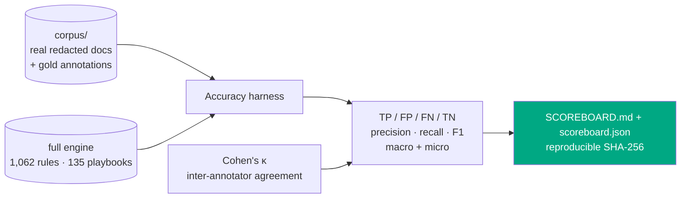
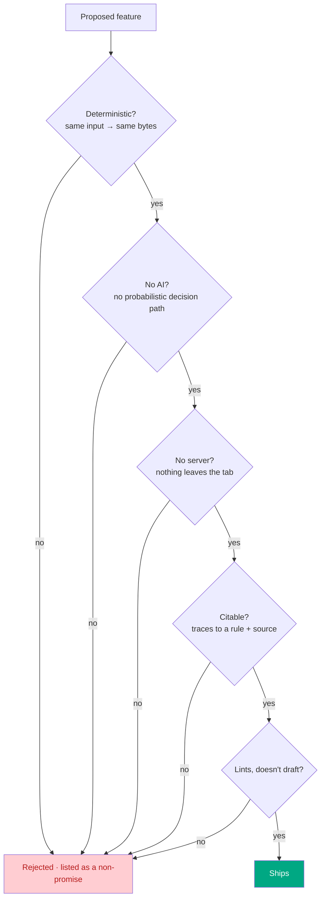
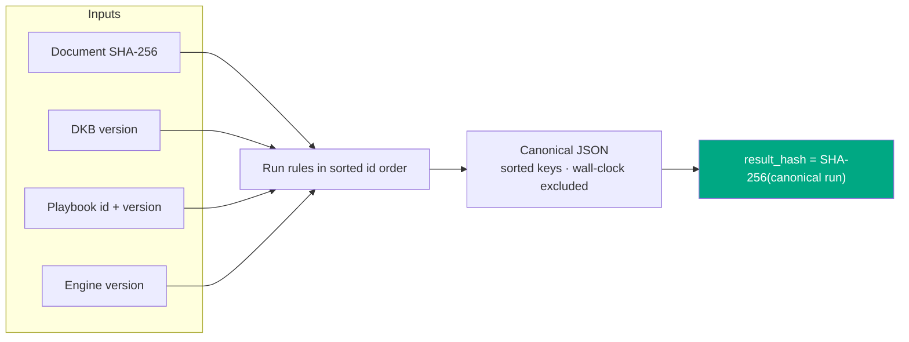
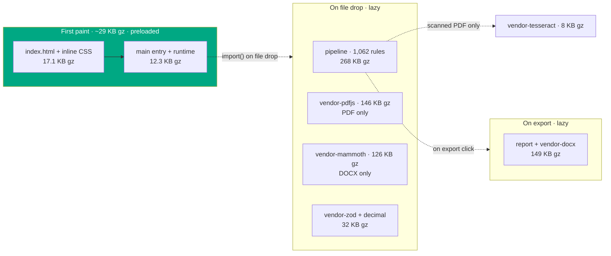
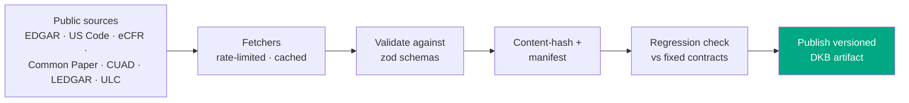

# Vaulytica

> The free, deterministic, runs-entirely-in-your-browser contract checker. A linter for legal documents. No login, no API key, no telemetry, no server. Drop in a contract, get back a Word document you can cite. That is the entire product.

**Vaulytica is the second pair of eyes you can cite.**

`1,062 deterministic rules` · `20 cross-document checks` · `16 document sub-domains` · `35 state-law overlays` · `7 export formats` · `0 servers` · `0 AI` · `2,708 passing tests` · `v8.0.0` · `MIT`


---

## The one idea

Every other contract tool leans on a language model. The output is fluent, confident, and **different every time you run it** — a senior partner cannot sign off on it, an auditor cannot trace it, a client cannot reproduce it.

Vaulytica is the opposite. It is a **pure function**:

```
report = engine(documents, DKB, playbook)
```

Same document + same engine version + same Deterministic Knowledge Base version → **byte-identical report on any machine, at any time.** The report carries a `result_hash` so you can prove it. Every finding traces to a numbered rule and a pinned public source. Nothing leaves the browser tab — open DevTools and watch the network panel go quiet.

## How it works (end to end)


Everything in this diagram runs in the tab. The DKB is a static, versioned, content-hashed JSON artifact served alongside the page; the engine is a synchronous pure function over it. The **same pipeline** runs headless from the [`vaulytica analyze` CLI](#v8--reach-the-linter-in-the-workflow) — proven byte-identical to the browser run.

## What you can drop in — ingest cheat sheet

Vaulytica takes the documents a real review actually arrives as — and handles every one of them in the tab. Each input is normalized to the same `DocumentTree` the engine reads, and the source bytes are **SHA-256 hashed (deterministically, before parsing)** so a report is always reproducible from the exact file you dropped.

| Input | How it's handled | Notes |
|---|---|---|
| **Digital PDF** | pdf.js text-layer extraction; headings inferred from font-size jumps + bold runs | the common case |
| **Scanned / image-only PDF** | OCR fallback — tesseract.js (English), lazy-loaded only when the text layer is near-empty, each page rasterized at ~200 DPI | the ~8 MB engine stays out of the main bundle; some structure is lost and the report says so |
| **DOCX** | mammoth, structure-preserving (headings, lists, tables → `DocumentTree`) | richest structure signal |
| **Pasted text** | normalized directly | no file needed |
| **Folder or `.zip`** | every file ingested, then the **cross-document consistency** pass runs | `.zip` unpacked client-side via fflate (MIT, same-origin) |

Two or more documents trigger **bundle mode**: per-document reports *plus* a portfolio risk matrix and cross-document checks (conflicting governing law, indemnity-cap stacking, defined-term drift across the set). A **composite document** — an MSA with a data-processing exhibit, say — is scanned with **every** family it clearly contains, not just its primary match, so a present family is never silently skipped; this holds whether the document is dropped alone or inside a folder. Nothing is uploaded — the file, and any playbook you load, never leaves the browser tab.

## What it checks — rule cheat sheet

The **v1 launch set** is 112 rules across ten always-on categories that apply to any agreement:

| Category | Rules | Catches (examples) |
|---|---|---|
| Structural | 16 | missing signature block, unfilled `[placeholders]`, broken cross-refs, used-but-undefined terms |
| Risk allocation | 17 | uncapped liability, indemnity without a cap, one-way fee-shifting, missing limitation of liability |
| Choice & venue | 12 | no governing law, venue/law mismatch, out-of-state law on a CA employee, class-action waiver |
| Temporal | 12 | impossible dates, auto-renewal with a short notice window, survival silent on confidentiality/IP |
| Financial | 9 | word-vs-numeral amount mismatch, usurious late fees, currency drift |
| Termination | 9 | termination asymmetry, no effect-of-termination clause, termination tied to payment |
| IP & data | 10 | no IP ownership clause, AI/model-training rights over customer data, cross-border transfer w/o safeguard |
| Obligations | 9 | sole-discretion language, MAC clause, residuals clause swallowing confidentiality |
| Dark patterns | 9 | unilateral amendment by posting, hidden auto-renewal, browsewrap acceptance |
| Personnel | 9 | stay-or-pay/training-repayment clauses, IC misclassification signals, overlong non-solicits |

On top of that, **v3 (+220 rules)** adds compliance-grade rule sets and **v4 (+730 rules)** adds 16 specialized sub-domains. The full **1,062-rule** catalog runs live, family-gated so a plain NDA is not flagged for missing GDPR clauses.

Those 1,062 are all **single-document** rules. Dropping a folder or `.zip` additionally runs **20 cross-document consistency rules** — defects no single-document scan can see because they live in the *relationship between* documents:

| Cross-doc check | Catches |
|---|---|
| `CROSS-JURIS` · `CROSS-PRECEDENCE` | conflicting governing law / order-of-precedence across an MSA and its exhibits |
| `CROSS-INDEMNITY` · `CROSS-SURVIVAL` | indemnity caps that stack, survival periods that disagree |
| `CROSS-DEFTERM` · `CROSS-PARTY` | a term defined one way in the MSA and another in the SOW; party-name drift |
| `CROSS-AMOUNT` · `CROSS-DATE` · `CROSS-MISSING` | fee/date conflicts between documents; a referenced companion doc that isn't in the set |
| `CC-001`…`CC-007` | BAA ↔ MSA ↔ DPA scope consistency (e.g. a BAA purpose broader than the MSA permits) |

## What the result looks like


The drop zone transforms in place into a result card: severity counts (critical / warning / informational), the matched playbook with a "why," any jurisdiction overlays for the governing-law state, and one-click exports — the **Word report** you can cite, the structured **JSON** with its `result_hash`, **SARIF 2.1.0** for code-scanning/PR annotation, a self-contained **single-file HTML** report that prints clean to PDF, the **fix-list** (Markdown / CSV), the obligations ledger (CSV), and deadlines as an **`.ics` calendar**. As of v8 **every** one of those carries each finding's resolvable citation — the URL rides into the spreadsheet row, the SARIF result, and the calendar event, not just the Word doc.

Every view is verified to render with **no horizontal scroll from 320 px to 1280 px** — the shot at right is the live card at a 390 px phone width. The whole flow runs in the tab; open DevTools and the network panel stays empty.

<br clear="all" />

## What each version added

| Ver | Theme | Headline | Status |
|---|---|---|---|
| v1 | Linter | 112 rules, DOCX report, `result_hash`, browser-only | shipped |
| v3 | Regulated agreements | +220 rules (HIPAA, GDPR, 8 US state privacy laws, EU SCCs, UK IDTA), cross-doc consistency, compliance matrix, citation-pinned sources | shipped |
| v4 | Every operative document | +730 rules, 16 sub-domains, multi-doc bundles (folder/zip), document classifier | shipped |
| v5 | Ground Truth | accuracy & validation harness, measured recall/precision, rule-retirement discipline | **infrastructure built** (Steps 67/69/71/75/83): corpus scaffolding, gold-annotation schema + Cohen's κ, `npm run accuracy` harness + reproducible scoreboard, legal-basis ledger + `tier` field. Numbers + sign-offs await a human-gated real corpus, attorney annotation, and legal review (Steps 68/70/76/77). |
| v6 | Workflow | version comparison · bring-your-own-playbook · findings-to-action exports · model-clause references · portfolio matrix · depth (classifier, cross-doc families, jurisdiction overlays) | **complete · 6.0.0** (Steps 87–102; only Step 98 extraction-recall deferred behind v5) |
| v7 | Depth & Proof | extraction recall · 3 new cross-doc families · mixed-text-layer OCR + per-word confidence · report provenance/exec-summary · **and** the missing test *kinds*: coverage + property + metamorphic + parity + schema-fuzz + report-structure + **mutation** + responsiveness gates | **substantially done · 7.0.0** (Steps 103–108, 110, 113–126; [`spec-v7`](docs/spec-v7.md) · [`docs/v7/`](docs/v7/README.md)). Deferred — all v5-/attorney-gated: 109 (routing measured against the real corpus), 111 (per-state overlay data), 112 (golden-churn + citable sources). |
| v8 | Hardening & Reach | (A) input-boundary guards + fuzz gate so the engine *survives* hostile input · (B) inline-everywhere/honest citations across every format · (C) SARIF, a headless CLI, a single-file HTML report, a playbook diff, a reproducibility verifier — the linter in the workflow | **complete · 8.0.0** (Steps 127–147; [`spec-v8`](docs/spec-v8.md) · [`docs/v8/`](docs/v8/README.md)). Deferred — npm/Action distribution, attorney-gated publication dates, scheduled (not per-commit) citation reachability, clause-level redline. |

## v8 — hardening: a tool that cannot be made to hang

The suite proves the engine is *correct* on inputs an author wrote down (v7) and — once the corpus lands — *legally right* (v5). v8 Thrust A adds the third claim: it *survives garbage*. Every public entry point now has a **pure-function input guard** (a bound, never a timeout — a timeout would break determinism): a 50 MB document or a 20-million-character paste is rejected with a typed error before parsing; a 20,000-section-deep hostile tree is flattened iteratively instead of overflowing the stack; a **zip bomb** is rejected by cumulative-inflated-byte budget + compression ratio *before* fflate inflates it (and nested archives are refused outright); a fifty-digit amount, a 100,000-rule custom playbook, and a megabyte-long regex are all capped. A `fast-check` **fuzz boundary gate** then proves the property across the whole surface — every public function *returns or throws a typed error, never an uncaught crash, on any input* — the boundary analog of v7's metamorphic suite. All of it is zero-churn against the goldens (guards reject hostile inputs the goldens never contained).

## v8 — citations: verifiable from whatever artifact you're holding

A finding is *citable* only if you can follow it to the source from the artifact in your hand. Before v8 that was true of the Word doc and the JSON and **false** of the spreadsheet row (URL stripped to a bare name), the calendar event (no source), and a cited-by-team-policy rule (it rendered `"Policy 4.2 — "` with a dangling em-dash). v8 closes every gap and pins it with a gate:

- **Inline-everywhere.** The Markdown fix-list carries a `[source](url)` link; the CSV gains an `authority_url` column; the URL-less custom rule renders cleanly as `Policy 4.2 (cited — team policy)`. A **cross-format completeness meta-test** asserts that for every cited finding, the resolvable URL survives into **all** of DOCX, JSON, Markdown, CSV, SARIF, and HTML — a new output that cannot carry a citation does not ship.
- **Breadth.** `citationFamily()` recognizes the forms the DKB actually cites beyond US statutes — **EU/GDPR** (`Regulation (EU) 2016/679`), **standards** (`ISO/IEC 27001:2022`, `NIST SP 800-53 Rev. 5`), and **secondary sources** (Restatements, uniform acts) — rendering each conventionally. Only US-statutory forms take a Bluebook parenthetical year (EU/standards embed their own); **pinpoint subsections** like `45 C.F.R. § 164.410(a)(1)` are preserved, never truncated to the base section.
- **Honesty & wrapping.** A reader-facing **freshness signal** shows the retrieval date (and publication date when genuinely known — *never fabricated*; absent when unknown). It is the *date*, never a computed elapsed "age" — elapsed time depends on the clock and would break determinism. Long citation URLs **wrap** (DOCX run-splitting · HTML `overflow-wrap`) and are **never truncated** — a structure test asserts the full source + URL render.
- **Integrity tool.** A build-only [`tools/citation-check`](tools/citation-check/) sweeps every citation URL: well-formedness gates every commit (pure), reachability runs on a schedule (network). It is `src/`-isolated — a guard test asserts the browser bundle can never import it.

## v8 — reach: the linter in the workflow

The product is "a linter for legal documents," yet it spoke no linter format and had no headless entry point. v8 Thrust C spends the v7 parity proof (the Node pipeline is byte-identical to the browser) to put the same engine wherever the work happens:

- **SARIF 2.1.0** — each rule → a `reportingDescriptor` (with the citation as `helpUri`), each finding → a `result` (severity → level, section → location, `result_hash` + finding id → `partialFingerprints` so findings dedupe across runs). Annotate a pull request, populate a code-scanning dashboard. The output is gated by a `sarifConformanceViolations()` structural check (level enum, in-range `ruleIndex`, string fingerprints, absolute `helpUri`) — negative-tested, so a regression that would make GitHub reject the file fails the build.
- **Standalone HTML report** — a self-contained `.html` (all CSS inlined, **no script**, no external resource) that renders the full report with wrapped inline citations and prints clean to PDF from any browser. The archivable, emailable, diff-able counterpart to the DOCX — and mobile-responsive by construction.
- **Headless API + CLI** — a single dispatcher, `vaulytica analyze | diff | verify`, over the **same parity-proven pipeline**. `analyze <path|glob|dir> --format json,sarif,html,md,csv --fail-on critical` runs the engine in CI, a pre-commit hook, or a folder sweep, exiting non-zero when findings breach a threshold. The DKB ships with the tool, so it opens **no socket** — "nothing leaves your machine" holds headless too.
- **Playbook diff** — `vaulytica diff a.json b.json` (and the `diffPlaybooks(a, b)` API) gives custom-playbook authors version control for their team standard: which built-in rules were selected, which severity overrides moved, which custom rules were added/removed/edited, rendered as Markdown or JSON. `--exit-code` makes it a CI primitive (non-zero when the standard changed).
- **Reproducibility verifier** — `vaulytica verify report.json original.txt` (and `verifyReproducibility(savedReport, original)`) re-derives the `result_hash` and reports *what* diverged — the input, the engine, or the DKB — turning the determinism promise into a checkable audit receipt.
- **Export enhancements** — a bundle "everything" archive (per-document fix-list/CSV/ICS/JSON in one download) and a **clause-evidence coverage** surface that tells a reviewer which findings pin a verbatim quoted clause span vs. rest on a bare match.

Every Thrust-B change is render-side or additive (zero `result_hash` churn); every Thrust-C format is a deterministic rendering of the same run that inherits the full citation. Full write-up: [`docs/v8/`](docs/v8/README.md).

### CLI cheat sheet

One dispatcher, three commands — `analyze`, `diff`, `verify` — over the parity-proven engine (`npm run cli -- <command>`):

```
# analyze: one file, print SARIF to stdout
npm run cli -- analyze contract.docx --format sarif

# analyze: sweep a deal folder, write HTML + JSON + fix-list per doc, gate CI on any critical
npm run cli -- analyze ./deal-room --format html,json,md --out ./out --fail-on critical

# diff: structural diff of two custom playbooks (CI primitive — --exit-code fails on any change)
npm run cli -- diff team-standard-v1.json team-standard-v2.json --exit-code

# verify: re-derive a saved report's result_hash from the original document (audit receipt)
npm run cli -- verify report.json original.txt

# build-only: check every citation URL is well-formed (per-commit) or reachable (scheduled)
npm run citation:check            # well-formedness
npm run citation:check -- --reachability   # + network sweep
```

| Command | Purpose | Exit code |
|---|---|---|
| `analyze <path\|glob\|dir>` | run the engine headless, write `json,sarif,html,md,csv` | `2` when findings breach `--fail-on` |
| `diff <a.json> <b.json>` | structural diff of two custom playbooks (Markdown/JSON) | `1` with `--exit-code` when they differ |
| `verify <report.json> <original>` | re-derive `result_hash`; report input/engine/DKB drift | `3` when not reproduced |

| `analyze` flag | Meaning |
|---|---|
| `--playbook <id>` | force a specific playbook instead of auto-matching |
| `--format <list>` | comma list of `json,sarif,html,md,csv` (default `json`) |
| `--out <dir>` | write one file per document per format (else stdout for a single file/format) |
| `--fail-on <sev>` | exit non-zero (code 2) when any finding is at or above `critical\|warning\|info` |

## v6 — fit the shape of a review

v4 widened *what* Vaulytica reads. v6 makes it *useful in the workflow* — without adding a model, a server, or a probabilistic answer.

- **Version comparison** — drop a base and a revised document; get a deterministic finding-delta: *resolved / introduced / unchanged / carried-clean*, with a comparison hash. "This redline resolved 2 high-severity issues but introduced 1 critical."
- **Bring-your-own playbook** — encode your team's positions (acceptable cap multiple, required clauses, forbidden terms) as a JSON playbook validated by a public schema, loaded **client-side only**, enforced alongside or instead of the built-ins. Custom-rule findings carry `source: custom-playbook` provenance and cite your own authority. Your standard never leaves the tab.
- **Findings to action** — export the fix-list (Markdown + CSV), the obligations ledger (CSV), and the deadlines as an **`.ics` calendar** with notice windows computed deterministically (`term end − notice period`). Ambiguous dates are listed "verify manually," never guessed.
- **Model-clause references** *(Steps 95–96, new)* — for findings whose rule has an associated public model clause, the rule card points to **what good looks like**: an attributed reference into Common Paper, Bonterms, or the EU SCCs, with source URL and license. It is a reference, never a generated redline — Vaulytica still does not draft. Coverage is published honestly; only rules with a genuine reference get one.
- **Portfolio risk matrix** *(Step 97, new)* — drop a deal folder; the bundle report gains a documents × key-checks grid (liability cap · auto-renewal · governing law · data-processing terms · breach-notice clause) plus rollups ("12 of 40 lack a capped liability clause"). A `portfolio_fingerprint` extends the bundle fingerprint; a grey `N/A` cell is an honest "rule did not run," never a wrong "Risk."
- **Depth** *(Steps 99–101)* — the sub-domain classifier's feature table was re-engineered against the labeled golden corpus, lifting top-1 accuracy from **70.7% → 100%** (75/75) and resolving the four named confusions (healthcare→privacy, ip-licensing→equity, settlement→commercial, compliance→employment) — still a hand-authored, inspectable table, no model. The cross-document consistency engine grew from 7 to **10 CROSS-\* families**, adding defined-term *usage* drift, indemnity-cap stacking, and confidentiality survival-period conflicts.
- **Jurisdiction overlays** *(Step 101, new)* — for the families where state law dominates the outcome, Vaulytica now surfaces the **state-law delta** for the governing-law state the document names. A California employment agreement's non-compete is flagged **void** (Cal. Bus. & Prof. § 16600); a New York residential lease carries its **1-month deposit cap, 14-day return** rule; a Texas promissory note carries its tiered usury ceilings. A *citable reference layer* (DOCX section + `jurisdiction_overlays` in JSON + a UI block), surfaced **outside** the `EngineRun` so no existing `result_hash` changes. Honest by construction: a governing-law state with no overlay is reported as a gap, never a silent clean pass.

#### State-law overlay cheat sheet

| Family | Topic | States covered | Posture range |
|---|---|---|---|
| Employment | non-compete enforceability | CA · ND · OK · MN · CO · WA · OR · MA · VA · IL · DC · NV · TX · FL · NY (15) | void → restricted → enforced |
| Residential lease | security-deposit cap & return | CA · NY · MA · NJ · DC · TX · FL · IL · WA · OR (10) | capped → no-cap-with-rules |
| Lending | usury / interest-rate cap | CA · NY · TX · FL · IL · DE · MA · PA · WA · CO (10) | informational reference |

Overlays gate on the matched family and the **governing-law** clause only (venue and arbitration-seat do not set substantive law), and the residential-deposit overlays attach to the *residential* lease playbook only — a commercial lease is correctly excluded. See [`docs/v6/jurisdiction-overlays.md`](docs/v6/jurisdiction-overlays.md).

### Design decision: why a feature table, not a model

The classifier is a hand-authored table of title keywords, distinguishing phrases, and negative features, scored with fixed weights (title 0.3, distinguishing 0.2, negative −0.1) and a per-domain normalization ceiling. Every classification is explainable ("matched: *licensor*, *royalty*; ceiling 1.4 → 0.71") and reproducible. The Step 99 gain came from adding phrases verified to appear **only** in their target sub-domain's fixtures — so each edit strictly helps its target and cannot regress another, a property a learned model cannot guarantee. The 100% figure is corpus-measured on 75 labeled fixtures (5 per sub-domain); the added phrases are genuine legal terms of art, so the lift generalizes, but a small labeled set is not the open world — the calibration test pins the acceptance floor so a future corpus change that breaks it fails loudly.

## v7 — Depth & Proof: more right, and provably so

v7 answers the two halves of *"is this thing actually right?"* in dependency order, without touching the five promises. Full write-up: [`docs/v7/`](docs/v7/README.md) and the [testing-architecture doc](docs/v7/testing-architecture.md).

**Thrust A — Depth** deepens the layers everything downstream reads:

- **Extraction recall** *(Steps 103–108)* — the extract layer now catches what it used to drop: **fiscal periods** ("FY2025-Q3") and **range deadlines** ("thirty to sixty days after…", both bounds kept), a broadened citable **anchor-alias** set; **range amounts** ("$100k to $200k" → a cap rule reads the upper bound), **per-unit qualifiers** ("$X per incident" ≠ an absolute cap), and a **deferred currency override**; party **alias/role chains** and **DBA** names and two-column signature blocks; **prohibitive/permissive modals** ("may not", "cannot" — previously invisible obligations), **nested triggers**, and **scope exclusions**; **definition-by-reference**, **scope-gated definitions**, and **circularity detection**; sub-reference and governing-law **fallback-precedence** capture. Every new field is optional and outside `result_hash`; the one intended behavior change (the new modals) shipped with a line-reviewed golden re-baseline.
- **Cross-document families** *(Step 110)* — the consistency engine grew 10 → **13 CROSS-\* families**: **termination-alignment** (a convenience-terminable master over a cause-only companion), **liability-cap carveout mismatch** (asymmetric uncapped exposure), and **payment-currency mismatch** across a bundle.
- **Ingest robustness** *(Step 113)* — a **per-page text-density** OCR trigger so a searchable cover over a scanned body no longer hides the body; **per-word confidence** `[uncertain]` markers + an ingest warning so a faxed scan never silently feeds a misread amount into a rule.
- **Report fidelity** *(Step 114)* — JSON **provenance** (DKB/engine/rule-taxonomy versions), a portfolio **executive summary** (rolled-up severity counts + per-document digest), and **`.ics` verify-manually events** for unresolved deadlines. All outside the run.

**Thrust B — Proof** adds the test *kinds* the suite lacked — **coverage gate, per-rule completeness, property-based (`fast-check`), metamorphic invariants, schema fuzz, report-structure validation, mutation testing (Stryker), Node↔browser parity, and responsiveness-as-a-test**. The standout:

- **Node↔browser parity** *(Step 120)* — a shared fixture driven through both the shipped browser pipeline and the Node accuracy harness must produce a **byte-identical `EngineRun`**, so a measured accuracy number provably describes shipped behavior.
- **Responsiveness- and accessibility-as-a-test** *(Step 125, extended)* — `scrollWidth ≤ clientWidth` at **320 / 390 / 768 / 1280 px** *and* a zero-violation **axe-core WCAG 2 AA** sweep (with `color-contrast` enabled, in **both** themes), turned into CI gates. The live-app spec pins the empty + complete states (and, for legacy reasons, runs only the dark theme with `color-contrast` disabled); companion specs close that gap deterministically via `page.setContent` (no server) over: **every** `DropzoneState` (empty · analyzing · complete · comparison · bundle · error, including the complete state's full overlay / chip / provenance content), the bring-your-own-playbook panel's error / loaded sub-states, the standalone HTML report, and the **full marketing landing page** — each in both themes, with overflow-*stressing* long filenames / ids. That exhaustive pass found and fixed real defects the short-fixture, dark-only, contrast-disabled live tests never exercised: long unbreakable filenames/ids overflowing `.dropzone-title` / `.dropzone-sub` / `.bundle-rejected-filename` / `.playbook-status` / the HTML report `<h1>` (no `overflow-wrap`); AA contrast failures (the light-theme `--muted`; **every link's brand-mint colour on the light surfaces** → a new `--link` token; the overlay citation link; the invalid-playbook **error message**, dark-red at ~2.7:1 on the dark surface → a themed `--critical`; a dimmed low-confidence number; the freshness label; the comparison DKB warning); a progressbar with no accessible name; and `aria-label` on a role-less panel `div`.

**Testing ≠ accuracy** stays explicit: Thrust B proves the engine does what each rule *says*; v5 proves each rule matches what a *lawyer* says. **Principled deferrals:** classifier live-routing (109) stays behind the v5 corpus; the 50-state overlay expansion (111) and deeper rule categories (112) are attorney-gated under the v5 honesty contract; Stryker mutation testing (123–124) belongs on a scheduled job.

## v5 — Ground Truth: making accuracy measured, not asserted

*Deterministic is not the same as correct.* A rule that fires identically every time can be reproducibly wrong. Every rule today passes a synthetic fixture authored by the same person who wrote the rule — a closed, self-confirming loop. v5 breaks it by measuring the engine against **real contracts it did not write**, graded by a credentialed attorney.

The **measurement machinery is built and unit-tested** (`tools/accuracy/`, run with `npm run accuracy`):



- **Reuses the real pipeline.** The harness runs the exact `ingest → extract → classify → engine` path the browser uses — a measured number reflects shipped behavior, not a test-only shortcut.
- **Honest by construction.** Gold silence on a fired rule scores as a false alarm (closed-world); a rule graded only on documents where annotators disagreed (Cohen's κ < 0.6) is flagged `unmeasured` and excluded from the headline, with the exclusion count published. Bootstrap placeholder docs never count toward a real number.
- **Reproducible.** The scoreboard is stamped `(corpus, dkb, engine)` and hashed with the same wall-clock-excluded discipline as `result_hash` — two machines produce a byte-identical scoreboard.
- **Privacy-preserved.** The corpus, annotations, and scoreboard live in `corpus/`, `tools/accuracy/`, and `docs/` — **never imported by `src/`** (a guard test asserts it), so not one byte ships in the deployed bundle. The user's document still never leaves the tab.

The committed scoreboard currently reports `status: empty` and publishes **no** precision/recall number — because there are zero real annotated documents yet. Sourcing license-clean real documents (EDGAR Ex-10 exhibits, CC0 template banks) and credentialed attorney annotation are human-gated steps that code cannot do; the harness produces a real number the moment they land. Publishing a number only when it is real is the entire point. See [`docs/v5/methodology.md`](docs/v5/methodology.md).

**Measurement says whether a rule matches a human; it does not say whether the rule's *legal premise* is sound.** The [legal-basis ledger](docs/legal-basis/README.md) closes that second gap: a per-rule record of the authority a rule rests on (statute/regulation + pinpoint + the DKB node that carries it) plus a credentialed attorney's sign-off — `verdict` (`sound` / `sound-but-narrow` / `disputed` / `unsound`, where `unsound` retires the rule) and `tier` (`established` black-letter law · `prevailing-practice` convention · `opinion` preference). The tier is an optional field on `Rule`/`Finding` so a finding grounded in a statute can read differently from one grounded in a drafting preference. It is **additive and currently dormant** — no rule is signed yet, so no finding carries a tier and `result_hash` is byte-unchanged; a machine-mirror test guarantees a surfaced tier can never be author-asserted (it must trace to a signed ledger entry that cites a real DKB node). The ledger is honestly empty until attorney review lands, the same posture the scoreboard takes.

## The posture filter — the gate every feature passes

A feature ships only if it answers **yes** to all five. This is the moat, and it is enforced per-PR:



## Determinism — why you can cite the result



The `executed_at` timestamp is set to `""` before hashing, so the only things that move the hash are the inputs and the rule outcomes. The v6 surfaces follow the same discipline: the comparison hash is `SHA-256(base_hash + revised_hash + canonical(delta))`; the portfolio fingerprint extends the bundle fingerprint with the canonical matrix; model-clause references and jurisdiction overlays live **outside** the `EngineRun`, so adding them changed no existing `result_hash`. See [`docs/determinism.md`](docs/determinism.md).

## Performance — the first-paint path is tiny on purpose

A "runs-entirely-in-your-browser" tool ships its whole engine to the client. The trap is obvious: a 1,062-rule engine plus a PDF parser plus a DOCX writer is megabytes of JavaScript, and if it all loads up front the page is slow to paint on the exact phones the product promises to serve. Vaulytica avoids this by splitting the bundle along the **interaction** that needs each piece — nothing parser- or engine-related is on the critical render path. The page paints from ~17 KB gz of self-contained HTML+CSS; everything heavy waits for the file drop.



| Chunk | gz | Loads when | Why it's deferred |
|---|---:|---|---|
| `index.html` (inline CSS) | 17.1 KB | first paint | the page renders from this alone — no JS needed to see content |
| `main` + `rolldown-runtime` | 12.3 KB | first paint (preloaded) | hydrates the drop zone; the *only* JS on the FCP path |
| `pipeline` (1,062 rules + extract/classify/engine) | 268 KB | file drop | you don't need the engine until there's a document to run it on |
| `vendor-pdfjs` | 146 KB | dropping a **PDF** | format-specific — a DOCX never loads it |
| `vendor-mammoth` | 126 KB | dropping a **DOCX** | format-specific — a PDF never loads it |
| `vendor-zod` + `vendor-decimal` | 32 KB | file drop | DKB validation + exact financial math, engine-only |
| `report` + `vendor-docx` | 149 KB | clicking **export** | you don't need the Word writer until you ask for the report |
| `vendor-tesseract` + `ocr` | 8 KB | a **scanned** (image-only) PDF | OCR fallback only; the ~8 MB language model is fetched lazily on top |

**The design decision.** Vite's `modulePreload` set is filtered so the heavy parser vendors are dropped from the `<link rel="modulepreload">` list in the built HTML — without that filter, the entry's lazy `import("./pipeline")` would drag all of pdfjs onto the first-paint path through Vite's shared preload helper. The built `index.html` preloads exactly two chunks: the entry and the runtime. **Zero vendor chunks leak onto the critical path** — verified in the build output, not just intended. Each heavy dependency is also its own named chunk, so a bump to one (say `docx`) leaves the immutable, year-cached `pdfjs` and `tesseract` chunks untouched for returning users.

**Enforced, not asserted.** CI runs Lighthouse on a throttled mobile profile (360 px, 4× CPU slowdown, ~1.6 Mbps) and **fails the build** below these floors, so the budget can't quietly regress:

| Metric | Budget | Metric | Budget |
|---|---|---|---|
| First Contentful Paint | ≤ 1.8 s | Performance score | ≥ 0.85 |
| Time to Interactive | ≤ 2.0 s | Accessibility score | ≥ 0.95 |
| Largest Contentful Paint | ≤ 2.0 s | Total Blocking Time | ≤ 200 ms |
| Cumulative Layout Shift | ≤ 0.1 | Best-practices / SEO | ≥ 0.90 |

See [`lighthouserc.json`](lighthouserc.json) and [`vite.config.ts`](vite.config.ts).

## What I do not do

- I do not give you legal advice. I am a software tool. If something here matters, hire a lawyer.
- I do not replace your judgment. I find mechanical things consistently. The hard calls are still yours.
- I do not use AI. Not a model, not a copilot, not "powered by." A probabilistic answer cannot be cited.
- I do not draft. I lint, compare, enforce, export, and *reference* public model language with attribution. I never write your clause.
- I do not see your data. There is no server. Your contract — and any playbook you load — never leaves the tab.

## Quick start

Requires **Node 22 LTS** (`.nvmrc` pins it; `nvm use` picks it up). Node 20 was the original target but reached end-of-life in April 2026.

```
git clone https://github.com/clay-good/vaulytica.git
cd vaulytica
npm install
npm run dev          # open the printed URL
```

## Build & verify

```
npm run build        # static site → dist/
npm run typecheck    # tsc --noEmit
npm run lint         # eslint
npm run test         # vitest — 2,708 tests, ~20s
npm run coverage     # vitest + V8 coverage, enforces the regression floor
npm run accuracy     # v5 Ground Truth harness → tools/accuracy/SCOREBOARD.md
npm run mutation     # Stryker mutation score (scoped to extractors; slow, off the per-push path)
npm run citation:check   # v8 build-only citation URL well-formedness (+ --reachability for the network sweep)
npm run cli -- analyze <path> --format sarif,html,json   # v8 headless CLI (also: diff, verify)
```

The CI gate (`.github/workflows/ci.yml`) runs typecheck + lint + **coverage** + build on Ubuntu; the test matrix re-runs the plain suite on Ubuntu/macOS/Windows for cross-OS determinism, and Lighthouse enforces the mobile performance budget. Mutation testing runs on its own weekly/on-demand workflow, never the per-push path. A commit is "green" only when the per-push gates pass.

### Coverage — measured, then gated (spec-v7 Part VIII)

The suite proves *behavior*; coverage proves the suite *reaches the code*. Measured over the shipped `src/` bundle (build-and-CI-only harnesses excluded), after the v7 depth work:

| Metric | Measured | Floor | Metric | Measured | Floor |
|---|---:|---:|---|---:|---:|
| Lines | 88.8% | 85% | Functions | 88.3% | 85% |
| Statements | 86.6% | 83% | Branches | 74.4% | 70% |

Floors are **regression-only** — set a couple points under the measured value (headroom for cross-platform drift), they fail the build on a *drop*, never block on an aspiration. A ratchet raises them as coverage climbs; branches (the lowest) is the next ratchet target. Same measure-first discipline the [v5 accuracy scoreboard](docs/v5/methodology.md) uses for precision/recall — publish the real number, gate against regression, never against a fabricated target.

Beyond the percentage, the **report itself — the thing you cite — is structurally asserted** (spec-v7 Step 122): the test unzips the generated DOCX and proves the cover carries the file fingerprint + engine/DKB versions + result hash, findings render grouped Critical → Warning → Info, citations resolve to a bibliography, and the verbatim determinism/privacy/non-advice block is present — so a regression that drops or reorders a load-bearing part of the report fails loudly, not silently.

The suite also tests **invariants no example could enumerate** (spec-v7 Step 118): [`fast-check`](https://github.com/dubzzz/fast-check) property tests over generated `DocumentTree`s prove the normalizer is idempotent and assigns exact, non-overlapping offsets, and that any US-dollar amount or valid ISO date round-trips through its extractor. A **fixed seed** makes the generated inputs identical on every machine and run — a property gate that drew fresh randomness would be non-deterministic, which this codebase forbids.

And it tests **what the engine *means*** with metamorphic relations (spec-v7 Step 119): a document and a copy of it with non-semantic whitespace noise must produce the **same `result_hash` and the same findings**. That relation immediately earned its keep — it caught a real determinism leak (the normalizer collapsed whitespace in run text but *not* in headings, so heading whitespace bled into the offset stream and the hash) which is now fixed, with zero change to any committed golden report.

Two more proofs round it out: the DKB schemas are **fuzzed with a known oracle** (spec-v7 Step 121) — every artifact round-trips through `parse → serialize → parse`, and a battery of single-field mutations (bad enum, missing-required, out-of-range, malformed URL/hash) is each rejected, because a schema's real job is to *refuse* corruption before it reaches the engine. And a **per-rule completeness gate** (spec-v7 Step 117) aggregates execution logs across the golden corpus to prove every always-on launch rule actually runs, holding a regression-only floor on how many are seen both to fire *and* to stay silent — so the always-on core can never quietly lose its positive or negative coverage.

And because coverage only proves a line *ran*, **mutation testing** (spec-v7 Steps 123–124) proves a test would *catch a bug* on it: Stryker injects faults into the date/amount extractors and measures how many the tests kill — a committed baseline of **55.65%** (raised from a first-measured 51.26% by a survivor-fix pass), gated regression-only on a weekly/on-demand job off the per-push path. See [`docs/v7/mutation-baseline.md`](docs/v7/mutation-baseline.md).

Finally, two structural guarantees close the loop. **Node↔browser parity** (spec-v7 Step 120) drives a shared fixture through both the shipped browser pipeline (`runReport`) and the Node accuracy harness (`runDocument`) and asserts a **byte-identical `EngineRun`** — so a measured accuracy number provably describes shipped behavior, not a test-only shortcut. And **responsiveness-as-a-test** (spec-v7 Step 125) asserts `scrollWidth ≤ clientWidth` for each view-state at 320/390/768/1280 px, turning the manual mobile audit into a CI gate. The full proof surface is documented in [`docs/v7/testing-architecture.md`](docs/v7/testing-architecture.md).

## Project layout

```
src/
  ingest/      PDF/DOCX/paste → normalized DocumentTree (+ OCR fallback)
  extract/     parties · dates · amounts · definitions · obligations ·
               jurisdictions · cross-refs · classifier
  dkb/         Deterministic Knowledge Base types, loader, model-clauses, state-overlays
  engine/      pure rule runner + 1,062 rules + cross-document consistency
  playbooks/   built-in playbooks + bring-your-own schema/validator/interpreter
  report/      DOCX · JSON · SARIF · HTML · bundle · comparison · exports ·
               portfolio matrix · citations · clause-evidence
  ui/          drop zone, pipeline, six-state result machine, theme toggle
dkb/build/     offline fetchers (EDGAR, US Code, eCFR, Common Paper, …) → DKB
tools/accuracy/ v5 Ground Truth harness (corpus loader, κ, metrics, scoreboard, legal-basis ledger)
tools/cli/     v8 headless API (analyzeText/analyzeFile) + `vaulytica analyze | diff | verify` CLI dispatcher
tools/citation-check/ v8 build-only citation URL well-formedness + scheduled reachability
corpus/        real-document accuracy corpus (build/CI-only; never in the bundle)
docs/          architecture, determinism, threat model, legal-basis ledger, specs v1–v8
playbooks/     served playbook JSON; tools/ bundles the v3+v4 catalog
```

## How the DKB stays current

The Deterministic Knowledge Base is rebuilt via a GitHub Action that fetches from SEC EDGAR, the US Code, the eCFR, govinfo, Common Paper, CUAD, LEDGAR, and the ULC. Each build is content-hashed and regression-checked against fixed test contracts before publishing; a stale regulator URL disables the affected rule until a human reviews the diff rather than silently serving outdated law.



See [`docs/data-sources.md`](docs/data-sources.md) and [`docs/determinism.md`](docs/determinism.md).

## Docs

| Topic | Doc |
|---|---|
| Architecture | [`docs/architecture.md`](docs/architecture.md) |
| Determinism + result-hash | [`docs/determinism.md`](docs/determinism.md) |
| Privacy + threat model | [`docs/threat-model.md`](docs/threat-model.md) |
| Data sources | [`docs/data-sources.md`](docs/data-sources.md) |
| Adding a rule | [`docs/adding-a-rule.md`](docs/adding-a-rule.md) |
| Adding a playbook | [`docs/adding-a-playbook.md`](docs/adding-a-playbook.md) |
| v6 overview (workflow features) | [`docs/v6/README.md`](docs/v6/README.md) |
| Bring-your-own playbook (authoring) | [`docs/v6/authoring-a-playbook.md`](docs/v6/authoring-a-playbook.md) |
| Jurisdiction overlays (state law) | [`docs/v6/jurisdiction-overlays.md`](docs/v6/jurisdiction-overlays.md) |
| Accuracy methodology (v5 Ground Truth) | [`docs/v5/methodology.md`](docs/v5/methodology.md) |
| Annotation protocol (v5) | [`docs/v5/annotation-protocol.md`](docs/v5/annotation-protocol.md) |
| Legal-basis ledger (v5, rule sign-off) | [`docs/legal-basis/README.md`](docs/legal-basis/README.md) |
| v4 overview + sub-domains | [`docs/v4/overview.md`](docs/v4/overview.md) |
| v7 overview (depth & proof) | [`docs/v7/README.md`](docs/v7/README.md) |
| v8 overview (hardening & reach) | [`docs/v8/README.md`](docs/v8/README.md) |
| v8 robustness & fuzzing (Thrust A) | [`docs/v8/robustness-and-fuzzing.md`](docs/v8/robustness-and-fuzzing.md) |
| v8 citation standard (Thrust B) | [`docs/v8/citation-standard.md`](docs/v8/citation-standard.md) |
| Specs | [`docs/spec.md`](docs/spec.md) · [`spec-v3`](docs/spec-v3.md) · [`spec-v4`](docs/spec-v4.md) · [`spec-v5`](docs/spec-v5.md) · [`spec-v6`](docs/spec-v6.md) · [`spec-v7`](docs/spec-v7.md) · [`spec-v8`](docs/spec-v8.md) |
| Contributing | [`CONTRIBUTING.md`](CONTRIBUTING.md) |

## What happened to the older project?

The Google Workspace & Microsoft 365 DSPM tooling has been rolled into [Mantissa Log](https://github.com/clay-good/mantissa-log) and [Mantissa Stance](https://github.com/clay-good/mantissa-stance).

## License

MIT. See [`LICENSE`](LICENSE).

## Disclaimer

Vaulytica is a software tool. It is not a lawyer, it does not give legal advice, and using it does not create an attorney-client relationship with anyone. If something here matters, hire a lawyer.
