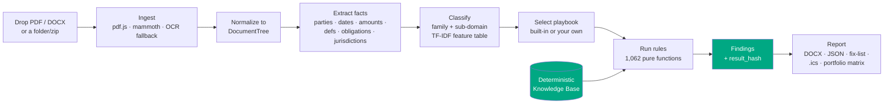
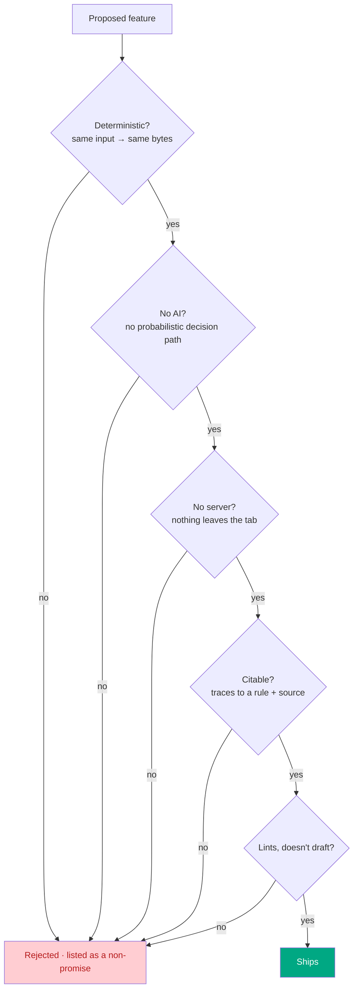
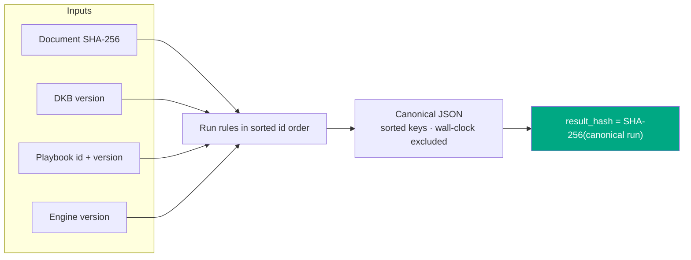
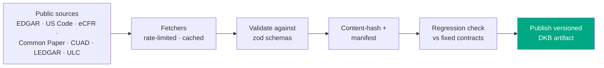

# Vaulytica

> The free, deterministic, runs-entirely-in-your-browser contract checker. A linter for legal documents. No login, no API key, no telemetry, no server. Drop in a contract, get back a Word document you can cite. That is the entire product.

**Vaulytica is the second pair of eyes you can cite.**

`1,062 deterministic rules` · `16 document sub-domains` · `0 servers` · `0 AI` · `2,386 passing tests` · `MIT`

---

## The one idea

Every other contract tool leans on a language model. The output is fluent, confident, and **different every time you run it** — a senior partner cannot sign off on it, an auditor cannot trace it, a client cannot reproduce it.

Vaulytica is the opposite. It is a **pure function**:

```
report = engine(documents, DKB, playbook)
```

Same document + same engine version + same Deterministic Knowledge Base version → **byte-identical report on any machine, at any time.** The report carries a `result_hash` so you can prove it. Every finding traces to a numbered rule and a pinned public source. Nothing leaves the browser tab — open DevTools and watch the network panel go quiet.

## How it works (end to end)



Everything in this diagram runs in the tab. The DKB is a static, versioned, content-hashed JSON artifact served alongside the page; the engine is a synchronous pure function over it.

## What it checks — rule cheat sheet

The **v1 launch set** is 112 rules across ten always-on categories that apply to any agreement:

| Category | Rules | Catches (examples) |
|---|---|---|
| Structural | 16 | missing signature block, unfilled `[placeholders]`, broken cross-refs, used-but-undefined terms |
| Risk allocation | 17 | uncapped liability, indemnity without a cap, one-way fee-shifting, missing limitation of liability |
| Choice & venue | 12 | no governing law, venue/law mismatch, out-of-state law on a CA employee, class-action waiver |
| Temporal | 12 | impossible dates, auto-renewal with a short notice window, survival silent on confidentiality/IP |
| Financial | 9 | word-vs-numeral amount mismatch, usurious late fees, currency drift |
| Termination | 9 | termination asymmetry, no effect-of-termination clause, termination tied to payment |
| IP & data | 10 | no IP ownership clause, AI/model-training rights over customer data, cross-border transfer w/o safeguard |
| Obligations | 9 | sole-discretion language, MAC clause, residuals clause swallowing confidentiality |
| Dark patterns | 9 | unilateral amendment by posting, hidden auto-renewal, browsewrap acceptance |
| Personnel | 9 | stay-or-pay/training-repayment clauses, IC misclassification signals, overlong non-solicits |

On top of that, **v3 (+220 rules)** adds compliance-grade rule sets and **v4 (+730 rules)** adds 16 specialized sub-domains. The full **1,062-rule** catalog runs live, family-gated so a plain NDA is not flagged for missing GDPR clauses.

## What each version added

| Ver | Theme | Headline | Status |
|---|---|---|---|
| v1 | Linter | 112 rules, DOCX report, `result_hash`, browser-only | shipped |
| v3 | Regulated agreements | +220 rules (HIPAA, GDPR, 8 US state privacy laws, EU SCCs, UK IDTA), cross-doc consistency, compliance matrix, citation-pinned sources | shipped |
| v4 | Every operative document | +730 rules, 16 sub-domains, multi-doc bundles (folder/zip), document classifier | shipped |
| v5 | Ground Truth | accuracy & validation harness, measured recall/precision, rule-retirement discipline | specified |
| v6 | Workflow | version comparison · bring-your-own-playbook · findings-to-action exports · model-clause references · portfolio matrix | **Parts I–V shipped** (Steps 87–97); depth (98–102) in progress |

## v6 — fit the shape of a review

v4 widened *what* Vaulytica reads. v6 makes it *useful in the workflow* — without adding a model, a server, or a probabilistic answer.

- **Version comparison** — drop a base and a revised document; get a deterministic finding-delta: *resolved / introduced / unchanged / carried-clean*, with a comparison hash. "This redline resolved 2 high-severity issues but introduced 1 critical."
- **Bring-your-own playbook** — encode your team's positions (acceptable cap multiple, required clauses, forbidden terms) as a JSON playbook validated by a public schema, loaded **client-side only**, enforced alongside or instead of the built-ins. Custom-rule findings carry `source: custom-playbook` provenance and cite your own authority. Your standard never leaves the tab.
- **Findings to action** — export the fix-list (Markdown + CSV), the obligations ledger (CSV), and the deadlines as an **`.ics` calendar** with notice windows computed deterministically (`term end − notice period`). Ambiguous dates are listed "verify manually," never guessed.
- **Model-clause references** *(Steps 95–96, new)* — for findings whose rule has an associated public model clause, the rule card points to **what good looks like**: an attributed reference into Common Paper, Bonterms, or the EU SCCs, with source URL and license. It is a reference, never a generated redline — Vaulytica still does not draft. Coverage is published honestly; only rules with a genuine reference get one.
- **Portfolio risk matrix** *(Step 97, new)* — drop a deal folder; the bundle report gains a documents × key-checks grid (liability cap · auto-renewal · governing law · data-processing terms · breach-notice clause) plus rollups ("12 of 40 lack a capped liability clause"). A `portfolio_fingerprint` extends the bundle fingerprint; a grey `N/A` cell is an honest "rule did not run," never a wrong "Risk."

## The posture filter — the gate every feature passes

A feature ships only if it answers **yes** to all five. This is the moat, and it is enforced per-PR:



## Determinism — why you can cite the result



The `executed_at` timestamp is set to `""` before hashing, so the only things that move the hash are the inputs and the rule outcomes. The v6 surfaces follow the same discipline: the comparison hash is `SHA-256(base_hash + revised_hash + canonical(delta))`; the portfolio fingerprint extends the bundle fingerprint with the canonical matrix; model-clause references live **outside** the `EngineRun`, so adding them changed no existing `result_hash`. See [`docs/determinism.md`](docs/determinism.md).

## What I do not do

- I do not give you legal advice. I am a software tool. If something here matters, hire a lawyer.
- I do not replace your judgment. I find mechanical things consistently. The hard calls are still yours.
- I do not use AI. Not a model, not a copilot, not "powered by." A probabilistic answer cannot be cited.
- I do not draft. I lint, compare, enforce, export, and *reference* public model language with attribution. I never write your clause.
- I do not see your data. There is no server. Your contract — and any playbook you load — never leaves the tab.

## Quick start

```
git clone https://github.com/clay-good/vaulytica.git
cd vaulytica
npm install
npm run dev          # open the printed URL
```

## Build & verify

```
npm run build        # static site → dist/
npm run typecheck    # tsc --noEmit
npm run lint         # eslint
npm run test         # vitest — 2,386 tests, ~10s
```

The CI gate (`.github/workflows/deploy.yml`) runs typecheck + lint + test + build; the test matrix re-runs on Ubuntu/macOS/Windows. A commit is "green" only when all four pass.

## Project layout

```
src/
  ingest/      PDF/DOCX/paste → normalized DocumentTree (+ OCR fallback)
  extract/     parties · dates · amounts · definitions · obligations ·
               jurisdictions · cross-refs · classifier
  dkb/         Deterministic Knowledge Base types, loader, model-clauses
  engine/      pure rule runner + 1,062 rules + cross-document consistency
  playbooks/   built-in playbooks + bring-your-own schema/validator/interpreter
  report/      DOCX · JSON · bundle · comparison · exports · portfolio matrix
  ui/          drop zone, pipeline, four document states, theme toggle
dkb/build/     offline fetchers (EDGAR, US Code, eCFR, Common Paper, …) → DKB
docs/          architecture, determinism, threat model, specs v1–v6
playbooks/     served playbook JSON; tools/ bundles the v3+v4 catalog
```

## How the DKB stays current

The Deterministic Knowledge Base is rebuilt via a GitHub Action that fetches from SEC EDGAR, the US Code, the eCFR, govinfo, Common Paper, CUAD, LEDGAR, and the ULC. Each build is content-hashed and regression-checked against fixed test contracts before publishing; a stale regulator URL disables the affected rule until a human reviews the diff rather than silently serving outdated law.



See [`docs/data-sources.md`](docs/data-sources.md) and [`docs/determinism.md`](docs/determinism.md).

## Docs

| Topic | Doc |
|---|---|
| Architecture | [`docs/architecture.md`](docs/architecture.md) |
| Determinism + result-hash | [`docs/determinism.md`](docs/determinism.md) |
| Privacy + threat model | [`docs/threat-model.md`](docs/threat-model.md) |
| Data sources | [`docs/data-sources.md`](docs/data-sources.md) |
| Adding a rule | [`docs/adding-a-rule.md`](docs/adding-a-rule.md) |
| Adding a playbook | [`docs/adding-a-playbook.md`](docs/adding-a-playbook.md) |
| Bring-your-own playbook (authoring) | [`docs/v6/authoring-a-playbook.md`](docs/v6/authoring-a-playbook.md) |
| v4 overview + sub-domains | [`docs/v4/overview.md`](docs/v4/overview.md) |
| Specs | [`docs/spec.md`](docs/spec.md) · [`spec-v3`](docs/spec-v3.md) · [`spec-v4`](docs/spec-v4.md) · [`spec-v5`](docs/spec-v5.md) · [`spec-v6`](docs/spec-v6.md) |
| Contributing | [`CONTRIBUTING.md`](CONTRIBUTING.md) |

## What happened to the older project?

The Google Workspace & Microsoft 365 DSPM tooling has been rolled into [Mantissa Log](https://github.com/clay-good/mantissa-log) and [Mantissa Stance](https://github.com/clay-good/mantissa-stance).

## License

MIT. See [`LICENSE`](LICENSE).

## Disclaimer

Vaulytica is a software tool. It is not a lawyer, it does not give legal advice, and using it does not create an attorney-client relationship with anyone. If something here matters, hire a lawyer.
