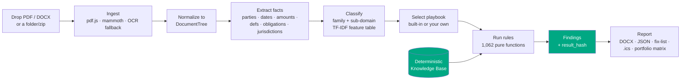
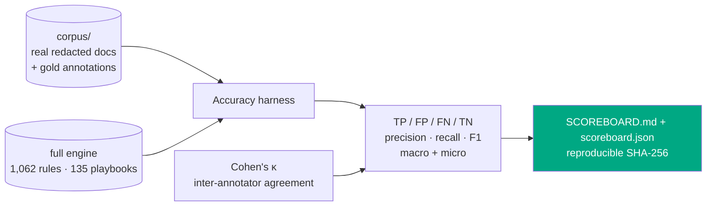
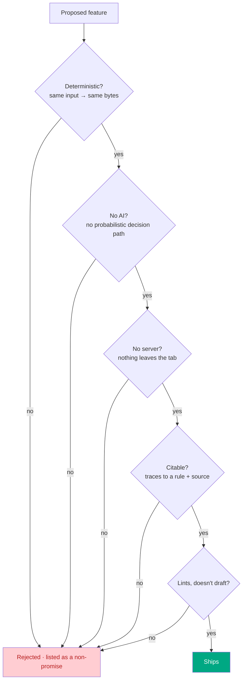
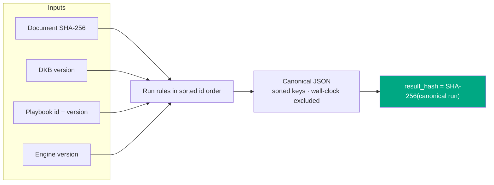
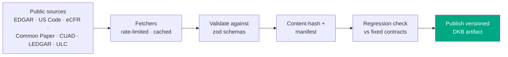

# Vaulytica

> The free, deterministic, runs-entirely-in-your-browser contract checker. A linter for legal documents. No login, no API key, no telemetry, no server. Drop in a contract, get back a Word document you can cite. That is the entire product.

**Vaulytica is the second pair of eyes you can cite.**

`1,062 deterministic rules` · `16 document sub-domains` · `35 state-law overlays` · `0 servers` · `0 AI` · `2,468 passing tests` · `v6.0.0` · `MIT`


---

## The one idea

Every other contract tool leans on a language model. The output is fluent, confident, and **different every time you run it** — a senior partner cannot sign off on it, an auditor cannot trace it, a client cannot reproduce it.

Vaulytica is the opposite. It is a **pure function**:

```
report = engine(documents, DKB, playbook)
```

Same document + same engine version + same Deterministic Knowledge Base version → **byte-identical report on any machine, at any time.** The report carries a `result_hash` so you can prove it. Every finding traces to a numbered rule and a pinned public source. Nothing leaves the browser tab — open DevTools and watch the network panel go quiet.

## How it works (end to end)



Everything in this diagram runs in the tab. The DKB is a static, versioned, content-hashed JSON artifact served alongside the page; the engine is a synchronous pure function over it.

## What it checks — rule cheat sheet

The **v1 launch set** is 112 rules across ten always-on categories that apply to any agreement:

| Category | Rules | Catches (examples) |
|---|---|---|
| Structural | 16 | missing signature block, unfilled `[placeholders]`, broken cross-refs, used-but-undefined terms |
| Risk allocation | 17 | uncapped liability, indemnity without a cap, one-way fee-shifting, missing limitation of liability |
| Choice & venue | 12 | no governing law, venue/law mismatch, out-of-state law on a CA employee, class-action waiver |
| Temporal | 12 | impossible dates, auto-renewal with a short notice window, survival silent on confidentiality/IP |
| Financial | 9 | word-vs-numeral amount mismatch, usurious late fees, currency drift |
| Termination | 9 | termination asymmetry, no effect-of-termination clause, termination tied to payment |
| IP & data | 10 | no IP ownership clause, AI/model-training rights over customer data, cross-border transfer w/o safeguard |
| Obligations | 9 | sole-discretion language, MAC clause, residuals clause swallowing confidentiality |
| Dark patterns | 9 | unilateral amendment by posting, hidden auto-renewal, browsewrap acceptance |
| Personnel | 9 | stay-or-pay/training-repayment clauses, IC misclassification signals, overlong non-solicits |

On top of that, **v3 (+220 rules)** adds compliance-grade rule sets and **v4 (+730 rules)** adds 16 specialized sub-domains. The full **1,062-rule** catalog runs live, family-gated so a plain NDA is not flagged for missing GDPR clauses.

## What the result looks like


The drop zone transforms in place into a result card: severity counts (critical / warning / informational), the matched playbook with a "why," any jurisdiction overlays for the governing-law state, and one-click exports — the **Word report** you can cite, the structured **JSON** with its `result_hash`, the **fix-list** (Markdown / CSV), the obligations ledger (CSV), and deadlines as an **`.ics` calendar**.

Every view is verified to render with **no horizontal scroll from 320 px to 1280 px** — the shot at right is the live card at a 390 px phone width. The whole flow runs in the tab; open DevTools and the network panel stays empty.

<br clear="all" />

## What each version added

| Ver | Theme | Headline | Status |
|---|---|---|---|
| v1 | Linter | 112 rules, DOCX report, `result_hash`, browser-only | shipped |
| v3 | Regulated agreements | +220 rules (HIPAA, GDPR, 8 US state privacy laws, EU SCCs, UK IDTA), cross-doc consistency, compliance matrix, citation-pinned sources | shipped |
| v4 | Every operative document | +730 rules, 16 sub-domains, multi-doc bundles (folder/zip), document classifier | shipped |
| v5 | Ground Truth | accuracy & validation harness, measured recall/precision, rule-retirement discipline | **infrastructure built** (Steps 67/69/71/83): corpus scaffolding, gold-annotation schema + Cohen's κ, `npm run accuracy` harness + reproducible scoreboard. Numbers await a human-gated real corpus + attorney annotation (Steps 68/70). |
| v6 | Workflow | version comparison · bring-your-own-playbook · findings-to-action exports · model-clause references · portfolio matrix · depth (classifier, cross-doc families, jurisdiction overlays) | **complete · 6.0.0** (Steps 87–102; only Step 98 extraction-recall deferred behind v5) |

## v6 — fit the shape of a review

v4 widened *what* Vaulytica reads. v6 makes it *useful in the workflow* — without adding a model, a server, or a probabilistic answer.

- **Version comparison** — drop a base and a revised document; get a deterministic finding-delta: *resolved / introduced / unchanged / carried-clean*, with a comparison hash. "This redline resolved 2 high-severity issues but introduced 1 critical."
- **Bring-your-own playbook** — encode your team's positions (acceptable cap multiple, required clauses, forbidden terms) as a JSON playbook validated by a public schema, loaded **client-side only**, enforced alongside or instead of the built-ins. Custom-rule findings carry `source: custom-playbook` provenance and cite your own authority. Your standard never leaves the tab.
- **Findings to action** — export the fix-list (Markdown + CSV), the obligations ledger (CSV), and the deadlines as an **`.ics` calendar** with notice windows computed deterministically (`term end − notice period`). Ambiguous dates are listed "verify manually," never guessed.
- **Model-clause references** *(Steps 95–96, new)* — for findings whose rule has an associated public model clause, the rule card points to **what good looks like**: an attributed reference into Common Paper, Bonterms, or the EU SCCs, with source URL and license. It is a reference, never a generated redline — Vaulytica still does not draft. Coverage is published honestly; only rules with a genuine reference get one.
- **Portfolio risk matrix** *(Step 97, new)* — drop a deal folder; the bundle report gains a documents × key-checks grid (liability cap · auto-renewal · governing law · data-processing terms · breach-notice clause) plus rollups ("12 of 40 lack a capped liability clause"). A `portfolio_fingerprint` extends the bundle fingerprint; a grey `N/A` cell is an honest "rule did not run," never a wrong "Risk."
- **Depth** *(Steps 99–101)* — the sub-domain classifier's feature table was re-engineered against the labeled golden corpus, lifting top-1 accuracy from **70.7% → 100%** (75/75) and resolving the four named confusions (healthcare→privacy, ip-licensing→equity, settlement→commercial, compliance→employment) — still a hand-authored, inspectable table, no model. The cross-document consistency engine grew from 7 to **10 CROSS-\* families**, adding defined-term *usage* drift, indemnity-cap stacking, and confidentiality survival-period conflicts.
- **Jurisdiction overlays** *(Step 101, new)* — for the families where state law dominates the outcome, Vaulytica now surfaces the **state-law delta** for the governing-law state the document names. A California employment agreement's non-compete is flagged **void** (Cal. Bus. & Prof. § 16600); a New York residential lease carries its **1-month deposit cap, 14-day return** rule; a Texas promissory note carries its tiered usury ceilings. A *citable reference layer* (DOCX section + `jurisdiction_overlays` in JSON + a UI block), surfaced **outside** the `EngineRun` so no existing `result_hash` changes. Honest by construction: a governing-law state with no overlay is reported as a gap, never a silent clean pass.

#### State-law overlay cheat sheet

| Family | Topic | States covered | Posture range |
|---|---|---|---|
| Employment | non-compete enforceability | CA · ND · OK · MN · CO · WA · OR · MA · VA · IL · DC · NV · TX · FL · NY (15) | void → restricted → enforced |
| Residential lease | security-deposit cap & return | CA · NY · MA · NJ · DC · TX · FL · IL · WA · OR (10) | capped → no-cap-with-rules |
| Lending | usury / interest-rate cap | CA · NY · TX · FL · IL · DE · MA · PA · WA · CO (10) | informational reference |

Overlays gate on the matched family and the **governing-law** clause only (venue and arbitration-seat do not set substantive law), and the residential-deposit overlays attach to the *residential* lease playbook only — a commercial lease is correctly excluded. See [`docs/v6/jurisdiction-overlays.md`](docs/v6/jurisdiction-overlays.md).

### Design decision: why a feature table, not a model

The classifier is a hand-authored table of title keywords, distinguishing phrases, and negative features, scored with fixed weights (title 0.3, distinguishing 0.2, negative −0.1) and a per-domain normalization ceiling. Every classification is explainable ("matched: *licensor*, *royalty*; ceiling 1.4 → 0.71") and reproducible. The Step 99 gain came from adding phrases verified to appear **only** in their target sub-domain's fixtures — so each edit strictly helps its target and cannot regress another, a property a learned model cannot guarantee. The 100% figure is corpus-measured on 75 labeled fixtures (5 per sub-domain); the added phrases are genuine legal terms of art, so the lift generalizes, but a small labeled set is not the open world — the calibration test pins the acceptance floor so a future corpus change that breaks it fails loudly.

## v5 — Ground Truth: making accuracy measured, not asserted

*Deterministic is not the same as correct.* A rule that fires identically every time can be reproducibly wrong. Every rule today passes a synthetic fixture authored by the same person who wrote the rule — a closed, self-confirming loop. v5 breaks it by measuring the engine against **real contracts it did not write**, graded by a credentialed attorney.

The **measurement machinery is built and unit-tested** (`tools/accuracy/`, run with `npm run accuracy`):



- **Reuses the real pipeline.** The harness runs the exact `ingest → extract → classify → engine` path the browser uses — a measured number reflects shipped behavior, not a test-only shortcut.
- **Honest by construction.** Gold silence on a fired rule scores as a false alarm (closed-world); a rule graded only on documents where annotators disagreed (Cohen's κ < 0.6) is flagged `unmeasured` and excluded from the headline, with the exclusion count published. Bootstrap placeholder docs never count toward a real number.
- **Reproducible.** The scoreboard is stamped `(corpus, dkb, engine)` and hashed with the same wall-clock-excluded discipline as `result_hash` — two machines produce a byte-identical scoreboard.
- **Privacy-preserved.** The corpus, annotations, and scoreboard live in `corpus/`, `tools/accuracy/`, and `docs/` — **never imported by `src/`** (a guard test asserts it), so not one byte ships in the deployed bundle. The user's document still never leaves the tab.

The committed scoreboard currently reports `status: empty` and publishes **no** precision/recall number — because there are zero real annotated documents yet. Sourcing license-clean real documents (EDGAR Ex-10 exhibits, CC0 template banks) and credentialed attorney annotation are human-gated steps that code cannot do; the harness produces a real number the moment they land. Publishing a number only when it is real is the entire point. See [`docs/v5/methodology.md`](docs/v5/methodology.md).

## The posture filter — the gate every feature passes

A feature ships only if it answers **yes** to all five. This is the moat, and it is enforced per-PR:



## Determinism — why you can cite the result



The `executed_at` timestamp is set to `""` before hashing, so the only things that move the hash are the inputs and the rule outcomes. The v6 surfaces follow the same discipline: the comparison hash is `SHA-256(base_hash + revised_hash + canonical(delta))`; the portfolio fingerprint extends the bundle fingerprint with the canonical matrix; model-clause references and jurisdiction overlays live **outside** the `EngineRun`, so adding them changed no existing `result_hash`. See [`docs/determinism.md`](docs/determinism.md).

## What I do not do

- I do not give you legal advice. I am a software tool. If something here matters, hire a lawyer.
- I do not replace your judgment. I find mechanical things consistently. The hard calls are still yours.
- I do not use AI. Not a model, not a copilot, not "powered by." A probabilistic answer cannot be cited.
- I do not draft. I lint, compare, enforce, export, and *reference* public model language with attribution. I never write your clause.
- I do not see your data. There is no server. Your contract — and any playbook you load — never leaves the tab.

## Quick start

```
git clone https://github.com/clay-good/vaulytica.git
cd vaulytica
npm install
npm run dev          # open the printed URL
```

## Build & verify

```
npm run build        # static site → dist/
npm run typecheck    # tsc --noEmit
npm run lint         # eslint
npm run test         # vitest — 2,468 tests, ~10s
npm run accuracy     # v5 Ground Truth harness → tools/accuracy/SCOREBOARD.md
```

The CI gate (`.github/workflows/deploy.yml`) runs typecheck + lint + test + build; the test matrix re-runs on Ubuntu/macOS/Windows. A commit is "green" only when all four pass.

## Project layout

```
src/
  ingest/      PDF/DOCX/paste → normalized DocumentTree (+ OCR fallback)
  extract/     parties · dates · amounts · definitions · obligations ·
               jurisdictions · cross-refs · classifier
  dkb/         Deterministic Knowledge Base types, loader, model-clauses, state-overlays
  engine/      pure rule runner + 1,062 rules + cross-document consistency
  playbooks/   built-in playbooks + bring-your-own schema/validator/interpreter
  report/      DOCX · JSON · bundle · comparison · exports · portfolio matrix
  ui/          drop zone, pipeline, six-state result machine, theme toggle
dkb/build/     offline fetchers (EDGAR, US Code, eCFR, Common Paper, …) → DKB
tools/accuracy/ v5 Ground Truth harness (corpus loader, κ, metrics, scoreboard)
corpus/        real-document accuracy corpus (build/CI-only; never in the bundle)
docs/          architecture, determinism, threat model, specs v1–v6
playbooks/     served playbook JSON; tools/ bundles the v3+v4 catalog
```

## How the DKB stays current

The Deterministic Knowledge Base is rebuilt via a GitHub Action that fetches from SEC EDGAR, the US Code, the eCFR, govinfo, Common Paper, CUAD, LEDGAR, and the ULC. Each build is content-hashed and regression-checked against fixed test contracts before publishing; a stale regulator URL disables the affected rule until a human reviews the diff rather than silently serving outdated law.



See [`docs/data-sources.md`](docs/data-sources.md) and [`docs/determinism.md`](docs/determinism.md).

## Docs

| Topic | Doc |
|---|---|
| Architecture | [`docs/architecture.md`](docs/architecture.md) |
| Determinism + result-hash | [`docs/determinism.md`](docs/determinism.md) |
| Privacy + threat model | [`docs/threat-model.md`](docs/threat-model.md) |
| Data sources | [`docs/data-sources.md`](docs/data-sources.md) |
| Adding a rule | [`docs/adding-a-rule.md`](docs/adding-a-rule.md) |
| Adding a playbook | [`docs/adding-a-playbook.md`](docs/adding-a-playbook.md) |
| v6 overview (workflow features) | [`docs/v6/README.md`](docs/v6/README.md) |
| Bring-your-own playbook (authoring) | [`docs/v6/authoring-a-playbook.md`](docs/v6/authoring-a-playbook.md) |
| Jurisdiction overlays (state law) | [`docs/v6/jurisdiction-overlays.md`](docs/v6/jurisdiction-overlays.md) |
| Accuracy methodology (v5 Ground Truth) | [`docs/v5/methodology.md`](docs/v5/methodology.md) |
| Annotation protocol (v5) | [`docs/v5/annotation-protocol.md`](docs/v5/annotation-protocol.md) |
| v4 overview + sub-domains | [`docs/v4/overview.md`](docs/v4/overview.md) |
| Specs | [`docs/spec.md`](docs/spec.md) · [`spec-v3`](docs/spec-v3.md) · [`spec-v4`](docs/spec-v4.md) · [`spec-v5`](docs/spec-v5.md) · [`spec-v6`](docs/spec-v6.md) |
| Contributing | [`CONTRIBUTING.md`](CONTRIBUTING.md) |

## What happened to the older project?

The Google Workspace & Microsoft 365 DSPM tooling has been rolled into [Mantissa Log](https://github.com/clay-good/mantissa-log) and [Mantissa Stance](https://github.com/clay-good/mantissa-stance).

## License

MIT. See [`LICENSE`](LICENSE).

## Disclaimer

Vaulytica is a software tool. It is not a lawyer, it does not give legal advice, and using it does not create an attorney-client relationship with anyone. If something here matters, hire a lawyer.
