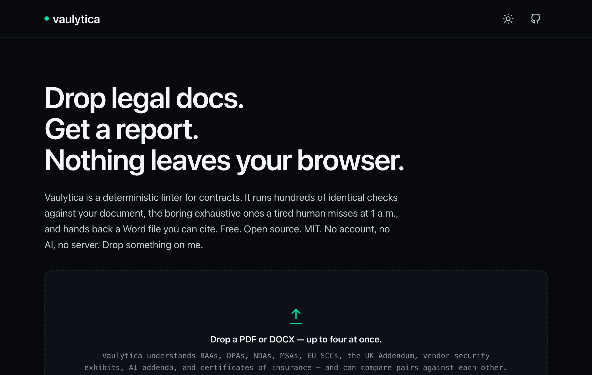

# Vaulytica

**A free contract checker that runs entirely in your browser.** Think of it as a spell-checker for legal documents.

Drop in a contract, get back a report of what looks wrong or missing. No sign-up, no upload, no AI.

👉 **Try it: [vaulytica.com](https://vaulytica.com)**



## What it does

- **Finds problems** like uncapped liability, missing signature lines, blank `[placeholders]`, broken cross-references, and risky auto-renewals.
- **Knows the document type.** An NDA, a lease, and a will each get the checks that fit them, across 260+ kinds of documents.
- **Checks a whole deal at once.** Drop a folder and it flags documents that disagree with each other, like two different governing laws.
- **Catches things before you hit send**, like leftover tracked changes, reviewer comments, and hidden text.
- **Gives you a Word report** you can share, with every finding tied to a numbered rule and, where it applies, a cited source.

## Why trust it

- **Private.** Your file never leaves your browser tab. There is no server to send it to.
- **Consistent.** The same document always gets the exact same report. There is no AI guessing.
- **Free and open source** under the MIT license.

## How to use it

1. Open [vaulytica.com](https://vaulytica.com).
2. Drag in a PDF or Word file (or a folder or `.zip`).
3. Read the results, then download the report.

## Command line

Run the same checks from a terminal (Node 22+). Reports land in the `report` folder:

```bash
git clone https://github.com/clay-good/vaulytica.git && cd vaulytica && npm install
```

```bash
npm run cli -- analyze contract.docx --format html --out report
```

Or add it to a GitHub workflow:

```yaml
- uses: clay-good/vaulytica@v9
  with:
    command: analyze
    files: contracts/
```

## Learn more

- [Full reference](docs/reference.md): every check, command, and export format
- [CI setup](docs/ci-integration.md)
- [Contributing](CONTRIBUTING.md)

## Disclaimer

Vaulytica is a software tool, not a lawyer. It does not give legal advice. If something matters, talk to a lawyer.
