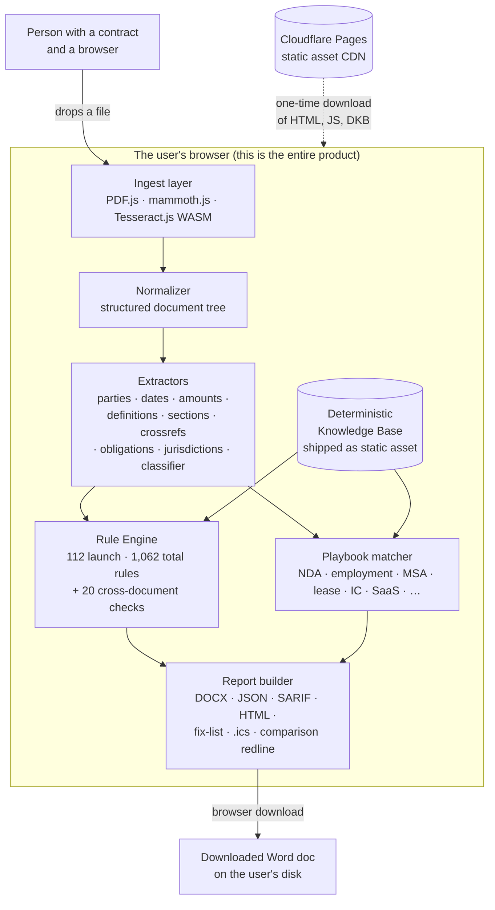

# Architecture

Vaulytica is one product split into five pipeline stages — ingest, extract, classify, run, report — plus a sixth stage (the **Deterministic Knowledge Base**, or DKB) that ships as a static data asset. Every stage runs in the user's browser. There is no backend.



## Stage 1 — Ingest ([src/ingest/](../src/ingest/))

The ingest layer turns a `File` (PDF or DOCX) or pasted text into a **normalized DocumentTree** — a tree of sections, paragraphs, and runs with stable IDs and contiguous character offsets.

| Source     | Module                              | Notes                                                                                  |
| ---------- | ----------------------------------- | -------------------------------------------------------------------------------------- |
| `.pdf`     | [`pdf.ts`](../src/ingest/pdf.ts)    | Wraps `pdfjs-dist` (legacy build). Heading detection via font-size jump heuristics.    |
| `.docx`    | [`docx.ts`](../src/ingest/docx.ts)  | Wraps `mammoth`'s `convertToHtml`; the pure `parseDocxHtml` is exposed for tests.      |
| Scanned PDF | [`ocr.ts`](../src/ingest/ocr.ts)   | Lazy-loaded `tesseract.js`. Fires only when the PDF text layer is empty and the caller opts in via `allowOcr: true`. |
| Pasted text | [`paste.ts`](../src/ingest/paste.ts)| ATX + Setext heading detection.                                                        |

Determinism contract: same bytes in → same tree out. The normalizer (`normalize.ts`) assigns stable IDs (`s1.p2.r0`) and contiguous offsets so every downstream extractor can refer to positions identically.

## Stage 2 — Extract ([src/extract/](../src/extract/))

Each extractor is a **pure function** from the `DocumentTree` (and the outputs of any earlier extractor it depends on) to its typed output. The composite `ExtractedData` is the contract the rule engine consumes.

- [`parties.ts`](../src/extract/parties.ts) — preamble + signature blocks
- [`dates.ts`](../src/extract/dates.ts) — ISO + US + prose + relative + named-anchor
- [`amounts.ts`](../src/extract/amounts.ts) — `decimal.js`-backed normalizer for `$1,500,000.00`, `USD 1.5MM`, "one million five hundred thousand," etc.
- [`definitions.ts`](../src/extract/definitions.ts) — defined terms + defined-but-unused tracking
- [`sections.ts`](../src/extract/sections.ts) — dotted-decimal / `Article I` / `§` labels
- [`crossrefs.ts`](../src/extract/crossrefs.ts) — resolves cross-references against the outline
- [`obligations.ts`](../src/extract/obligations.ts) — LEXDEMOD-style modal-verb parser
- [`jurisdictions.ts`](../src/extract/jurisdictions.ts) — governing-law / venue / arbitration-seat normalized against the DKB
- [`classifier.ts`](../src/extract/classifier.ts) — TF-IDF + pattern overlay; pure given a vocab + patterns

## Stage 3 — DKB ([src/dkb/](../src/dkb/), [dkb/dist/](../dkb/dist/))

The DKB is a versioned bundle of seven JSON files shipped at `/dkb/<version>/`:

```
dkb-manifest.json            # versions, build date, file hashes
dkb-clauses.json             # standard clause library
dkb-jurisdictions.json       # jurisdiction reference
dkb-definitions.json         # definition templates
dkb-dark-patterns.json       # dark-pattern catalog
dkb-statutes.json            # statutory citation index
dkb-classifier-vocab.json    # TF-IDF vocabulary
dkb-classifier-patterns.json # regex overrides
```

`loadDkb()` fetches the manifest, then the files, validates every one against [`schema.ts`](../src/dkb/schema.ts), and caches the aggregate in IndexedDB keyed by `manifest.version`. The DKB is rebuilt weekly by [.github/workflows/dkb-rebuild.yml](../.github/workflows/dkb-rebuild.yml); see [data-sources.md](data-sources.md) for the source catalog and [`dkb/build/`](../dkb/build/) for the pipeline.

## Stage 4 — Playbook matcher ([src/playbooks/](../src/playbooks/))

Given the extracted data + the document title, [`matchPlaybook`](../src/playbooks/matcher.ts) scores the document against every playbook's `match_features` (title keywords, required clauses, distinguishing phrases, negative features) and returns the highest-scoring playbook plus a human-readable `reasoning` string. The 12 launch playbooks live as JSON under [`playbooks/`](../playbooks/). If nothing scores above the threshold, `generic-fallback` runs only structural + basic-financial + temporal + dark-pattern rules.

## Stage 5 — Rule engine ([src/engine/](../src/engine/))

The engine is a deterministic executor over a sorted list of `Rule`s. Each `Rule` is `(ctx: RuleContext) => Finding | null`, pure — no time, no randomness, no network, no environment. The runner:

1. Sorts rules lexicographically by id.
2. Applies playbook `rule_overrides` (`skip: true`, `severity: …`).
3. Executes each rule in isolation, capturing execution-log entries for the audit trail.
4. Sorts findings by `(severity, rule_id, document_position)`.
5. Computes a `result_hash` (SHA-256 over the canonicalized `EngineRun` JSON with `result_hash` + `executed_at` blanked).

That hash is the determinism contract. See [determinism.md](determinism.md).

## Stage 6 — Report builder ([src/report/](../src/report/))

The report layer renders one deterministic `EngineRun` into many formats, each a pure function of the run (so each reproduces byte-for-byte):

- **DOCX** (`buildDocxReport`) — cover + proof fields, executive summary, findings (Critical → Warning → Info), obligations ledger, extracted-data appendix, audit trail with full bibliography, verbatim disclaimer block.
- **JSON** (`buildJsonReport`) — the full `EngineRun` plus provenance, model-clause references, jurisdiction overlays, and `clause_evidence` (the surfaces outside the run, so they never move `result_hash`).
- **SARIF 2.1.0** (`buildSarif`) for code-scanning / PR annotation, and a **single-file, script-free HTML report** (`buildHtmlReport`) that prints clean to PDF.
- **Findings-to-action exports** (`exports.ts`) — the fix-list (Markdown / CSV), the obligations ledger (CSV), and deadlines as an **`.ics`** calendar.
- **Bundle / portfolio** (`bundle.ts`, `portfolio.ts`) — the multi-document consolidated report, the documents × key-checks matrix, and the "everything" archive.
- **Version comparison** (`compare.ts`, `compare-docx.ts`) — the finding delta of two runs *plus* the **clause-level redline** (`clause-diff.ts`): a paragraph-level LCS text diff with an inline word-level redline of every rewritten clause, all outside the comparison `result_hash`.

Every citation is rendered by the shared `citations.ts` formatter, so a finding's pinned source resolves identically in every format (a cross-format completeness test enforces it).

## Headless surface ([tools/cli/](../tools/cli/))

The same engine runs outside the browser via a Node API + CLI, proven **byte-identical** to the tab by `parity.test.ts` (the CLI composes `src/` ingest with the parity-proven `runIngested`). One dispatcher exposes four commands: `analyze` (run the engine in CI / a folder sweep, `--fail-on` gating), `diff` (structural diff of two custom playbooks), `compare` (version-compare two documents + emit the redline, a CI redline gate), and `verify` (re-derive a saved `result_hash`). The DKB ships with the tool, so it opens **no socket** — "nothing leaves your machine" holds headless too. `tools/` is build/CI-only and never imported by `src/` (a guard test asserts the direction).

## UI ([src/ui/](../src/ui/), [site/](../site/))

The marketing site and the tool are the **same DOM**. The drop zone transforms in place through six view-states — empty → analyzing → complete, plus comparison-complete, bundle-complete, and error — each verified to render with no horizontal scroll from 320 px to 1280 px (a responsiveness test pins `scrollWidth ≤ clientWidth`). The whole UI is wired by [`main.ts`](../src/ui/main.ts), which boots the dropzone, theme toggle, service-worker registration, and the pipeline. The service worker ([`sw.js`](../site/sw.js)) precaches HTML + assets and serves the DKB stale-while-revalidate so the app works offline.

## Deploy ([.github/workflows/deploy.yml](../.github/workflows/deploy.yml))

Push to `main` → lint + typecheck + test → Vite build → `cloudflare/wrangler-action@v3 pages deploy dist` → Playwright smoke test against `https://vaulytica.com`. Static security headers (strict CSP with no external `connect-src`, Permissions-Policy denying hardware APIs, HSTS, etc.) live in [`vite.config.ts`](../vite.config.ts) and ship as `dist/_headers`.
