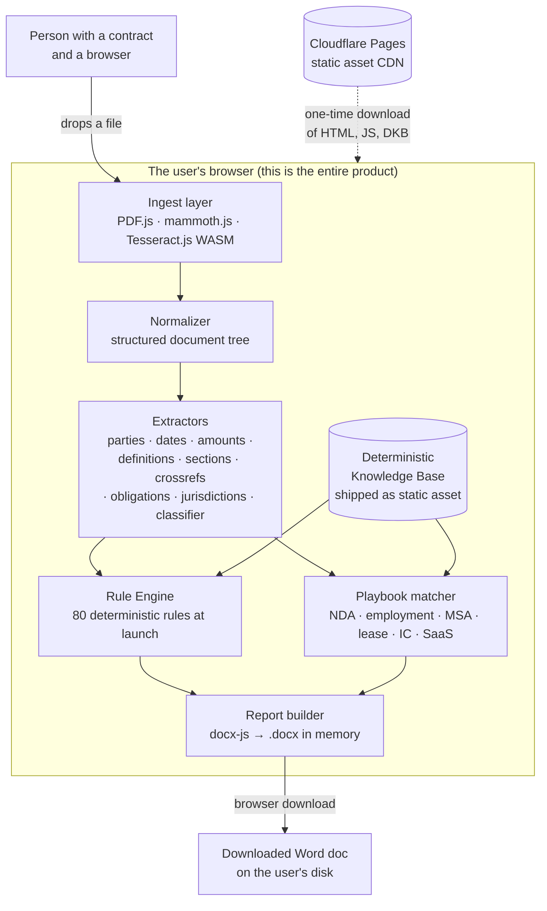
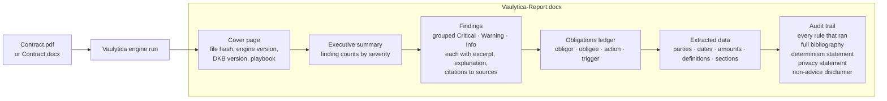

# Vaulytica — Build Specification v2

> The free, deterministic, runs-entirely-in-your-browser contract checker. A linter for legal documents. No login, no API key, no telemetry, no server. Drop in a contract, get back a Word document you can cite. That is the entire product.

> v2 supersedes v1. Read v2 alone. Everything that was vague in v1 is now concrete: real source URLs, real fetch protocols, real licenses, real schemas, real rule definitions with citations, and Claude Code prompts long enough to act on without ambiguity.

---

## Table of Contents

Part I — Product and brand
1. Product North Star
2. Why deterministic-only
3. Brand, voice, and the "cuteness aggression" rule
4. Format decisions (input and output)

Part II — Architecture
5. System architecture diagram
6. Repository layout
7. Performance budgets and offline behavior
8. Accessibility
9. Privacy posture and the threat model
10. Legal disclaimers

Part III — The Deterministic Knowledge Base
11. DKB philosophy and shape
12. Source catalog with full URLs, licenses, fetch protocols, and parsing notes
13. The classifier corpus (CUAD + LEDGAR + Common Paper)
14. DKB schema, versioning, and validation
15. The DKB build pipeline (concrete pseudo-code)

Part IV — The Engine
16. Extractors — what they pull from the document tree
17. Rule engine design and determinism guarantees
18. The Rule Catalog — 80 rules at v1 launch with full definitions
19. Playbook system
20. The 12 launch playbooks

Part V — The Report and the UI
21. Citation and audit-trail anatomy
22. The DOCX report structure (page by page)
23. The single-page UI

Part VI — Build
24. SEO, schema.org, and discoverability
25. The static marketing site copy (the actual words)
26. The seventeen-step build plan with full Claude Code prompts
27. Launch checklist
28. Roadmap and explicit non-goals
29. License, contribution, and governance

Appendices
A. Mermaid diagrams (architecture, report anatomy, pipeline)
B. Full DKB JSON-schema sketch
C. Full rule JSON-schema sketch
D. The minimum-viable corpus list (real contracts to test against)
E. Glossary

---

# Part I — Product and brand

## 1. Product North Star

Vaulytica is a single static webpage at vaulytica.com. An attorney, a solo founder, a small-business owner, or a person staring at a lease drops a contract onto the page. The page runs hundreds of deterministic checks entirely inside their browser. Within a few seconds it hands back a Word document with the issues annotated, the missing clauses listed, the dollar figures and dates extracted, the obligations indexed, and an audit trail at the end that names every rule, every data source, and every dataset version that produced the result.

Nothing about the contract ever leaves the device. There is no account. There is no upload. There is no API key. There is no upgrade. The product is finished when you close the tab.

The single sentence we are willing to be quoted on is this: **Vaulytica is the second pair of eyes you can cite.**

This is not "AI contract review." It is the opposite. Where AI review gives a different, persuasive, sometimes-wrong answer every time, Vaulytica gives the same answer every time, and you can point to the rule that produced it. That is the only thing in this category that a senior partner can actually sign off on, that an auditor can trace, that a client can reproduce, and that opposing counsel cannot wave away as model hallucination. That is the wedge.

## 2. Why deterministic-only

Every other free or paid contract tool in 2026 leans on a language model. The pitch is always the same: paste your contract, the AI summarizes, the AI flags risks, the AI suggests redlines. The output is fluent and confident and changes if you run it twice. A junior associate can use it for research. A senior associate cannot sign off on it. An auditor cannot trace it. A client cannot reproduce it. The output is, by construction, uncitable.

Vaulytica is for the work the AI tools cannot do: exhaustive, identical, citable checking. The professional failure mode in contract review is not "I did not understand the indemnity clause." It is "I read eighty pages at midnight and missed that the auto-renewal triggers sixty days before expiry rather than thirty." A deterministic rule engine catches that failure mode in a way a chatbot fundamentally cannot, because the rule engine is exhaustive and reproducible and the chatbot is neither.

Three downstream consequences follow from this choice, and they are all good.

The first is technical. With no model in the loop, there is no API key, no rate limit, no cost per analysis, no provider lock-in, no telemetry to argue about. The product runs on a static site served from Cloudflare Pages, costs ten dollars per year for the domain, and has no marginal cost per user. A million people can use it on a Tuesday and the bill does not change.

The second is positional. Every legal-tech company is racing to bolt AI onto contract review. A free open tool that pointedly does not use AI and instead does the boring exhaustive checking work better than anyone is a sharper wedge than another AI tool would be. It is the thing the paid AI tools all need but do not have, because their entire pitch depends on the model being the value.

The third is rhetorical. The privacy story is unfakeable. "Nothing leaves your browser" is true because there is no server to receive anything. Network tab open, see for yourself. This is the single most important sentence in legal-tech marketing in 2026 and most companies cannot honestly say it.

## 3. Brand, voice, and the "cuteness aggression" rule

The name is Vaulytica. The wordmark is `vaulytica` in lowercase, set in a confident sans-serif (Inter, Geist, or system-ui). The single accent color is mint, drawing from the broader family of public utilities you have shipped: `#00E5A8` in dark mode, `#00A883` in light mode. The background is near-black in dark mode (`#07090D`) and a warm cream in light mode (`#FAF8F3`). Dark is the default. The light mode has a parchment cast rather than office white because the audience is people who read paper for a living.

The voice is what you called "cuteness aggression." That phrase means: the product is warm and visibly cares about the user, but it is not soft about what it does or who it is for. It is allowed to be funny. It is not allowed to be cute about the law itself. The contract review is serious. The page around the contract review is delightful.

Concrete voice rules. The product never says "AI" because it is not AI. It says "rules," "checks," "the linter," or "the engine." When the topic of AI comes up at all, the product is direct: a probabilistic answer cannot be cited; this can. The product never says "we" in a way that suggests an organization with employees. It is open source, MIT, run by a person. The voice is first-person-singular-but-modest. "I built this," not "our team." The product never asks for an email, never says "sign up," never says "free trial." There is no trial. There is only the product. The product is allowed to be witty in the marketing copy and in the empty-state messages, but the report output is dry and forensic. Wit in the report is unprofessional; dryness in the marketing is forgettable. The product is honest about its limits in plain language. "This is not legal advice" appears once in the footer, once at the top of every report, and is written like a person wrote it.

## 4. Format decisions

The input is PDF or DOCX, with DOCX preferred when both are available. DOCX wins on parseability because it is already structured XML; parties, headings, and definitions can be extracted from the document tree directly. PDF requires text-layer extraction, which is fine for digitally generated PDFs but unreliable for scans. We accept both, and we run OCR locally via Tesseract.js (WASM) if the PDF has no text layer. The decision to run OCR is automatic, not a setting. If we cannot get usable text out of the document, we say so plainly in the UI and refuse to produce a misleading report.

We also accept paste-as-text for the case where the user has copy-pasted from elsewhere. That input path has its own caveats and we surface them in the UI ("pasted text loses structure; some rules will be skipped").

We do not accept legacy .doc files. We refuse them with a one-sentence message: "Open it in Word or Google Docs and save it as .docx, then come back." We do not accept images directly; if you want OCR of a phone photo of a contract, that is a different product.

The output is a Microsoft Word document, always. The choice is deliberate. The attorney workflow downstream of Vaulytica is to put the report into something they can edit, mark up, send to a client, paste sections of into an email, or import into Drive, SharePoint, or iManage. Word is the universal substrate. PDFs are dead ends for that workflow. The DOCX is generated entirely in the browser using the open-source `docx` JavaScript package, which runs fine client-side via the bundler. No server. The file is created in memory and offered as a download. We optionally also offer a JSON export of the same data, for users who want to script around it. The JSON is the structured truth; the DOCX is the readable presentation. We do not offer PDF. If the user wants a PDF, they print the DOCX. Adding a PDF generator triples the bundle size for a use case we do not need to serve.

---

# Part II — Architecture

## 5. System architecture diagram

The architecture is intentionally trivial: there is one box, and it is the user's browser. Everything else is a static asset CDN.

The architecture diagram and the report-anatomy diagram in Mermaid form are in Appendix A.

## 6. Repository layout

```
vaulytica/
├── README.md                   # public README
├── LICENSE                     # MIT
├── CODE_OF_CONDUCT.md
├── CONTRIBUTING.md             # how to add rules, fix bugs, propose playbooks
├── CHANGELOG.md
├── DISCLAIMER.md
├── SECURITY.md
├── site/
│   ├── index.html              # entire marketing + tool page
│   ├── og-image.svg
│   ├── favicon.svg
│   ├── manifest.webmanifest
│   ├── sw.js                   # service worker
│   └── styles.css              # may be inlined into index.html
├── src/
│   ├── ingest/
│   │   ├── pdf.ts
│   │   ├── docx.ts
│   │   ├── ocr.ts
│   │   ├── paste.ts
│   │   ├── normalize.ts
│   │   └── types.ts
│   ├── extract/
│   │   ├── parties.ts
│   │   ├── dates.ts
│   │   ├── amounts.ts
│   │   ├── definitions.ts
│   │   ├── sections.ts
│   │   ├── crossrefs.ts
│   │   ├── obligations.ts
│   │   ├── jurisdictions.ts
│   │   └── classifier.ts       # deterministic clause classifier (TF-IDF + rule patterns)
│   ├── engine/
│   │   ├── runner.ts
│   │   ├── finding.ts
│   │   ├── ordering.ts         # deterministic rule ordering
│   │   └── rules/
│   │       ├── structural/     # 12 rules
│   │       ├── financial/      # 8 rules
│   │       ├── temporal/       # 10 rules
│   │       ├── obligations/    # 6 rules
│   │       ├── risk-allocation/# 14 rules
│   │       ├── choice-and-venue/# 8 rules
│   │       ├── termination/    # 8 rules
│   │       ├── ip-and-data/    # 6 rules
│   │       ├── personnel/      # 4 rules
│   │       └── dark-patterns/  # 4 rules (expandable)
│   ├── playbooks/
│   │   ├── matcher.ts
│   │   └── types.ts
│   ├── dkb/
│   │   ├── loader.ts
│   │   ├── schema.ts
│   │   ├── types.ts
│   │   └── version.ts
│   ├── report/
│   │   ├── docx.ts
│   │   ├── json.ts
│   │   ├── citations.ts
│   │   └── bibliography.ts
│   ├── ui/
│   │   ├── dropzone.ts
│   │   ├── ticker.ts
│   │   ├── progress.ts
│   │   ├── theme.ts
│   │   └── main.ts
│   └── index.ts
├── playbooks/
│   ├── mutual-nda.json
│   ├── unilateral-nda.json
│   ├── employment-at-will-us.json
│   ├── independent-contractor.json
│   ├── saas-customer.json
│   ├── saas-vendor.json
│   ├── msa-general.json
│   ├── sow.json
│   ├── lease-commercial-multitenant.json
│   ├── lease-residential-us.json
│   ├── consulting-agreement.json
│   └── generic-fallback.json
├── dkb/
│   ├── build/
│   │   ├── sources.yaml        # the authoritative source list
│   │   ├── build.ts
│   │   ├── classifiers/
│   │   │   ├── tfidf.ts
│   │   │   └── patterns.ts
│   │   ├── fetchers/
│   │   │   ├── edgar.ts
│   │   │   ├── uscode.ts
│   │   │   ├── ecfr.ts
│   │   │   ├── govinfo.ts
│   │   │   ├── commonpaper.ts
│   │   │   ├── cuad.ts
│   │   │   ├── ledgar.ts
│   │   │   └── ulc.ts
│   │   └── golden/             # golden-output regression fixtures
│   └── dist/                   # built DKB artifacts (gitignored or LFS)
├── tests/
│   ├── unit/
│   ├── integration/
│   ├── fixtures/
│   │   ├── contracts/          # synthetic + redacted real contracts
│   │   └── expected/           # expected EngineRun outputs for each fixture
│   └── e2e/                    # Playwright tests
├── .github/
│   └── workflows/
│       ├── ci.yml
│       ├── dkb-rebuild.yml
│       └── deploy.yml
├── docs/
│   ├── architecture.md
│   ├── adding-a-rule.md
│   ├── adding-a-playbook.md
│   ├── data-sources.md
│   ├── threat-model.md
│   └── determinism.md
├── tsconfig.json
├── vite.config.ts
├── vitest.config.ts
├── .eslintrc.cjs
├── .prettierrc
├── .nvmrc
└── package.json
```

## 7. Performance budgets and offline behavior

The page should be interactive on a mid-range Android device within two seconds on a cold load over 4G. The DKB downloads in the background after first paint. The first-time experience for a user who drops a file before the DKB arrives is a small "preparing the rule data…" progress indicator that resolves cleanly. After the first visit, both the page and the DKB are cached aggressively. The page is small enough that it can be a fully working Progressive Web App, and it should be: a service worker caches all assets, the page is installable to the home screen on mobile, and the entire product works fully offline once installed. The "offline-first PWA" angle is also a marketing point worth making once: works on a plane, works in a SCIF, works at a client site with no Wi-Fi.

Concrete performance budgets. Time to first paint under 800 ms. Time to interactive under 2 s on 4G mid-tier mobile. Main JS bundle compressed under 250 KB. DKB compressed under 20 MB and lazy-loaded after first paint. OCR engine compressed under 8 MB and lazy-loaded only when a scanned PDF triggers it. Lighthouse score 95+ on every category.

## 8. Accessibility

The product is for everyone, including pro se users and small business owners, which means accessibility is not optional. The target is WCAG 2.2 AA. Concretely: keyboard navigation throughout, including the drop zone (Enter or Space to open file picker), ARIA labels on every interactive element, focus-visible states with strong contrast, screen reader announcements for analysis progress and completion, color never the sole carrier of meaning (severity is also indicated by text labels and icons), all text contrast ratios at least 4.5:1, `prefers-reduced-motion` respected for every animation, and the DOCX output itself accessible (proper heading hierarchy, alt text on any embedded images, clean table semantics).

## 9. Privacy posture and the threat model

The privacy claim is: nothing about the user's contract ever leaves the device. This claim is true because there is no server to receive anything. The user can verify it themselves at any time. Open browser DevTools, open the Network tab, drop a contract, confirm zero requests during analysis.

The site makes verification a first-class affordance: a small "Verify privacy" link in the footer pops a one-paragraph instruction on how to confirm in DevTools.

We do not run analytics. Not Plausible, not Fathom, not Google Analytics, not Cloudflare Web Analytics. Zero. The claim is "no telemetry" and it must be literal. We do not embed third-party scripts. Not fonts from Google Fonts (use system fonts or self-host), not icons from CDNs, not error reporting. Every byte the browser fetches comes from `vaulytica.com`. The privacy posture is documented in `docs/threat-model.md` in the repo, which explains explicitly what the threat model is and is not, what we protect against (network exfiltration, server-side breach, vendor-side mining), and what we don't (we don't protect against a compromised browser; we don't protect against the user themselves sharing the report; we don't protect against the user installing a malicious extension).

## 10. Legal disclaimers

A contract-review tool that produces a report that looks like legal analysis needs a clear, repeated, non-buried disclaimer that it is not legal advice. Three places: site footer, top of every report, and the FAQ. Each says the same thing in plain language:

> Vaulytica is a software tool. It is not a lawyer, it does not give legal advice, and using it does not create an attorney-client relationship with anyone. If something here matters, hire a lawyer.

A separate paragraph addresses the bar-rules issue for attorneys using the tool:

> If you are a licensed attorney, this tool produces a checklist of mechanical findings. Whether to act on any finding is your professional judgment. Vaulytica is not a "service" for unauthorized-practice-of-law purposes; it is a static reference document about a contract you provided to it.

We do not attempt to be exhaustive or legally defensive in the disclaimer. We attempt to be honest.

---

# Part III — The Deterministic Knowledge Base

## 11. DKB philosophy and shape

The DKB is the data the rule engine and the playbook matcher need to do their job without an LLM. It is the moat of this project. Anyone can write a rule engine; very few people will assemble and maintain a clean, citable corpus of legal reference material. The DKB is what gets updated weekly while the UI stays still.

The DKB ships as a static asset of the site, bundled into compressed JSON files. The browser downloads it once and caches it indefinitely with a version tag. The DKB contains five top-level collections.

The first is the standard clause library. Categorized representative clauses with normalized clean text, source attribution, tagged metadata (clause type, jurisdiction-specificity, deal-type-specificity, "favorable to which side"), and the position the clause takes (restrictive, mutual, permissive). Sourced from CUAD, LEDGAR, Common Paper, and curated SEC EDGAR exhibits.

The second is the jurisdiction reference. For each US state plus DC, plus Delaware as a peer "jurisdiction" given its choice-of-law dominance, plus England & Wales and New York as common foreign and domestic choices: court structure, primary venue choices, choice-of-law statute citation, statute of frauds citation, electronic signature law (UETA vs. ESIGN vs. state-specific like New York's ESRA), arbitration-act citation, non-compete enforceability bucket, and statute of limitations defaults for contract claims.

The third is the definition templates. Common contractual defined terms ("Affiliate," "Confidential Information," "Material Adverse Effect," "Force Majeure Event," "Permitted Transferee," "Change of Control") with restrictive, balanced, and permissive variants. The presence and choice of variant in a contract is one of the highest-signal features for both the classifier and the rules.

The fourth is the dark-pattern catalog. Curated list of clause patterns the engine flags as risk, each with: the pattern (text or structural), a plain-language explanation, the harm pattern, and at least one citable authority (FTC guidance, FRCP rules, ABA model rule numbers, state bar opinions in the public domain).

The fifth is the statutory citation index. A compact index of the statutory citations the rules reference, with the citation, the canonical URL at `uscode.house.gov`, `ecfr.gov`, or the relevant state legislature, and a short excerpt of the operative text. This is what the report bibliography pulls from.

Every entry in every collection records its `source_url`, `retrieved_at` (ISO 8601), `source_published_at` (when known), `license` (SPDX-style identifier or named license), and a stable `id`. No fabricated citations, ever. If a fact does not have a free, public, retrievable source, it does not go in the DKB.

## 12. Source catalog

This is the authoritative source list. Every URL has been verified as of the spec drafting. The DKB build pipeline reads this catalog from `dkb/build/sources.yaml` and uses it for fetching, parsing, and license attribution.

### 12.1 SEC EDGAR — exhibits as real-world clause corpus

EDGAR is the SEC's filing system. Every public US company files material contracts as Exhibit 10 attachments to their Form 10-K, 10-Q, 8-K, and S-1 filings. These exhibits are real, in-the-wild contracts that public companies considered material — meaning they are exactly the kind of contracts Vaulytica's users encounter or aspire to. They are works of US government records by virtue of being filed and disseminated by a federal agency, and the filings themselves are public-record material; the underlying contracts are works of the filers, but their reproduction within SEC filings is uncontroversially permitted.

The fetch endpoints are official, free, and require no API key, just a polite User-Agent.

The full-text search endpoint is `https://efts.sec.gov/LATEST/search-index` with POST or GET parameters; results are JSON. The endpoint indexes every filing since 2001 including all exhibits. A query like `q="indemnification"&forms=10-K&dateRange=custom&startdt=2024-01-01&enddt=2024-12-31` returns matching filings with metadata pointing at the raw exhibit URLs on `www.sec.gov/Archives/edgar/data/...`.

The submissions endpoint is `https://data.sec.gov/submissions/CIK{10-digit-padded}.json`, which returns every filing for a given CIK. Filings of interest include 10-K (annual), 10-Q (quarterly), 8-K (current events), and S-1 (registration). The accompanying documents listing for each filing names every attachment; `EX-10.*` types are the material contracts.

Rate limit: 10 requests per second total across all EDGAR endpoints. The User-Agent header is mandatory and must identify the requester: `Vaulytica DKB Builder (vaulytica.com) <maintainer-email>`. Exceeding the rate limit triggers a temporary IP block. The build pipeline uses 150ms delays between requests and exponential backoff on errors.

License framing: SEC filings are US government records of private submissions. The filings as published are in the public domain as government works of dissemination. We use them for clause-pattern extraction with attribution to the filer and the filing accession number. Every quoted clause in the DKB records the source filing's accession number and the URL.

For initial corpus building, the strategy is to sample approximately 5,000 EX-10 attachments stratified by industry SIC code and filing year (2020–2025), classified by clause type using the TF-IDF + pattern classifier described in §13, with the modal language for each clause type promoted to the standard clause library.

### 12.2 Office of Law Revision Counsel — official US Code in USLM XML

The official US Code is published by the House Office of the Law Revision Counsel at `https://uscode.house.gov/download/download.shtml`. Bulk downloads are available as USLM XML (the United States Legislative Markup schema), XHTML, PCC, and PDF. Each of the 53 titles is a separate file, and a full-corpus ZIP is also available. The USLM schema is documented at `https://xml.house.gov/` with full XSD and stylesheets.

Titles relevant to Vaulytica are: Title 9 (Arbitration; the Federal Arbitration Act), Title 11 (Bankruptcy, for the few bankruptcy-relevant clauses), Title 15 (Commerce and Trade, including the Magnuson-Moss Warranty Act and the Robinson-Patman Act), Title 17 (Copyright), Title 18 §§ 1831–1839 (Defend Trade Secrets Act, EEA), Title 28 (Judiciary and Judicial Procedure, including 28 USC § 1391 venue rules), Title 35 (Patents), and Title 41 (Public Contracts).

License framing: the US Code is a work of the United States Government and not subject to copyright in the United States (17 USC § 105). Free to reproduce and redistribute.

Fetch pattern: HTTP GET against `https://uscode.house.gov/download/releasepoints/us/pl/...` for specific release points, or against the title-level URLs (e.g., `https://uscode.house.gov/download/annualhistoricalarchives/XHTML/2024/usc09.zip` for Title 9 in 2024). The build pipeline parses USLM XML using a typed parser; each section becomes a record with citation, heading, and operative text.

### 12.3 govinfo.gov — primary government records

govinfo.gov is the official online portal for US Government Publishing Office content. Bulk data at `https://www.govinfo.gov/bulkdata/` includes the Code of Federal Regulations (CFR), the Electronic CFR (eCFR), the Federal Register (FR), Public and Private Laws (PLAW), and Statute Compilations (COMPS) — all in XML, mostly USLM. The API at `https://api.govinfo.gov/` requires a `api.data.gov` key (free, unlimited for reasonable use); bulk data requires no key.

For Vaulytica, the relevant feeds are CFR Title 16 (FTC regulations including unfair-and-deceptive-practices guidance), CFR Title 17 (CFTC), Public Laws (when statutes referenced by rules are amended), and Statute Compilations.

License framing: works of the US government, no copyright (17 USC § 105). Free to reproduce.

Fetch pattern: HTTP GET against bulk-data URLs returning ZIP archives of XML files, parsed with the same USLM parser as the US Code.

### 12.4 ecfr.gov — Electronic Code of Federal Regulations

ecfr.gov provides the eCFR via a clean JSON REST API at `https://www.ecfr.gov/api/versioner/v1/`, no key required. The API exposes endpoints for: full structure (`/full/{date}/title-{n}.xml`), section text (`/structure/{date}/title-{n}.json`), and versioning history. CORS is enabled, so the API works from the browser if ever needed — but Vaulytica's DKB ingests eCFR only at build time, not at runtime.

For Vaulytica, the relevant titles are Title 12 (Banks and Banking, for the Truth-in-Lending and Equal Credit Opportunity references), Title 16 (Commercial Practices, FTC), Title 17 (Commodity and Securities Exchanges), Title 26 (IRS), Title 29 (Labor, including FLSA and OSHA references in employment contracts), and Title 45 (Public Welfare, including HIPAA).

License framing: works of the US government, no copyright (17 USC § 105). Free to reproduce.

### 12.5 federalregister.gov — Federal Register API

federalregister.gov provides Federal Register documents via a no-key REST API at `https://www.federalregister.gov/api/v1/`. Useful for tracking when CFR sections were last amended and for surfacing regulatory guidance that affects contract drafting (FTC guidance on negative-option marketing, for example).

License framing: same as govinfo and ecfr — works of the US government.

### 12.6 The Contract Understanding Atticus Dataset (CUAD)

CUAD is the seminal expert-annotated NLP dataset for legal contract review, produced by The Atticus Project. The dataset contains 510 commercial legal contracts pulled from EDGAR with 13,000+ expert annotations spanning 41 categories of important clauses lawyers look for in contract review. Published at `https://www.atticusprojectai.org/cuad`, mirrored at Zenodo (`https://zenodo.org/records/4595826`), on Hugging Face (`https://huggingface.co/datasets/theatticusproject/cuad-qa`), and on GitHub (`https://github.com/TheAtticusProject/cuad`). License: CC BY 4.0.

For Vaulytica, CUAD provides the training data for the deterministic clause classifier (§13) and the labeled examples for each of 41 clause categories. The 41 categories include: Document Name, Parties, Agreement Date, Effective Date, Expiration Date, Renewal Term, Notice Period to Terminate Renewal, Governing Law, Most Favored Nation, Non-Compete, Exclusivity, No-Solicit Of Customers, Competitive Restriction Exception, No-Solicit Of Employees, Non-Disparagement, Termination For Convenience, Rofr/Rofo/Rofn, Change Of Control, Anti-Assignment, Revenue/Profit Sharing, Price Restrictions, Minimum Commitment, Volume Restriction, IP Ownership Assignment, Joint IP Ownership, License Grant, Non-Transferable License, Affiliate License-Licensor, Affiliate License-Licensee, Unlimited/All-You-Can-Eat-License, Irrevocable Or Perpetual License, Source Code Escrow, Post-Termination Services, Audit Rights, Uncapped Liability, Cap On Liability, Liquidated Damages, Warranty Duration, Insurance, Covenant Not To Sue, and Third Party Beneficiary.

Fetch pattern: clone the Hugging Face dataset or download the Zenodo ZIP at build time. Cache locally in the build environment.

### 12.7 LEDGAR

LEDGAR is a large-scale multi-label corpus of legal provisions in contracts, scraped from EDGAR with 80,000+ provisions across 100 clause categories. Released by ZHAW Centre for Artificial Intelligence under CC BY 4.0. Available on Hugging Face as part of LexGLUE (`https://huggingface.co/datasets/coastalcph/lex_glue`, subset `ledgar`) and at the source paper (`https://aclanthology.org/2020.lrec-1.155/`).

For Vaulytica, LEDGAR provides the broader training set for the TF-IDF classifier (combined with CUAD), with the 100 LEDGAR categories serving as the primary clause taxonomy. LEDGAR categories overlap significantly with CUAD but are more granular (e.g., LEDGAR distinguishes "Amendments," "Notices," "Definitions," "Counterparts," "Severability," "Waivers," and "Entire Agreement," all of which CUAD groups under structural categories).

### 12.8 Common Paper

Common Paper publishes standard, expertly drafted contract templates released under CC BY 4.0 at `https://commonpaper.com/standards/` and mirrored on GitHub at `https://github.com/CommonPaper`. The current set covers: Mutual NDA, One-Way NDA, Cloud Service Agreement (SaaS), Cloud Service Standard Terms (the "framework terms" model), Software License Agreement, Professional Services Agreement, Statement of Work, Data Processing Agreement, Business Associate Agreement (HIPAA), AI Addendum, Partnership Agreement, Service Level Agreement, and a Modifications library of pre-written clause amendments.

For Vaulytica, Common Paper provides the canonical, balanced reference clauses for each major contract type. Each playbook in §20 references Common Paper clauses as the "balanced default" benchmark.

Fetch pattern: clone the relevant repositories from `github.com/CommonPaper/*` at build time, parse the markdown or DOCX source, and extract clause text. Attribution per CC BY 4.0 is preserved in every DKB entry and every report bibliography.

### 12.9 Uniform Law Commission — uniform acts

The Uniform Law Commission (ULC) drafts uniform state laws at `https://www.uniformlaws.org/`. The final approved text of each uniform act is published as a PDF on the ULC site and is freely available. The acts of interest for Vaulytica are: Uniform Electronic Transactions Act (UETA), Uniform Commercial Code (UCC) — particularly Articles 1, 2 (sales), 2A (leases), and 9 (secured transactions) — Uniform Trade Secrets Act (UTSA), Uniform Computer Information Transactions Act (UCITA — relevant to a small number of jurisdictions), Revised Uniform Fiduciary Access to Digital Assets Act (RUFADAA), and Uniform Partnership Act (UPA).

License framing: ULC publishes the final acts on its website for free download and broad reuse. The ULC site footer states acts are made available for general use. For the DKB, we redistribute citations and short excerpts (one or two sentences for context) under fair-use principles consistent with the ULC's stated openness; we link rather than mirror full texts. The actual enforceable text in any given state is the state's enacted version, which may differ from the uniform act, and which is in the public domain as a state statute.

### 12.10 The awesome-legal repository

`https://github.com/ankane/awesome-legal` is a community-maintained CC0 list of public, free legal templates. It collates GitHub Inc.'s Balanced Employee IP Agreement, Basecamp's policies, Y Combinator's open templates (SAFEs under CC BY-ND 4.0), Orrick and Cooley's published employee offer letters, and Founder Institute's FAST agreement. For Vaulytica, this is a useful curated set of additional reference templates to compare against Common Paper for cross-validation of "what does the market actually use."

### 12.11 Open-Agreements

`https://github.com/open-agreements/open-agreements` builds on Common Paper, Bonterms, and OpenAgreements-authored templates, releasing them as fillable DOCX files. MIT-licensed code; templates retain their source licenses (CC BY 4.0 for Common Paper, CC BY-ND 4.0 for YC SAFE). Useful for additional clause variants and for parsed DOCX examples that exercise our ingest pipeline.

### 12.12 Cornell Legal Information Institute (LII)

LII at `https://www.law.cornell.edu/` is a non-profit free-access-to-law service of Cornell Law School. LII mirrors the US Code, the eCFR, the UCC (with cross-references to state enactments), and the state codes for all 50 states plus DC. For Vaulytica, LII is a secondary source — useful primarily for the cross-reference utility (LII's UCC cross-references to each state's enacted version are invaluable) and for state code lookups where the state legislature does not publish in clean XML. License: LII content is generally free to use; we link rather than mirror.

### 12.13 Atticus Project clause categories

The Atticus Project (separate from CUAD specifically, although they produced CUAD) publishes additional curated resources at `https://www.atticusprojectai.org/`, including the Atticus Open Contract Dataset and clause-type definitions. Used to confirm and extend the CUAD 41-category taxonomy.

### 12.14 Summary table of sources

| Source | URL | License | Use |
|---|---|---|---|
| SEC EDGAR EFTS | `efts.sec.gov/LATEST/search-index` | Public domain (US gov dissemination) | Real-world clause corpus |
| SEC EDGAR Submissions | `data.sec.gov/submissions/CIK*.json` | Public domain | Filing index for sampling |
| US Code (LRC) | `uscode.house.gov/download/` | Public domain (17 USC § 105) | Statutory text |
| govinfo bulk | `govinfo.gov/bulkdata/` | Public domain | CFR, PLAW, Stat Comp |
| eCFR API | `ecfr.gov/api/versioner/v1/` | Public domain | Federal regulations |
| Federal Register API | `federalregister.gov/api/v1/` | Public domain | Regulatory amendments |
| CUAD | `huggingface.co/datasets/theatticusproject/cuad-qa` | CC BY 4.0 | Classifier training |
| LEDGAR | `huggingface.co/datasets/coastalcph/lex_glue` (ledgar) | CC BY 4.0 | Classifier training |
| Common Paper | `github.com/CommonPaper` | CC BY 4.0 | Reference clauses |
| awesome-legal | `github.com/ankane/awesome-legal` | CC0 1.0 | Curated templates |
| Open-Agreements | `github.com/open-agreements/open-agreements` | MIT (code) + CC BY 4.0 / CC BY-ND 4.0 (templates) | Additional reference |
| ULC | `uniformlaws.org/acts/` | Free use per ULC | Uniform act citations |
| Cornell LII | `law.cornell.edu/` | Free use | Cross-references |
| Atticus Project | `atticusprojectai.org/` | CC BY 4.0 | Clause taxonomy |

Every source is real and reachable as of v2 drafting. Every license is stated. The build pipeline records each source's `retrieved_at` and `source_published_at` in every DKB entry derived from it.

## 13. The classifier corpus (CUAD + LEDGAR + Common Paper)

Vaulytica's clause classifier is deterministic. It uses a TF-IDF cosine-similarity model with a curated pattern overlay, trained at build time and shipped as static weights inside the DKB. No neural network, no model file in the conventional sense — the classifier is a JSON file of (clause_type → vocabulary_vector) and a small set of regex patterns that override the TF-IDF prediction when a high-confidence pattern matches.

The training pipeline:

The corpus is the union of CUAD (510 contracts, 41 categories) and LEDGAR (80k+ provisions, 100 categories). The 41 CUAD categories and 100 LEDGAR categories are reconciled to a unified taxonomy of approximately 80 categories — the LEDGAR taxonomy with CUAD-only categories merged in, and overly granular LEDGAR distinctions collapsed where they would not improve rule-engine behavior. The taxonomy is stored in `dkb/build/classifier_taxonomy.json`.

For each category, all positive examples from both datasets are concatenated. The text is tokenized using a standard English tokenizer (split on whitespace and punctuation, lowercase, no stemming because legal vocabulary penalizes stemming). Stopwords are removed using a contract-specific stopword list (the standard English stopwords plus a curated list of high-frequency contract words like "shall," "party," "agreement," "section," "hereof" that carry no clause-type signal).

A TF-IDF vector is computed per category using the standard formula. The result is a JSON file of (category → top-1000 terms with weights). At inference time, an incoming clause is tokenized the same way, vectorized, and cosine-similarity-scored against each category. The top score wins; ties broken alphabetically by category name for determinism.

Patterns override TF-IDF when they fire with high confidence. Examples: a clause containing both "governing law" and a state name in the same sentence is classified as `governing-law` regardless of TF-IDF; a clause containing "indemnify" plus "hold harmless" is classified as `indemnification`. Patterns are stored in `dkb/build/classifier_patterns.json` and applied before the TF-IDF fallback.

The classifier output is `{category, confidence, method: "pattern" | "tfidf"}`. Confidence is the cosine-similarity score for TF-IDF and 1.0 for pattern matches. Findings produced by rules that depend on classifier output include the classifier's confidence in the audit trail.

The whole classifier (vocabulary, weights, patterns) compresses to under 5 MB and is part of the DKB asset.

## 14. DKB schema, versioning, and validation

The DKB is one logical entity but ships as a small number of files for cache efficiency. The top-level file `dkb-manifest.json` references the others by content-hashed filename:

```
dkb-manifest.json                 # version, build date, file list with hashes
dkb-clauses.json                  # standard clause library
dkb-jurisdictions.json            # jurisdiction reference
dkb-definitions.json              # definition templates
dkb-dark-patterns.json            # dark-pattern catalog
dkb-statutes.json                 # statutory citation index
dkb-classifier-vocab.json         # TF-IDF vocabulary and weights
dkb-classifier-patterns.json      # regex overrides
```

Every file is JSON, optionally gzipped at the CDN layer. Every file has at the top a `schema_version`, a `dkb_version`, and a `built_at` ISO 8601 timestamp.

The schema for each file is defined in `src/dkb/schema.ts` using Zod, and the build pipeline validates every artifact against the schema before publishing. Schema validation is part of CI; a failing schema fails the build.

Versioning is `vYYYY-MM-DD-<commit>` (e.g., `v2026-05-11-a1b2c3d`). The version appears in `dkb-manifest.json`, in the URL of every DKB asset, in the site footer, and on every report's cover page.

The full schema sketch is in Appendix B.

## 15. The DKB build pipeline (concrete pseudo-code)

The pipeline runs as a GitHub Action on a weekly cron and on manual dispatch. It produces a new DKB version, validates it, and either commits the new artifact (if the regression check passes) or opens a PR for human review (if findings on the fixed corpus changed).

The pipeline structure:

```
1. setup
   - check out repo at HEAD
   - install Node 20, Python 3.12 (some parsers are cleaner in Python)
   - install deps (pnpm, pip)
   - read dkb/build/sources.yaml

2. fetch
   for each source in sources.yaml:
     respect rate limits (esp. EDGAR's 10 req/sec)
     fetch with appropriate User-Agent
     retry with exponential backoff on transient errors
     cache responses to dkb/build/cache/{source-id}/{path}
     record retrieved_at timestamp per file

3. parse
   for each source:
     run the source-specific parser (src/dkb/build/fetchers/{source}.ts)
     produce normalized records conforming to the per-collection schema
     attach citation metadata to every record

4. classify (corpus only)
   merge CUAD + LEDGAR
   reconcile taxonomies via classifier_taxonomy.json
   compute TF-IDF vocabulary and weights
   write dkb-classifier-vocab.json

5. extract clause library
   run the classifier against the sampled EDGAR EX-10 corpus (5000 docs)
   for each category, select the modal-length representative clauses (top 10)
   write dkb-clauses.json with full attribution to source filings

6. validate
   for each file in the candidate DKB:
     parse JSON
     validate against Zod schema
     check internal references (every clause source_id exists in statutes/citations)
     check license attribution on every entry
   fail the build on any validation error

7. regression check
   load the test corpus from tests/fixtures/contracts/
   run the full Vaulytica pipeline against each fixture
     using the candidate DKB
   diff EngineRun outputs against tests/fixtures/expected/{fixture}.json
   if any diff is unexpected (rules changed findings on stable inputs):
     produce a diff report
     fail the build OR open a PR for review (configurable)
   if the diff is empty:
     proceed

8. publish
   compute content hashes for each DKB file
   write dkb-manifest.json with versions and hashes
   gzip every file
   write to dkb/dist/{dkb_version}/

9. commit and deploy
   commit dkb/dist/{dkb_version}/ to main with message "chore(dkb): rebuild vYYYY-MM-DD"
   trigger Cloudflare Pages deploy
   verify the deploy with the post-deploy smoke test
```

The pipeline is bounded in time (each weekly run completes in under 30 minutes on GitHub's standard runners) and bounded in cost ($0 — GitHub Actions free tier covers this comfortably for an MIT-licensed public repo).

Every step is idempotent and logged. The cache in step 2 means subsequent runs only fetch what has changed; full rebuild is only triggered by a manual flag or by a quarterly schedule. Incremental rebuilds typically take 5–10 minutes.

---

# Part IV — The Engine

## 16. Extractors — what they pull from the document tree

The extractor layer sits between the ingest layer (which produces a normalized DocumentTree) and the rule engine (which consumes structured ExtractedData). Each extractor is a pure function: same DocumentTree in, same ExtractedData out, byte for byte.

`parties.ts` reads the preamble (typically the first 1–3 paragraphs) and the signature blocks to identify parties. Heuristics: the preamble usually contains a phrase like "This Agreement is made between X and Y" or "between X, a [state] [entity type] ('Provider'), and Y, a [state] [entity type] ('Customer')." Signature blocks at the end of the document anchor the canonical party names. The extractor produces `Party[]` records with name, role (when stated, like "Provider" or "Licensee"), entity type, jurisdiction of formation, and document positions for each occurrence of the party name throughout the document.

`dates.ts` extracts every date reference. Three categories: absolute dates ("January 1, 2025," "2025-01-01," "1/1/2025"), relative dates ("thirty (30) days after the Effective Date," "two years from the date hereof"), and named-anchor dates ("the Effective Date," "the Closing Date" — definitions that are looked up against the definitions extractor). Output is `DateReference[]` records with raw text, resolved absolute date (when possible), reference type, and document position.

`amounts.ts` extracts every monetary reference. Output records: raw text, normalized amount (decimal), currency code (USD by default; explicit detection for other currencies), word/numeral form, and document position. The normalizer handles "$1,500,000.00," "USD 1.5MM," "one million five hundred thousand dollars," and "$1.5M" identically.

`definitions.ts` finds the definitions section if present (typically titled "Definitions," "Defined Terms," or "Glossary" — or sometimes just the first numbered section). It also picks up inline definitions ("'Effective Date' means…" anywhere in the document). Output is a map of defined term → definition text + document positions of every use throughout the document. The extractor tracks defined-but-never-used and used-but-never-defined cases.

`sections.ts` builds the document outline. It identifies headings via a combination of: numbering patterns ("1.", "1.1", "Article I"), heading-style detection in DOCX (where styles are preserved), and indentation/typography heuristics in PDF (font-size jumps, bold detection). Output is a typed tree of sections with stable IDs.

`crossrefs.ts` resolves "Section 4.2" or "Article III" references against the section tree. Unresolved references are flagged as findings by a structural rule.

`obligations.ts` extracts every modal-verb sentence as a candidate obligation. The model is: scan every sentence, identify deontic modals (shall, must, will, agrees to, is responsible for, undertakes to, is obligated to, hereby covenants), and parse the sentence into (obligor, action, trigger, qualifier). The obligor is the subject of the modal; the action is the verb phrase; the trigger is any "upon," "if," "when," "promptly after" clause; the qualifier is any "subject to," "except," "provided that" clause. This is the LEXDEMOD pattern adapted from the survey literature. Output is `Obligation[]` records.

`jurisdictions.ts` reads the governing-law and venue clauses (identified by the classifier) and extracts the explicit jurisdiction reference. It matches against the DKB jurisdiction table for normalization.

`classifier.ts` applies the trained TF-IDF + patterns classifier to every paragraph in the document, tagging each with a clause type (or `unclassified` if confidence is below threshold).

## 17. Rule engine design and determinism guarantees

The engine is a deterministic executor over a sorted list of rules. The contract:

A `Rule` is `{id, version, name, category, severity, description, dkb_citations}` plus a `check` function with signature `(ctx: RuleContext) => Finding | null`, where `RuleContext` is `{tree, extracted, dkb, playbook, options}`. The function is pure — no side effects, no randomness, no network, no time.

The runner sorts rules by `id` alphabetically (stable, lexicographic). Rules execute serially. The engine records an `ExecutionLog` entry for every rule, capturing `{rule_id, fired: boolean, finding_id?: string, elapsed_ms: number}` for the audit trail. Each rule's `check` runs in isolation: it cannot read previous findings, it cannot share state with other rules. Rules that need to share computation can request the same precomputed data from the extractor layer (which is cached for the duration of the run).

Determinism guarantees:

The engine output is a function of `(DocumentTree, DKB version, Playbook, Engine version)` and nothing else. There is no time, no randomness, no environment variable, no locale. Floating-point operations are avoided where possible; where required, they use the standard IEEE 754 rules (which are deterministic on a given architecture and identical across Node and browser JavaScript engines for the operations Vaulytica uses).

Iteration order is always deterministic: rule IDs sorted lexicographically, findings sorted by `(severity, rule_id, document_position)`, citation indices assigned in document-order of first reference. The DOCX builder is deterministic in the same way: structure and content are functions of the inputs only.

The `EngineRun` output includes a `result_hash`, computed as SHA-256 over the serialized EngineRun (excluding the hash field itself). Two runs of the same input on different machines must produce identical hashes. The launch checklist (§27) explicitly verifies this.

## 18. The Rule Catalog — 80 launch rules with full definitions

The launch target is approximately 80 rules across 10 categories. This is enough to produce a substantively useful report for the most common contract types while leaving room for the community to add the next 200 rules in PRs after launch. Each rule below has: id, name, severity, what it checks, the DKB sources it cites, and the playbooks where it applies (or "always").

### Structural and formal (always run) — 12 rules

`STRUCT-001 Party identification block present` (warning). Checks the first 25% of the document for a preamble matching the "between X and Y" pattern, or for distinct signature blocks at the end. Fires if neither is found. Cites: Common Paper anatomy guidance; standard contract drafting practice (referenced via UCC § 2-201 statute of frauds where applicable).

`STRUCT-002 Effective date present and parseable` (warning). Looks for "Effective Date" as a defined term, or for "dated as of [date]" in the preamble, or for an explicit "Effective Date: [date]" line. Cites: Common Paper Order Form structure.

`STRUCT-003 Signature block present` (critical). Looks for the canonical "By:," "Name:," "Title:," "Date:" pattern in the bottom 15% of the document. Cites: UETA § 7 (signatures); ESIGN 15 USC § 7001.

`STRUCT-004 Defined terms section identifiable` (info). Finds a section titled Definitions / Defined Terms / Glossary, or detects inline-defined terms via the pattern `"X" means …`. Cites: Common Paper drafting standard.

`STRUCT-005 Defined-but-never-used terms` (info). Lists each defined term that does not appear (outside its definition) elsewhere in the document. Cites: standard contract drafting practice.

`STRUCT-006 Used-but-never-defined capitalized terms` (warning). Lists Title-Case multi-word phrases that are used but not defined, excluding party names and section headers. Cites: standard contract drafting practice.

`STRUCT-007 Cross-reference resolution` (warning). For every "Section X.Y" or "Article Z" reference, attempt to resolve against the section tree. Fires when a reference cannot be resolved. Cites: standard contract drafting practice.

`STRUCT-008 Section numbering integrity` (info). Detects skipped numbers, duplicate numbers, or out-of-order sections in the numbered hierarchy. Cites: standard practice.

`STRUCT-009 Defined-term capitalization consistency` (info). Flags inconsistent capitalization of a defined term (e.g., "Confidential Information" defined but "confidential information" used in the body).

`STRUCT-010 TOC parity` (info). When a table of contents is present, verify that every TOC entry resolves to a real section.

`STRUCT-011 Hanging "[insert]" or "[•]"` (critical). Detects template placeholders that were left unfilled (`[insert]`, `[Counterparty Name]`, `[•]`, `[ ]`, `[XX]`, `TBD`, `[Drafting Note: …]`). Cites: standard practice.

`STRUCT-012 Conflicting or duplicate headings` (info). Flags duplicate section headings at the same level.

### Financial terms — 8 rules

`FIN-001 Word-numeral amount mismatch` (critical). For every parenthesized numeral following a word-form number (e.g., "one million dollars ($1,000,000)"), verify the two match. Common drafting error with material consequences. Cites: standard practice.

`FIN-002 Inconsistent named amounts` (warning). Detects when a defined amount (e.g., "the Cap" = $1,000,000) is referenced with a different value in another section.

`FIN-003 Currency consistency` (warning). Flags when more than one currency is referenced in the document. Cites: UCC § 2-304.

`FIN-004 Late payment interest rate sanity` (warning). For US-jurisdiction contracts, flag late-payment interest rates above state usury thresholds (referenced from the jurisdiction table in the DKB). For example: New York General Obligations Law § 5-501 caps at 16% for general contracts.

`FIN-005 Payment terms presence and parseability` (warning). For commercial contracts, check for "Net X" or specific payment-term language and verify parseability.

`FIN-006 Liquidated damages reasonableness` (info). When a liquidated-damages clause is detected (classifier), flag for review with citation to the restatement-style reasonableness test (the LD must be a reasonable estimate of harm, not a penalty).

`FIN-007 Most-favored-nation present` (info). Flags MFN clauses for review with explanation of competitive implications. CUAD category "Most Favored Nation."

`FIN-008 Minimum commitment language` (info). Flags minimum-commitment or take-or-pay language. CUAD category "Minimum Commitment."

### Temporal — 10 rules

`TEMP-001 Impossible date` (critical). Detects calendar-impossible dates (Feb 30, April 31, etc.).

`TEMP-002 Past-dated effective date in a forward-looking contract` (info). When the effective date is more than 30 days before the document date, flag for confirmation.

`TEMP-003 Deadline-to-term inconsistency` (warning). When a notice period (e.g., "60 days' notice") exceeds the contract term (e.g., "30 day term"), flag.

`TEMP-004 Auto-renewal present and parseable` (warning). Detects auto-renewal clauses (CUAD category "Renewal Term"). Surfaces the renewal term length and the notice window.

`TEMP-005 Auto-renewal notice window unusual` (warning). When the auto-renewal notice window is greater than 90 days or less than 30 days, flag for review. Cites: FTC negative-option marketing guidance (16 CFR § 425).

`TEMP-006 Survival clause present` (info). Detects "survives termination" clauses and lists which sections survive.

`TEMP-007 Survival list completeness` (info). Cross-references the survival list against the typical surviving categories (confidentiality, indemnity, payment obligations accrued before termination, choice of law) and flags missing categories for review.

`TEMP-008 Cure period present` (info). Detects cure periods for material breach and surfaces their length.

`TEMP-009 Cure period length unusual` (info). When the cure period is less than 10 days or greater than 60 days, flag for review.

`TEMP-010 Specific dates near or after expiry` (info). When the contract references specific dates that fall after its expiration or termination date, flag.

### Obligations and rights ledger — 6 rules

`OBLI-001 Obligor identification quality` (info). For each obligation, verify the obligor is clearly identified. Flag obligations whose subject is "the parties" or "the appropriate party" where the obligor is ambiguous.

`OBLI-002 Reciprocity asymmetry` (info). For obligations of a kind that are typically mutual (confidentiality, indemnification, representations and warranties), flag when only one party is bound.

`OBLI-003 Trigger condition ambiguity` (info). Flag obligations with ambiguous triggers ("from time to time," "as needed," "as appropriate") with the obligor's discretion unspecified.

`OBLI-004 "Best efforts" vs. "reasonable efforts"` (info). Flag uses of "best efforts" with explanation that the standard is jurisdiction-dependent. Cites: case-law commentary indexed via Common Paper's drafting notes (the actual case-law is not cited; the standard-of-care commentary is).

`OBLI-005 Negative covenants list` (info). Surfaces all "shall not" / "may not" / "is prohibited from" obligations.

`OBLI-006 Standalone discretionary language` (info). Flags single-party discretionary phrases ("in its sole discretion") for visibility.

### Risk allocation — 14 rules

`RISK-001 Indemnification clause present` (warning). Detects indemnification language (CUAD "Indemnity"). Required by most playbooks.

`RISK-002 Indemnity mutuality` (warning). Compares Party A's indemnity to Party B's indemnity. Flags significant asymmetry (one party indemnifies broadly, the other narrowly or not at all). Playbook-dependent.

`RISK-003 Indemnity cap present` (info). Surfaces the cap amount or flags its absence.

`RISK-004 Indemnity cap vs. limitation of liability cap` (warning). When both an indemnity cap and a separate LoL cap exist, flag if they are inconsistent or if the indemnity is carved out of the LoL in a way that creates uncapped exposure.

`RISK-005 Limitation of liability present` (warning). Detects LoL clause. CUAD "Cap On Liability."

`RISK-006 LoL exceptions list` (info). Surfaces the list of exceptions to the LoL (typical: fraud, willful misconduct, IP indemnity, confidentiality breach, payment obligations). Flags unusual exceptions.

`RISK-007 Consequential damages waiver present` (info). Detects "no consequential damages" / "no special, incidental, or consequential damages" waivers.

`RISK-008 Consequential damages waiver mutuality` (warning). Flags when only one party benefits from the waiver.

`RISK-009 Uncapped liability detection` (critical). Detects "unlimited liability" or "no cap" language. CUAD "Uncapped Liability."

`RISK-010 Insurance requirement levels` (info). Surfaces insurance requirement amounts and types. Common Paper standards as benchmark.

`RISK-011 Indemnity procedure clause present` (info). Verifies the indemnity has the standard procedural elements (notice, control of defense, settlement consent).

`RISK-012 IP indemnity scope` (info). Detects IP indemnity and surfaces its scope (third-party claims only, or broader).

`RISK-013 Force majeure clause present` (info). Detects force majeure and surfaces its scope and notice requirements.

`RISK-014 Confidentiality term length` (info). When the contract has a confidentiality clause, surface the term length (typical: 3–5 years post-termination; perpetual for trade secrets).

### Choice and venue — 8 rules

`CHOICE-001 Governing law clause present` (warning). Detects governing law clause and identifies the chosen jurisdiction. Cites: standard practice.

`CHOICE-002 Governing law unspecified state` (warning). When governing law clause exists but the state is unspecified or ambiguous, flag.

`CHOICE-003 Venue clause present` (info). Detects venue/forum clause.

`CHOICE-004 Venue-governing-law mismatch` (warning). When governing law is one state and venue is another, surface the mismatch. Not always wrong (sometimes deliberate), but warrants attention.

`CHOICE-005 Foreign venue without enforceability treaty` (warning). When venue is in a jurisdiction without a New York Convention or Hague Convention path to US enforcement, flag.

`CHOICE-006 Arbitration clause present` (info). Detects arbitration clause and surfaces its scope, rules (AAA, JAMS, ICC), seat, and language.

`CHOICE-007 Class action waiver in consumer-facing contract` (warning). When the contract is consumer-facing (heuristic: lease, employment, terms of service) and contains a class-action waiver, flag with the AT&T Mobility v. Concepcion citation as context.

`CHOICE-008 Jury trial waiver` (info). Detects jury trial waivers. Note that jury waivers are unenforceable in some states (e.g., California for pre-dispute waivers in employment).

### Termination — 8 rules

`TERM-001 Termination for convenience present` (info). Detects TFC and surfaces notice period.

`TERM-002 Termination for cause present` (warning). Required by most playbooks.

`TERM-003 Termination asymmetry` (warning). When only one party can terminate for convenience but both can terminate for cause, surface for visibility.

`TERM-004 Notice of termination form requirement` (info). Detects "in writing," "by certified mail," "by email to [address]" language.

`TERM-005 Effect of termination clause present` (warning). Required by most playbooks.

`TERM-006 Wind-down or transition services` (info). Detects wind-down period and transition-services obligations.

`TERM-007 Post-termination obligations enumerated` (info). Surfaces the explicit post-termination obligations.

`TERM-008 Termination linked to payment status` (warning). When termination is conditioned on payment-default with no cure period, flag.

### IP and data — 6 rules

`IPDATA-001 IP ownership clause present` (warning). Detects IP ownership / work-for-hire / assignment language. CUAD "IP Ownership Assignment."

`IPDATA-002 Pre-existing IP carve-out clarity` (warning). Detects whether pre-existing IP is carved out of any assignment, and whether the carve-out is clear.

`IPDATA-003 License grant scope` (info). For license-granting contracts, surface the license scope (exclusive/non-exclusive, transferable/non-transferable, territory, term).

`IPDATA-004 Data ownership distinction from IP` (info). When a contract is data-heavy (SaaS, services with deliverables containing data), flag if data ownership is not separately addressed from IP ownership.

`IPDATA-005 GDPR/CCPA/HIPAA reference` (info). For contracts in domains where these regimes apply (B2B SaaS with EU customers, healthcare, consumer data), flag the absence of the relevant references. Cites: GDPR Art. 28 (processors); CCPA § 1798.140; 45 CFR § 164.504 (HIPAA BAA requirements).

`IPDATA-006 Source code escrow` (info). Detects source-code escrow language; surfaces the trigger conditions. CUAD "Source Code Escrow."

### Personnel — 4 rules

`PERS-001 Non-compete present` (info). Detects non-compete; surfaces geographic and temporal scope. CUAD "Non-Compete." Cites: FTC non-compete rule (16 CFR § 910 — pending litigation status noted in DKB) and state-by-state enforceability from jurisdiction table.

`PERS-002 Non-solicit present` (info). Detects employee and customer non-solicit; surfaces scope. CUAD "No-Solicit Of Employees," "No-Solicit Of Customers."

`PERS-003 Independent contractor classification language` (warning). For independent-contractor agreements, flag if the agreement includes language inconsistent with IC status (e.g., "shall report to," "shall work the hours of," "the company shall provide tools and equipment"). Cites: IRS 20-factor test (referenced as Rev. Rul. 87-41).

`PERS-004 Anti-poaching language between organizations` (warning). For contracts between competitors, flag mutual no-hire clauses with FTC antitrust guidance citation.

### Dark patterns — 4 rules

`DARK-001 Unilateral modification right` (warning). Detects clauses like "Provider may modify these terms at any time upon notice" without corresponding customer rights to terminate.

`DARK-002 Auto-renewal with hidden notice window` (warning). When auto-renewal is present and the notice window is buried (not in a top-level section, requires reading multiple clauses to determine), flag. Cites: FTC negative-option marketing.

`DARK-003 Asymmetric fee-shifting` (warning). When a fee-shifting clause runs only one way (only the customer pays the vendor's attorneys' fees, never vice versa), flag.

`DARK-004 Mandatory arbitration with class waiver in consumer contract` (warning). See CHOICE-007; this is the dark-pattern framing.

This 80-rule launch set is concrete enough to produce a useful report for every contract type in the launch playbooks. The roadmap (§28) targets expanding to ~250 rules over the first year via community PRs.

## 19. Playbook system

A playbook is a named bundle of expected clauses, expected terms, and rule overrides for a specific contract type. The playbook tells the engine "for this contract type, missing a confidentiality term is critical rather than a warning," or "for this contract type, an indemnity cap below 1x annual fees is unusual." Without playbooks, the engine treats every contract the same, which is the wrong behavior because an NDA and a $50M acquisition agreement have nothing in common.

A playbook is a JSON file with the following shape:

```
{
  "id": "mutual-nda",
  "version": "1.0.0",
  "name": "Mutual Non-Disclosure Agreement",
  "description": "Two parties exchanging confidential information for a specific purpose.",
  "match_features": {
    "title_keywords": ["non-disclosure", "confidentiality", "mutual nda"],
    "required_clauses": ["confidentiality-obligation", "permitted-disclosures", "term"],
    "distinguishing_phrases": ["Discloser", "Recipient", "Confidential Information"],
    "negative_features": ["payment", "fees", "services performed"]
  },
  "expected_clauses": [
    {"category": "confidentiality-obligation", "severity_if_missing": "critical"},
    {"category": "permitted-disclosures", "severity_if_missing": "critical"},
    {"category": "term", "severity_if_missing": "warning"},
    {"category": "governing-law", "severity_if_missing": "warning"},
    ...
  ],
  "expected_defined_terms": [
    {"term": "Confidential Information", "severity_if_missing": "critical"},
    {"term": "Permitted Purpose", "severity_if_missing": "warning"},
    ...
  ],
  "rule_overrides": {
    "RISK-001": {"severity": "info"},
    "FIN-005": {"skip": true},
    ...
  },
  "balanced_defaults": [
    {"clause": "term", "value": "2-5 years", "source_dkb_id": "common-paper-nda-v1.1-term"},
    {"clause": "non-disclosure-term", "value": "3 years post-termination", "source_dkb_id": "common-paper-nda-v1.1-nd-term"}
  ],
  "sources": ["common-paper-mutual-nda-v1.1"]
}
```

The playbook the engine applies is chosen by a deterministic classifier that runs first. The classifier scores the document against each playbook's `match_features` (title keywords, required clauses, distinguishing phrases, negative features) and picks the highest-scoring playbook, with a confidence score. If no playbook scores above a threshold, `generic-fallback` is used. The user can override the choice with a dropdown in the UI.

## 20. The 12 launch playbooks

1. **Mutual NDA** (`mutual-nda.json`). Two-way confidentiality. Most common contract solos and small firms see. Based on Common Paper Mutual NDA v1.1.
2. **Unilateral NDA** (`unilateral-nda.json`). One-way confidentiality. Different asymmetries. Based on Common Paper One-Way NDA.
3. **Employment Agreement, US, at-will, exempt** (`employment-at-will-us.json`). The most common US employment contract. Includes IP assignment expectations. Based on GitHub's Balanced Employee IP Agreement and Cooley's published offer letters.
4. **Independent Contractor Agreement** (`independent-contractor.json`). Focused on misclassification dark patterns. Based on Common Paper Professional Services Agreement and IRS 20-factor commentary.
5. **SaaS Customer Side** (`saas-customer.json`). For the customer reviewing a SaaS contract. Based on Common Paper Cloud Service Agreement, customer-side perspective.
6. **SaaS Vendor Side** (`saas-vendor.json`). For the vendor selling SaaS. Same Common Paper baseline, vendor-side perspective.
7. **MSA, General** (`msa-general.json`). Generic professional services MSA. Used as fallback for B2B services. Based on Common Paper Professional Services Agreement.
8. **Statement of Work** (`sow.json`). Child of MSA. Based on Common Paper SOW.
9. **Commercial Real Estate Lease, multi-tenant office, US** (`lease-commercial-multitenant.json`). High-anxiety contract for small businesses. Built from ABA Real Property section's published drafting standards and ULC commentary.
10. **Residential Lease, US** (`lease-residential-us.json`). Pro se and consumer use case. Per-state variation noted in the jurisdictions table.
11. **Consulting Agreement** (`consulting-agreement.json`). Hybrid IC + services. Based on Common Paper PSA with consulting-specific overlays.
12. **Generic Fallback** (`generic-fallback.json`). Used when no playbook matches confidently. Runs only the structural, financial-basic, temporal, and dark-pattern rules.

Each playbook is shipped as a JSON file in `playbooks/` and is part of the version-controlled repo. Adding or modifying playbooks is a PR-able operation.

---

# Part V — The Report and the UI

## 21. Citation and audit-trail anatomy

Every Word document Vaulytica produces ends with a long, dry, forensic audit section that makes the report citable. The audit section contains:

A document fingerprint (SHA-256 hash of the input file).

The engine version (full semver) plus the git commit hash of the deployed Vaulytica build.

The DKB version and the build date.

The playbook used, identifier and version, plus whether it was auto-selected or user-chosen, plus the matcher's confidence score.

The complete list of rules executed, with each rule's identifier, version, and whether it produced a finding or returned null. Every rule, even the silent ones — because the auditor's question is "what did you check," not just "what did you find."

A deduplicated bibliography of every DKB source referenced by any finding in the report, with full URLs, retrieval dates, and source-published dates. Standard citation format, with a simple Bluebook-flavor for US legal materials and plain hyperlinks for everything else.

A determinism statement (verbatim text in Appendix or §22).

A privacy statement (verbatim text below).

A non-advice statement (verbatim text below).

## 22. The DOCX report structure

The report is generated client-side using the `docx` npm package. US Letter size, 1" margins, Arial 11pt body, bold sans-serif headings, single mint accent.

Pages, in order:

**Page 1 — Cover.** The title ("Vaulytica Report"), the input file's name, the analysis date in ISO 8601 plus a human-readable form, the input file's SHA-256 fingerprint, the engine version, the DKB version, and the playbook used. Below that, the determinism statement in italics. A small Vaulytica wordmark in mint at the bottom.

**Page 2 — Executive summary.** A one-paragraph summary stating the playbook, the count of findings by severity, and a one-line conclusion ("This report contains 4 critical findings, 11 warnings, and 23 informational items; review the critical section first.").

**Page 3+ — Findings, Critical.** Each critical finding on its own block: title, severity badge, the document excerpt (quoted with section reference), the explanation in plain language, the recommendation (if any), and inline source citations as superscript numbers.

**Page N+ — Findings, Warnings.** Same structure.

**Page N+ — Findings, Info.** Same structure, slightly more compact.

**Page N+ — Obligations Ledger.** A table: Obligor / Obligee / Action / Trigger / Source Section / Severity-if-Breached. Two columns: one for Party A obligations, one for Party B obligations. This is genuinely useful and no AI tool produces it reliably.

**Page N+ — Extracted Data Appendix.** Compact tables of: Parties (name, role, entity, jurisdiction), Dates (raw text, resolved date, reference type), Amounts (raw text, normalized, currency), Definitions (term, definition), Sections (outline of section numbering).

**Page N+ — Audit Trail.** The full list of rules executed (one per line, with rule ID, name, version, "fired" or "silent"). Followed by the deduplicated bibliography.

**Final page — Disclaimer block.** The determinism statement, the privacy statement, and the non-advice statement, each in its own callout block.

The verbatim text:

*Determinism statement.* This report was produced by a deterministic process. Given the same input file, the same Vaulytica engine version, and the same Deterministic Knowledge Base version listed above, the rules in this report will produce an identical report on any machine, at any time. The fingerprint of the input file is recorded above for verification. No part of this analysis was performed by a language model or any other non-deterministic system. The complete list of rules executed, including those that produced no findings, is included in the Audit Trail section so that the scope of the analysis is fully transparent.

*Privacy statement.* This analysis was performed entirely inside the user's web browser. No portion of the input document was transmitted to any server. Vaulytica is a static web page hosted on Cloudflare Pages; the page has no backend, no database, no analytics, and no telemetry. The developer of Vaulytica has no record of this analysis, no ability to recover it, and no way to identify the user who performed it. The user's network logs at the time of analysis can independently confirm this.

*Non-advice statement.* Vaulytica is a software tool, not a lawyer. This report is a checklist of mechanical findings produced by a deterministic rule engine against a contract you provided. It is not legal advice, and using Vaulytica does not create an attorney-client relationship with anyone. The findings may be incorrect, incomplete, or inapplicable to your situation. The decision to act on any finding, or not, is yours and your counsel's. If something in this report matters to a transaction or a dispute, consult a licensed attorney in the relevant jurisdiction.

## 23. The single-page UI

The entire product UI is one page. The user lands on vaulytica.com and the marketing site and the tool are the same DOM. As they scroll past the hero, they reach the drop zone. They drop a contract. The page transforms in place to show progress, then findings, then the download button. No navigation, no modals, no wizard.

Sections from top to bottom: nav bar (sticky, blurred, wordmark + theme toggle + GitHub link), hero (eyebrow pill + H1 + lead + drop zone), drop zone (also the analysis surface — becomes a progress display when running, then a results card when complete), "what it checks" grid, "how it works" diagram, "what it does not do" list, "why no AI" explainer, "your privacy" promise, "what gets cited" source grid, FAQ accordion, closing block, footer.

Motion: hero text fades and rises on first paint; drop zone has a slow ambient pulse; on drop, a tiny exhale animation; during analysis, a rule ticker scrolls rule IDs in monospaced text below the progress bar ("checking IND-003 mutual indemnity cap"…); on completion, the download button does a soft pop-in. All motion respects `prefers-reduced-motion`.

---

# Part VI — Build

## 24. SEO, schema.org, and discoverability

The site needs to be findable. Match the Proxilion pattern: full schema.org JSON-LD blocks for Organization, SoftwareApplication (with `applicationCategory: "BusinessApplication"`, `offers.price: "0.00"`, `license: MIT URL`), FAQPage (covering the FAQ verbatim — one of the highest-leverage SEO moves available), TechArticle for the "how it works" section. Full Open Graph and Twitter card meta tags. Canonical link. Theme-color metas for dark and light. The keyword strategy targets long-tail intent-driven phrases — "free contract review tool," "deterministic contract checker," "open source contract analysis," "NDA checker free," "commercial lease review checklist," "employment contract red flags checklist," "contract audit log" — not the head terms.

The GitHub README mirrors the marketing site's structure in plain Markdown; GitHub READMEs rank in Google and matter for the open-source-project signal.

## 25. The static marketing site copy

The exact copy for the homepage:

**Eyebrow pill:** `free · open source · no signup · runs in your browser`

**H1:** Drop a contract. Get a report. Nothing leaves your browser.

**Lead:** Vaulytica is a deterministic linter for contracts. It runs hundreds of identical checks against your document — the boring exhaustive ones a tired human misses at 1 a.m. — and hands back a Word file you can cite. Free. Open source. MIT. No account, no AI, no server. Drop something on me.

**Drop zone empty state:** Drop a PDF or DOCX here, or click to choose.

**"What it checks" header:** What I check.

**"How it works" header:** How this works. (One sentence below: Your file enters the page, runs through the engine, comes back out as a Word document. Nothing else moves.)

**"What it does not do" section header:** What I do not do.

The bullets:
- I do not give you legal advice. I am a software tool. If something here matters, hire a lawyer.
- I do not replace your judgment. I find mechanical things consistently. The hard calls are still yours.
- I do not use AI. Not a model, not a copilot, not "powered by." A probabilistic answer cannot be cited. The whole point of this is the opposite.
- I do not see your data. There is no server. Your contract never leaves the tab. Open DevTools and watch the network panel if you want to confirm.

**"Why no AI" header:** Why no AI?

The body: Every other contract tool you can find right now leans on a language model. The pitch is the same everywhere: paste your contract, the AI summarizes, the AI flags risk, the AI suggests redlines. The output is fluent and confident and changes every time you run it. A junior associate can use that for research. A senior partner cannot sign off on it. An auditor cannot trace it. A client cannot reproduce it. The output is, by construction, uncitable. Vaulytica is for the work the AI tools cannot do: exhaustive, identical, cited checking. The professional failure mode in contract review is not "I did not understand the indemnity clause." It is "I read eighty pages at midnight and missed that the auto-renewal triggers sixty days before expiry rather than thirty." A deterministic checklist runner catches that failure mode every time. A chatbot is neither exhaustive nor reproducible. If you want to chat with an AI about your contract, do — it is fine, just do not do it here.

**"Your privacy" header:** Your privacy.

The body: Vaulytica runs entirely in your browser. There is no server to send your file to, because there is no server. Open DevTools, open the Network tab, drop your contract, and confirm zero requests. Verify it yourself. The site is a static page on Cloudflare Pages, the code is on GitHub under MIT, and there is no analytics, no telemetry, no error reporting, no fonts from CDNs. Every byte your browser fetches comes from vaulytica.com.

**"What gets cited" header:** Where the rules come from.

A grid of source cards: SEC EDGAR, Cornell LII, Common Paper, CUAD, LEDGAR, US Code (LRC), eCFR, govinfo, Uniform Law Commission, awesome-legal, Atticus Project, Open-Agreements. Each card states what we use from that source and links to it.

**Closing quote:** Stop hoping you didn't miss anything. Prove you didn't.

**Footer disclaimer:** Vaulytica is a software tool. It is not a lawyer, it does not give legal advice, and using it does not create an attorney-client relationship with anyone. If something here matters, hire a lawyer.

## 26. The build plan — 17 Claude Code prompts

This is the sequence of prompts to issue to Claude Code (or any capable coding agent) to bring the project from empty repo to deployed v1. Each prompt is sized to fit comfortably in one Claude Code session and produces a verifiable artifact. Run them in order; do not skip steps.

### Step 0 — Repo scaffolding

> Create a new TypeScript project named "vaulytica" in this directory. Use Vite as the bundler configured for a single-page static site (no framework — vanilla TS with manual DOM). Use Vitest for testing. Use ESLint with `@typescript-eslint/recommended` and `eslint-config-prettier`, plus Prettier. Create the directory structure exactly as specified in §6 of the attached spec. Each empty directory should contain a placeholder `index.ts` exporting nothing but documenting what will go there in a JSDoc block. Add a `package.json` with scripts: `dev` (vite), `build` (vite build), `test` (vitest run), `test:watch` (vitest), `lint` (eslint .), `lint:fix` (eslint . --fix), `typecheck` (tsc --noEmit), `format` (prettier --write .). Add `.gitignore` (node_modules, dist, .DS_Store, dkb/dist, dkb/build/cache, *.log), `.editorconfig` (UTF-8, LF, 2-space indent, final newline), `.nvmrc` pinned to `20`, `tsconfig.json` with strict mode and module: ESNext. Add a barebones `README.md` matching the structure of the marketing site copy in §25. Add the MIT `LICENSE` file with the user's name and the current year. Add `CODE_OF_CONDUCT.md` (Contributor Covenant 2.1), `CONTRIBUTING.md` (placeholder for now, to be expanded in step 16), `SECURITY.md` (a one-paragraph "report security issues to GitHub Security Advisories" plus a note about the no-server threat model), and `CHANGELOG.md` starting at "## [Unreleased]". Commit each meaningful step with a clear conventional-commits message. Do not add any production dependencies yet — only dev tooling. Verify with: `npm run typecheck && npm test && npm run lint && npm run build`.

### Step 1 — The marketing site shell

> Build the static marketing site for Vaulytica as a single `site/index.html` file with inline `<style>` and a single inline `<script>` block. Match the structure and visual DNA of the attached reference site (Proxilion). The page must be one file with no external dependencies — only system fonts (use `ui-sans-serif, -apple-system, BlinkMacSystemFont, "Inter", "Segoe UI", Roboto, sans-serif` for body and `ui-monospace, SFMono-Regular, Menlo, Consolas, monospace` for mono). Color tokens: dark default uses `--bg: #07090D`, `--surface: #0D1117`, `--heading: #F5F7FA`, `--body: #C8CCD4`, `--muted: #8B919C`, `--line: #1F2530`, `--accent: #00E5A8`; light mode (`[data-theme="light"]`) uses `--bg: #FAF8F3` (parchment cream), `--surface: #F3F1EA`, `--heading: #0D1117`, `--body: #3A3F4B`, `--muted: #6B7280`, `--line: #E6E4DD`, `--accent: #00A883`. Implement the flash-of-unstyled-content guard from the reference site (read localStorage before paint). Sections in order: (1) nav bar — sticky, blurred backdrop, wordmark "vaulytica" with mint dot, theme toggle button, GitHub link; (2) hero with the eyebrow pill, H1, lead, and a non-functional drop zone visual; (3) "what it checks" — a six-tile grid (Structural, Financial, Temporal, Risk allocation, Choice and venue, Dark patterns) each listing 6–8 example rule IDs from the rule catalog (§18); (4) "how it works" — an SVG mermaid-style architecture diagram inline (use the diagram from §5 of the spec); (5) "what I do not do" — the four bullets verbatim from §25; (6) "why no AI" — the body verbatim from §25; (7) "your privacy" — the body verbatim from §25 plus a small "Verify in DevTools" disclosure block with instructions; (8) "where the rules come from" — a grid of source cards listing SEC EDGAR, Cornell LII, Common Paper, CUAD, LEDGAR, US Code (LRC), eCFR, govinfo, Uniform Law Commission, awesome-legal, Atticus Project, and Open-Agreements with one-sentence descriptions and links; (9) FAQ — `<details>` accordion with 10 questions including "Is this legal advice?" "Can I trust the report?" "Do you train models on my data?" "Why no AI?" "How is the data kept current?" "What contract types are supported?" "What if I find a bug?" "Can I add a rule?" "Why MIT license?" "What about other languages?"; (10) closing block with the quote "Stop hoping you didn't miss anything. Prove you didn't." and the GitHub CTA; (11) footer with the disclaimer, MIT badge, "DKB last refreshed on [date]" placeholder, "Built with care, not telemetry" line. Include all schema.org JSON-LD blocks (Organization, SoftwareApplication with offers.price="0.00", FAQPage with every FAQ verbatim, TechArticle), full Open Graph + Twitter card meta tags, canonical link, theme-color metas for both modes, proper apple-touch-icon. Implement the theme toggle and the FAQ accordions in the single inline `<script>` block. The page must pass Lighthouse with 95+ on all categories. Verify visually on mobile (375px), tablet (768px), and desktop (1440px) viewports.

### Step 2 — Ingest layer (PDF and DOCX, no OCR yet)

> Build the ingest pipeline for Vaulytica. Add as production dependencies: `pdfjs-dist@^4` (Mozilla PDF.js, MIT, latest stable v4.x), and `mammoth@^1.8` (MIT, for DOCX). In `src/ingest/types.ts`, define the `DocumentTree` type: a tree with `type: "document"` root containing `Section[]`, each Section having a stable id, heading text, level (1..N), and child runs/paragraphs. Each paragraph has a stable id and `Run[]`. Each Run has text, character offsets within the document (start/end), and optional formatting hints (bold, italic, underline). Also define `IngestResult = {tree: DocumentTree, source: "pdf"|"docx"|"paste", word_count: number, page_count?: number, language?: string, sha256: string, warnings: string[]}`. In `src/ingest/pdf.ts`, write `ingestPdf(file: File): Promise<IngestResult>` that uses PDF.js to extract per-page text with character positions, builds the DocumentTree by detecting headings via font-size jumps and bold detection, computes the SHA-256 hash of the file bytes using the SubtleCrypto API, and counts pages and words. In `src/ingest/docx.ts`, write `ingestDocx(file: File): Promise<IngestResult>` that uses mammoth.js's `convertToHtml` with a custom style map to preserve heading levels (H1–H6), then parses the resulting HTML into a DocumentTree (DOCX preserves real heading metadata; use it). Compute SHA-256 the same way. In `src/ingest/normalize.ts`, write a `normalize(tree: DocumentTree): DocumentTree` function that ensures stable IDs, contiguous character offsets, and consistent whitespace. In `src/ingest/paste.ts`, write `ingestPaste(text: string): IngestResult` that builds a flat DocumentTree from raw text using empty-line paragraph separators and Markdown-style heading detection (a line of "===" or "#" prefix). Write Vitest unit tests for each function using small committed fixtures under `tests/fixtures/ingest/` (provide both a simple PDF and a simple DOCX in the repo for testing — generate them from `tests/fixtures/source.md` using a build helper if you prefer). Verify `npm run test src/ingest` passes. Do not yet add OCR — that is step 3. Do not yet wire to the UI — that is step 11.

### Step 3 — OCR fallback

> Add OCR as a lazy-loaded fallback to Vaulytica's PDF ingest path. Add `tesseract.js@^5` (Apache 2.0). In `src/ingest/ocr.ts`, write `ocrPdfPage(canvas: HTMLCanvasElement, onProgress: (p: number) => void): Promise<string>` that runs Tesseract.js against a rendered canvas at 200 DPI. Tesseract.js must be loaded via dynamic `import()` only when needed, so the main bundle stays under 250 KB compressed. In `src/ingest/pdf.ts`, after attempting text-layer extraction, detect the case where the text layer is empty or near-empty (heuristic: fewer than 100 alphabetic characters across all pages of a multi-page document). When detected, render each page to a canvas at 200 DPI using PDF.js's render API, then call `ocrPdfPage` for each. Surface OCR progress per page back to the caller via the IngestResult's `warnings` array and via a new `onProgress` callback in `ingestPdf`. Add `language: "eng"` as a constant for now (English-only at launch per §28). Write a unit test against a scanned-PDF fixture (`tests/fixtures/ingest/scanned-nda.pdf` — a screenshot of an NDA saved as PDF). Verify the OCR path produces usable text.

### Step 4 — The extractors

> Build the extractor layer in `src/extract/*.ts`. Each extractor is a pure function and has its own file. Implement in this order, each with its own Vitest unit tests against fixtures in `tests/fixtures/extract/`. (a) `parties.ts` — exports `extractParties(tree: DocumentTree): Party[]`. Heuristics: scan the first 25% of the document for the patterns "between X and Y," "between X (\"...\") and Y (\"...\")," and "X, a [state] [entity type]"; cross-reference signature blocks at the end. (b) `dates.ts` — `extractDates(tree: DocumentTree): DateReference[]`. Use a robust date regex covering ISO 8601, US (MM/DD/YYYY, M/D/YY), and prose forms ("January 1, 2025"), plus relative dates ("thirty (30) days after the Effective Date" → {type: "relative", anchor: "Effective Date", offset_days: 30}). (c) `amounts.ts` — `extractAmounts(tree: DocumentTree): MoneyReference[]`. Normalize "$1,500,000.00," "USD 1.5MM," "one million five hundred thousand dollars," and "$1.5M" to the same Decimal. Use the `decimal.js` package for exact arithmetic. (d) `definitions.ts` — `extractDefinitions(tree: DocumentTree): DefinitionMap`. Find the Definitions section by heading match, plus inline `"X" means ...` patterns. (e) `sections.ts` — `extractSections(tree: DocumentTree): SectionOutline`. (f) `crossrefs.ts` — `extractCrossRefs(tree: DocumentTree, outline: SectionOutline): CrossRef[]`. (g) `obligations.ts` — `extractObligations(tree: DocumentTree, parties: Party[]): Obligation[]`. Parse each sentence with a deontic modal (shall, must, will, agrees to, is responsible for, undertakes to, hereby covenants) into {obligor, action, trigger, qualifier, raw_text, position}. (h) `jurisdictions.ts` — `extractJurisdictions(tree: DocumentTree, dkb: DKB): JurisdictionReference[]`. (i) `classifier.ts` — `classifyClauses(tree: DocumentTree, dkb: DKB): ClassifiedParagraph[]`. Uses the TF-IDF vocabulary and the regex patterns shipped in the DKB. Output `{paragraph_id, category, confidence, method}`. Heuristics in each extractor must be conservative: when uncertain, return less rather than guess. Each extractor has type-level invariants enforced by Zod. Verify all tests pass: `npm run test src/extract`.

### Step 5 — DKB scaffolding (types, loader, hand-authored starter)

> Build the Deterministic Knowledge Base scaffolding for Vaulytica. Add `zod@^3.23` as a production dependency. In `src/dkb/types.ts`, define the typed shapes for: `ClauseLibraryEntry` (id, category, position, normalized_text, source: {filing_accession, source_url, retrieved_at, license, license_url}, jurisdiction?, deal_types[], side?), `JurisdictionRecord` (id, name, abbreviation, court_structure, choice_of_law_citation, statute_of_frauds_citation, ueta_or_esign_citation, non_compete_enforceability_bucket, statute_of_limitations_contract_years), `DefinitionTemplate` (term, variants: {restrictive, balanced, permissive}, source), `DarkPatternEntry` (pattern_id, pattern_description, detection: {regex?, structural_check?}, plain_language_explanation, harm_pattern, authorities: [{citation, url}]), `StatutoryIndexEntry` (citation, canonical_url, jurisdiction, excerpt, retrieved_at), and the top-level `DKB` aggregate. Every entry type has `id`, `version`, and the source attribution. In `src/dkb/schema.ts`, write Zod schemas for each type and a `DkbManifest` schema for `dkb-manifest.json`. In `src/dkb/loader.ts`, write `loadDkb(): Promise<DKB>` that fetches `/dkb-manifest.json` from same-origin, then fetches each referenced file (using the content-hashed filenames in the manifest), validates each against its schema, caches all to IndexedDB under the manifest's version key, and returns the parsed DKB. Handle missing-cache (network fetch), stale-cache (version mismatch with current manifest — re-fetch), and offline (use cached version if available, else throw a typed error). In `src/dkb/version.ts`, define helpers for version comparison. Hand-author a starter DKB at `dkb/dist/v0.0.1-starter/` with: ~30 clause entries (covering NDA confidentiality, governing law, termination, indemnity), the 12 most relevant US jurisdictions (Delaware, New York, California, Texas, Florida, Illinois, Massachusetts, Washington, Georgia, Pennsylvania, plus the District of Columbia, plus England & Wales), 10 definition templates ("Affiliate," "Confidential Information," "Material Adverse Effect," "Force Majeure Event," "Permitted Transferee," "Change of Control," "Effective Date," "Term," "Party," "Notice"), 8 dark patterns (the four from §18 plus four extras), and 30 statutory index entries covering the citations used by the launch rules. Every entry has a real, citeable, retrievable source — fabricate nothing. Write unit tests for the loader and schema validation. Verify `npm run test src/dkb` passes.

### Step 6 — Rule engine and first 12 rules

> Build the rule engine for Vaulytica. In `src/engine/finding.ts`, define the `Finding` type from §17 (severity, rule_id, rule_version, title, description, excerpt, explanation, recommendation?, source_citations[], document_position, classifier_confidence?). Define `Rule` interface: `{id, version, name, category, severity, description, dkb_citations[], appliesToPlaybook?(playbookId): boolean, check(ctx: RuleContext): Finding | null}`. Define `RuleContext = {tree, extracted, dkb, playbook, options}` and `EngineRun = {findings, executionLog, version, dkbVersion, playbookId, sourceFileHash, executedAt}`. Define `ExecutionLogEntry = {rule_id, rule_version, fired, elapsed_ms}`. In `src/engine/ordering.ts`, write `sortRules(rules: Rule[]): Rule[]` that sorts by `id` lexicographically. In `src/engine/runner.ts`, write `runEngine(rules: Rule[], ctx: RuleContext): EngineRun`. Determinism contract: the `EngineRun.findings` are sorted by (severity, rule_id, document_position) and the `executionLog` is in execution order (which equals sortRules order). Compute `result_hash` via SHA-256 over the JSON-serialized EngineRun (with the hash field set to empty). Implement the first 12 rules across the structural and financial categories, each as a separate file under `src/engine/rules/`: STRUCT-001 through STRUCT-008 (the first 8 from §18), FIN-001, FIN-002, TEMP-001, RISK-009 (uncapped liability — high-value early rule). Each rule has its own folder with `rule.ts`, `rule.test.ts` and a `fixtures/` directory holding test inputs and golden outputs. The rule files must import from `../engine/finding` and follow the typed contract exactly. Wire the runner end-to-end against a real test contract (use a CC BY 4.0 Common Paper Mutual NDA from `tests/fixtures/contracts/common-paper-nda.docx`) and verify the engine produces deterministic output by running it twice and asserting `result_hash` equality.

### Step 7 — Remaining 68 rules

> Implement the remaining 68 rules from §18 of the spec, in the same per-rule folder/test/fixture pattern as step 6. The full list: STRUCT-009 through STRUCT-012; FIN-003 through FIN-008; TEMP-002 through TEMP-010; OBLI-001 through OBLI-006; RISK-001 through RISK-008, RISK-010 through RISK-014; CHOICE-001 through CHOICE-008; TERM-001 through TERM-008; IPDATA-001 through IPDATA-006; PERS-001 through PERS-004; DARK-001 through DARK-004. For each rule, the test fixture must include both a positive case (a clause that triggers the rule) and a negative case (a clause that does not). Each rule must cite at least one DKB entry by id. Group commits by category (one commit per category of rules, message: "feat(rules/RISK): implement risk-allocation rules"). Verify the full test suite passes with `npm run test`. Verify the engine still produces deterministic output by running it three times against the same fixture and asserting all three result_hashes match.

### Step 8 — Playbook system and 12 playbooks

> Build the playbook system. In `src/playbooks/types.ts`, define the `Playbook` type per §19 with Zod schema. In `src/playbooks/matcher.ts`, write `matchPlaybook(extracted: ExtractedData, classified: ClassifiedParagraph[], available: Playbook[]): {playbookId, confidence, alternatives, reasoning}`. The scoring function weights: title keyword matches (0.3), required-clause matches (0.4), distinguishing-phrase matches (0.2), negative-feature penalties (-0.1 each). The highest score above 0.5 wins; below, `generic-fallback` is selected. The `reasoning` field is a human-readable explanation of which features matched. Author the 12 playbook JSON files under `playbooks/` per §20. Each must cite Common Paper or other DKB sources by id for every `balanced_defaults` entry. Wire the playbook into the runner so playbook rule overrides apply. Update the runner to add `playbook_match_reasoning` to the EngineRun. Write integration tests in `tests/integration/playbook-matching.test.ts` with at least one fixture per playbook plus three "ambiguous" fixtures that should fall to generic-fallback. Verify `npm run test` passes.

### Step 9 — DOCX report builder

> Build the report builder. Add `docx@^9` as a production dependency (npm package, MIT-licensed). In `src/report/docx.ts`, write `buildDocxReport(run: EngineRun, ingest: IngestResult, dkb: DKB, playbook: Playbook): Promise<Blob>` that produces the report described in §22. Use US Letter page size (12240 x 15840 DXA), 1-inch margins (1440 DXA), Arial 11pt body (size 22 in half-points), Arial bold for headings, mint accent (`#00A883` in light mode RGB — the docx is intended to look good in both Word's default white and on dark backgrounds; use mint sparingly only for section headings and the wordmark). Sections per §22: cover page, executive summary, findings (grouped Critical → Warning → Info), obligations ledger (a two-column table), extracted data appendix (compact tables for parties, dates, amounts, definitions, sections), audit trail (full rules-executed list followed by deduplicated bibliography), and the disclaimer block. In `src/report/citations.ts`, write `formatCitation(source: SourceCitation): string` using a simple Bluebook-flavor for US legal materials (e.g., "9 U.S.C. § 2 (2024) — https://uscode.house.gov/...") and plain hyperlinks for everything else. In `src/report/bibliography.ts`, write `buildBibliography(findings: Finding[], dkb: DKB): BibliographyEntry[]` that deduplicates source citations across all findings, assigns them in document-order of first reference, and produces the final bibliography. In `src/report/json.ts`, write `buildJsonReport(run: EngineRun, ingest: IngestResult): Blob` that serializes the full run as pretty JSON. Test by generating reports against three real fixture contracts and opening them in Microsoft Word, Google Docs, and Apple Pages to verify rendering. Confirm the DOCX validates with `python /mnt/skills/public/docx/scripts/office/validate.py` if available, or with a `docx-js` validation pass.

### Step 10 — DKB build pipeline part 1 (fetchers and parsers)

> Build the DKB fetchers and parsers. In `dkb/build/sources.yaml`, declare every source from §12 with: id, name, url, fetch_method (http, github-clone, huggingface-download), parser (the function in `dkb/build/fetchers/`), license (SPDX or named), license_url, rate_limit (rps), and notes. In `dkb/build/fetchers/`, implement each fetcher in TypeScript (run as a Node script via `tsx`): `edgar.ts` (uses `efts.sec.gov/LATEST/search-index` for full-text search and `data.sec.gov/submissions/CIK*.json` for submissions; respects 10 RPS with 150ms delay; uses User-Agent header "Vaulytica DKB Builder (vaulytica.com)"; samples 5000 EX-10 exhibits stratified by SIC code), `uscode.ts` (fetches USLM XML from `uscode.house.gov/download/`), `ecfr.ts` (uses `ecfr.gov/api/versioner/v1/` for the relevant titles), `govinfo.ts` (uses `govinfo.gov/bulkdata/` for CFR and Public Laws), `commonpaper.ts` (clones `github.com/CommonPaper/*` and parses the templates), `cuad.ts` (downloads from HuggingFace `theatticusproject/cuad-qa`), `ledgar.ts` (downloads from HuggingFace `coastalcph/lex_glue` subset `ledgar`), and `ulc.ts` (fetches the listed ULC act PDFs and extracts text via `pdf-parse`). Each fetcher caches results under `dkb/build/cache/{source_id}/` keyed by URL hash. Each parser produces typed records conforming to the DKB schema from `src/dkb/types.ts`. Run each fetcher individually with a test command (e.g., `pnpm tsx dkb/build/fetchers/commonpaper.ts`) and verify the cached output is well-formed JSON.

### Step 11 — DKB build pipeline part 2 (classifier training, validation, regression)

> Complete the DKB build pipeline. In `dkb/build/classifiers/tfidf.ts`, implement TF-IDF training over the merged CUAD + LEDGAR corpus. Tokenization: lowercase, split on `/[^a-z0-9]+/`, filter stopwords from `dkb/build/stopwords.txt` (provide a contract-specific stopword list: standard English plus "shall", "party", "agreement", "section", "hereof", "hereunder", "thereof", etc.). For each clause category, compute the standard TF-IDF over positive examples; keep the top 1000 terms per category. Write the result to `dkb/dist/{version}/dkb-classifier-vocab.json`. In `dkb/build/classifiers/patterns.ts`, hand-author the regex pattern overrides per §13 — at minimum patterns for: governing-law, indemnification, limitation-of-liability, confidentiality-obligation, term, termination-for-cause, termination-for-convenience, force-majeure, assignment, entire-agreement, severability, waiver, notices, counterparts. Write to `dkb-classifier-patterns.json`. In `dkb/build/build.ts`, write the top-level orchestrator that: (1) reads `sources.yaml`; (2) calls each fetcher; (3) calls each parser; (4) trains the classifier; (5) assembles the DKB; (6) validates every artifact against its Zod schema; (7) runs the regression check (load `tests/fixtures/contracts/*` and run the full engine pipeline against each, diff against `tests/fixtures/expected/*.json`, fail or open-PR on unexpected diff); (8) computes content hashes; (9) writes manifest with versioned filenames; (10) gzips outputs to `dkb/dist/{version}/`. Provide a `dkb:build` npm script. Add `.github/workflows/dkb-rebuild.yml` that runs the build weekly on a Sunday cron and on `workflow_dispatch`, runs on `ubuntu-latest`, uses Node 20, caches `dkb/build/cache/`, and on success either commits directly to main (if regression diff is empty) or opens a PR for review (if non-empty). Use a `peter-evans/create-pull-request` action for the PR path. Run the workflow manually once and verify it completes successfully.

### Step 12 — UI hookup

> Wire the analysis pipeline into the marketing page's drop zone. In `src/ui/dropzone.ts`, implement drag-and-drop and click-to-pick on the drop zone, file-type validation (.pdf and .docx only; reject .doc with the message "Open it in Word or Google Docs and save it as .docx, then come back"), ARIA-compliant keyboard support (Enter/Space opens picker, focus-visible outline, role="button"). In `src/ui/ticker.ts`, implement the rule ticker that displays rule IDs and names as they execute, with smooth horizontal scrolling, mono-spaced text, mint accent. In `src/ui/progress.ts`, implement the horizontal progress bar that fills as rules run. In `src/ui/theme.ts`, refactor the existing inline theme toggle into a typed module. In `src/ui/main.ts`, wire the full flow: file received → call `ingestPdf` or `ingestDocx` → call all extractors → call `loadDkb` (cached after first load) → call `matchPlaybook` → call `runEngine` with progress reporting (subscribe to per-rule completion events) → call `buildDocxReport` → trigger browser download via `URL.createObjectURL` + a hidden `<a>` element. Replace the placeholder drop zone in `site/index.html` with the live one — the same DOM element transforms in-place through three states: (1) empty (the empty-state CTA), (2) analyzing (file name + progress bar + rule ticker + DKB version), (3) complete (finding counts by severity, playbook name + "Why this playbook?" disclosure, big "Download report (Word)" button, smaller "Download structured data (JSON)" link). Show all loading and error states. Respect `prefers-reduced-motion`. Verify by dropping a real contract and watching the full pipeline run end-to-end with no server requests (open Network tab and confirm).

### Step 13 — PWA and offline support

> Make Vaulytica a fully offline PWA. Add `site/manifest.webmanifest` with: name "Vaulytica", short_name "Vaulytica", description from §25, start_url "/", display "standalone", theme_color "#07090D" (dark default), background_color "#07090D", icons sized 192x192, 512x512, and a maskable 512x512 (generate from the favicon SVG using `sharp` if needed). Add `site/sw.js` — a service worker that: caches the HTML, main JS bundle, and CSS on `install` (use `cache.addAll` with a versioned cache name); intercepts `fetch` events with a network-first strategy for `/` (the HTML) and a cache-first-with-network-revalidate strategy for hashed assets; for the DKB manifest and DKB files, use a stale-while-revalidate strategy that checks for a newer manifest in the background and updates the cache transparently. Register the service worker from `src/ui/main.ts` on page load, gated by `'serviceWorker' in navigator`. Add a small "Works offline" badge to the footer that appears once the service worker is active (use `navigator.serviceWorker.controller`). Verify: install the PWA on iOS Safari, Chrome desktop, and Android Chrome; disconnect the network; reload the page; drop a contract; confirm analysis completes and the DOCX downloads.

### Step 14 — Cloudflare Pages deployment

> Set up Cloudflare Pages deployment for vaulytica.com. Add `.github/workflows/deploy.yml` that on push to main: (1) runs `npm ci`; (2) runs `npm run lint && npm run typecheck && npm run test`; (3) runs `npm run build` (Vite builds to `dist/`); (4) copies the latest DKB from `dkb/dist/{latest}/` to `dist/dkb/`; (5) deploys to Cloudflare Pages via the `cloudflare/wrangler-action@v3` action with `command: pages deploy dist --project-name=vaulytica --branch=main`; (6) runs a post-deploy smoke test (Playwright) that hits the production URL, drops a fixture contract, waits for the download button, downloads the report, and verifies it is a valid DOCX of nonzero size. Configure the Cloudflare Pages project: custom domain `vaulytica.com`, HTTPS enforced, "Always Use HTTPS" enabled. Add a `dist/_headers` file (generated by the build) setting: `Content-Security-Policy: default-src 'self'; script-src 'self' 'sha256-...' ; style-src 'self' 'unsafe-inline'; img-src 'self' data:; font-src 'self'; connect-src 'self'; manifest-src 'self'; worker-src 'self'; frame-ancestors 'none'; base-uri 'self'; form-action 'none'` (no external connect-src is the whole point); `Referrer-Policy: no-referrer`; `X-Content-Type-Options: nosniff`; `X-Frame-Options: DENY`; `Permissions-Policy: accelerometer=(), camera=(), geolocation=(), gyroscope=(), magnetometer=(), microphone=(), payment=(), usb=()`. Add `dist/_redirects` setting `/* /index.html 200` (SPA fallback, though we are single-page so this is mostly a courtesy). Verify the deploy works end-to-end, the smoke test passes, all security headers are present (use `securityheaders.com` to verify), and the Network tab during a real analysis shows zero outbound requests.

### Step 15 — Documentation and contribution guides

> Write the user-facing and contributor documentation. Update `README.md` to mirror the marketing site copy structure with: project title and one-line description, badges (build status, MIT license, no-AI-pledge SVG badge you generate), what-it-is paragraph, what-it-does-not-do bullets, quick-start (three lines: clone, install, run), full-build instructions, "How the DKB stays current" paragraph linking to the workflow, "Adding a rule" link to `docs/adding-a-rule.md`, "Adding a playbook" link to `docs/adding-a-playbook.md`, FAQ, license. Write `docs/architecture.md` with the mermaid diagrams from Appendix A and prose explanations of each pipeline stage. Write `docs/adding-a-rule.md` with a concrete walk-through using a hypothetical TEMP-011 rule: file structure, the Rule interface, citing DKB entries, writing tests, the CI gate. Write `docs/adding-a-playbook.md` with a walk-through using a hypothetical "Distribution Agreement" playbook. Write `docs/data-sources.md` listing every source from §12 with URL, license, what we extract, and the parser file. Write `docs/threat-model.md` with the privacy posture: what we protect against (network exfiltration, vendor mining, server breach), what we do not (compromised browser, malicious extensions, the user themselves), the unfakeable claim, the verification procedure. Write `docs/determinism.md` explaining the determinism guarantees, the result_hash, and how to reproduce a report on a different machine. Update `CONTRIBUTING.md` with the full PR flow: fork, branch naming, conventional commits, lint+typecheck+test must pass, every new rule must cite at least one DKB entry, every new playbook must reference Common Paper or equivalent sources. Verify every doc renders correctly on GitHub by previewing the rendered markdown.

### Step 16 — Test corpus assembly and golden outputs

> Assemble the test corpus and golden outputs. In `tests/fixtures/contracts/`, place: (a) the Common Paper Mutual NDA v1.1 in DOCX from `github.com/CommonPaper/Mutual-NDA` (CC BY 4.0 attribution preserved); (b) the Common Paper One-Way NDA in DOCX; (c) the Common Paper Cloud Service Agreement in DOCX; (d) the Common Paper Professional Services Agreement in DOCX; (e) GitHub's Balanced Employee IP Agreement in DOCX from `github.com/github/balanced-employee-ip-agreement` (CC0); (f) a synthetic "bad NDA" containing 5 intentional rule violations (unfilled `[insert]` placeholders, hanging cross-reference, word/numeral amount mismatch, asymmetric indemnity, uncapped liability) — generate this in DOCX format with a build helper script `tests/fixtures/build-bad-nda.ts`; (g) a synthetic "bad SaaS" with auto-renewal-buried-notice, unilateral modification right, dark-pattern fee shifting; (h) a real commercial lease (use an open-licensed template — search awesome-legal); (i) a scanned PDF version of fixture (a) to exercise the OCR path; (j) a pasted-text version of fixture (a) to exercise the paste-ingest path. Run the full pipeline against each fixture with the current DKB and engine version, save the resulting EngineRun JSON to `tests/fixtures/expected/{fixture}.json`. Add `tests/integration/golden-output.test.ts` that loads each fixture, runs the full pipeline, and asserts the output matches the golden output byte-for-byte (with `result_hash` equality). The build pipeline's regression check (step 11) uses this same test. Document in `tests/fixtures/README.md` how to add a fixture and how to regenerate the golden output after intentional rule changes.

### Step 17 — Launch checklist execution

> Execute every item on the launch checklist from §27 of the spec. For each item, document in a Markdown file `LAUNCH.md` whether it passes (date + verifier initials), and if not, fix it. The items: (a) the privacy claim is literally true — open DevTools, perform a full analysis, confirm zero network requests; (b) the disclaimer appears in three places (footer, top of report, FAQ) with identical voice; (c) the engine produces an identical result_hash on three different machines for the same input; (d) every launch rule cites at least one DKB entry with a working URL; (e) every DKB URL was accessed within the last 7 days (re-run the DKB build); (f) the DKB version and date appear in the site footer and on every report cover; (g) the GitHub repo is public, MIT, clean README, CONTRIBUTING, CHANGELOG starting v1.0.0, CODE_OF_CONDUCT; (h) accessibility passes WCAG 2.2 AA (axe DevTools full audit, zero violations); (i) PWA installs cleanly on iOS Safari and Android Chrome, offline path works end-to-end; (j) OG image renders correctly on Twitter, LinkedIn, Bluesky, iMessage; (k) FAQ schema validates with Google Rich Results test; (l) site loads in under 2s on throttled 4G mobile profile (DevTools throttling); (m) test corpus contains at least 10 real contracts, golden-output regression passes; (n) the README and the marketing site say the same thing; (o) one non-lawyer human and one lawyer human each drop a contract and produce a report without asking a clarifying question — and the lawyer's only critique is wording, not correctness. After every check passes, tag the v1.0.0 release with a clean changelog entry.

## 27. Launch checklist

(The list of pass/fail items is in step 17 above. The launch checklist is the same content reformatted for human use.)

## 28. Roadmap and explicit non-goals

In scope for v1: the one-page site at vaulytica.com; the deterministic rule engine with ~80 rules at launch; 12 playbooks at launch; the DKB with the full source list in §12; DOCX and JSON output; offline PWA; light/dark themes; weekly DKB rebuilds via GitHub Actions; open source on GitHub under MIT.

Explicitly out of scope: any AI, ML, or LLM, in any form, ever, including for "optional enhancements" — not BYOK, not opt-in, not a separate tier; accounts, login, profiles; saved analyses on a server; sharing links; document storage of any kind; multi-user collaboration features; annotations or comments; telemetry, analytics, error reporting; cookies (except the absolute-minimum theme preference in localStorage); a paid tier; an "enterprise" version; hosting service (firms wanting to run it on their intranet download index.html and serve it themselves); integration with Clio, MyCase, Practice Panther, or any case-management system; a Chrome extension; a desktop app; translations into other languages (legal language is jurisdiction-specific and "just translate it" is wrong); e-signature integration; a redlining mode emitting tracked changes; a "compare these two contracts" mode (interesting, but v2).

The non-goals list is part of the marketing. It says, on the page, in clear language, what the product is not. This is the second-strongest trust-building move on the site after the privacy story.

## 29. License, contribution, and governance

MIT, full stop. The choice is intentional: MIT is the most permissive license most attorneys recognize on sight, it is the same license the rest of your public-utility family uses, and it removes any friction for someone who wants to fork the project, run it internally at a firm, or build a paid wrapper around it (which is fine — the MIT license invites that, and it is a sign of health rather than threat).

Contributions are welcomed via GitHub pull requests. The CONTRIBUTING.md document explains how to add a rule, a playbook, or a data source. Governance is the maintainer's. There is no foundation. There is no DAO. There is a single human who makes decisions about scope, with full transparency in GitHub issues. This is the right model for a project this size; over-engineering governance is a way of pretending the project is bigger than it is.

A contributor license agreement is not used; MIT is sufficient, and CLAs are friction.

---

# Appendices

## Appendix A — Mermaid diagrams

System architecture:



Report anatomy:



DKB build pipeline:

```mermaid
flowchart TB
    cron[Weekly cron<br/>or manual dispatch]
    cache[(Build cache<br/>dkb/build/cache)]

    subgraph fetch[Fetch + Parse]
        edgar[EDGAR<br/>EFTS + Submissions]
        uscode[US Code<br/>uscode.house.gov USLM]
        ecfr[eCFR<br/>ecfr.gov API]
        govinfo[govinfo<br/>bulk XML]
        commonpaper[Common Paper<br/>GitHub clones]
        cuad[CUAD<br/>HuggingFace]
        ledgar[LEDGAR<br/>HuggingFace]
        ulc[ULC<br/>act PDFs]
    end

    classify[Train TF-IDF classifier<br/>over CUAD + LEDGAR]
    assemble[Assemble DKB<br/>clauses · jurisdictions · definitions ·<br/>dark patterns · statutes · classifier]
    validate[Zod schema validation<br/>cross-reference integrity]
    regress[Regression check<br/>full pipeline against fixed corpus]
    publish[Hash + gzip + manifest<br/>dkb/dist/v{date-hash}/]
    deploy[Commit + deploy<br/>Cloudflare Pages]

    cron --> fetch
    fetch -.-> cache
    fetch --> classify --> assemble --> validate --> regress
    regress -- "diff empty" --> publish --> deploy
    regress -- "diff non-empty" --> pr[Open PR for human review]
```

## Appendix B — DKB JSON-schema sketch

The full Zod schemas live in `src/dkb/schema.ts`. The shape, expressed as TypeScript:

```typescript
type SourceCitation = {
  id: string;                    // stable id within the DKB
  source: string;                // human-readable source name
  source_url: string;            // canonical URL
  retrieved_at: string;          // ISO 8601
  source_published_at?: string;  // ISO 8601, when known
  license: string;               // SPDX or named
  license_url: string;
  attribution?: string;          // required attribution string for CC BY etc.
};

type ClauseLibraryEntry = {
  id: string;
  version: string;
  category: string;              // canonical category from the unified taxonomy
  position: "restrictive" | "balanced" | "permissive";
  normalized_text: string;
  jurisdiction?: string;
  deal_types: string[];
  side?: "provider" | "customer" | "employer" | "employee" | "neutral";
  source: SourceCitation;
};

type JurisdictionRecord = {
  id: string;                    // e.g., "us-ca" or "uk-england-wales"
  name: string;
  abbreviation: string;
  jurisdiction_type: "us-state" | "us-federal" | "foreign-country" | "foreign-subdivision";
  court_structure: string;
  choice_of_law_citation?: SourceCitation;
  statute_of_frauds_citation?: SourceCitation;
  electronic_signature_law: {
    standard: "UETA" | "ESIGN" | "ESRA" | "other";
    citation: SourceCitation;
  };
  arbitration_act_citation?: SourceCitation;
  non_compete_enforceability: "enforced" | "limited" | "narrow" | "void" | "varies";
  statute_of_limitations_contract_years: number;
};

type DefinitionTemplate = {
  id: string;
  version: string;
  term: string;
  variants: {
    restrictive: { text: string; source: SourceCitation };
    balanced: { text: string; source: SourceCitation };
    permissive: { text: string; source: SourceCitation };
  };
  notes?: string;
};

type DarkPatternEntry = {
  id: string;
  version: string;
  pattern_description: string;
  detection: {
    regex?: string[];
    structural_check?: string;
  };
  plain_language_explanation: string;
  harm_pattern: string;
  authorities: SourceCitation[];
};

type StatutoryIndexEntry = {
  id: string;
  citation: string;              // e.g., "9 U.S.C. § 2"
  canonical_url: string;
  jurisdiction: string;          // jurisdiction id
  excerpt: string;               // 1-3 sentences
  retrieved_at: string;
  source_published_at?: string;
};

type ClassifierVocabEntry = {
  category: string;
  terms: Record<string, number>; // term -> TF-IDF weight
};

type ClassifierPattern = {
  category: string;
  pattern: string;               // regex string
  flags?: string;
  confidence: number;            // typically 0.9-1.0 for hand-curated patterns
};

type DkbManifest = {
  version: string;               // e.g., "v2026-05-11-a1b2c3d"
  schema_version: string;        // e.g., "1.0.0"
  built_at: string;              // ISO 8601
  files: {
    clauses: { filename: string; sha256: string; entries: number };
    jurisdictions: { filename: string; sha256: string; entries: number };
    definitions: { filename: string; sha256: string; entries: number };
    dark_patterns: { filename: string; sha256: string; entries: number };
    statutes: { filename: string; sha256: string; entries: number };
    classifier_vocab: { filename: string; sha256: string };
    classifier_patterns: { filename: string; sha256: string; entries: number };
  };
  sources: SourceCitation[];     // top-level deduplicated list
};
```

## Appendix C — Rule JSON-schema sketch

```typescript
type Severity = "critical" | "warning" | "info";

type Finding = {
  id: string;                    // unique within the EngineRun
  rule_id: string;
  rule_version: string;
  severity: Severity;
  title: string;
  description: string;
  excerpt: { text: string; section_id?: string; start_offset: number; end_offset: number };
  explanation: string;           // plain language
  recommendation?: string;
  source_citations: SourceCitation[];
  document_position: number;     // for stable sorting
  classifier_confidence?: number;
};

type Rule = {
  id: string;                    // e.g., "RISK-009"
  version: string;
  name: string;
  category: string;
  default_severity: Severity;
  description: string;
  dkb_citations: string[];       // ids of DKB entries this rule depends on
  applies_to_playbooks?: string[]; // if absent, always applies
  check(ctx: RuleContext): Finding | null;
};

type ExecutionLogEntry = {
  rule_id: string;
  rule_version: string;
  fired: boolean;
  finding_id?: string;
  elapsed_ms: number;
};

type EngineRun = {
  version: string;               // engine version
  dkb_version: string;
  playbook_id: string;
  playbook_match_confidence: number;
  playbook_match_reasoning: string;
  source_file: { name: string; sha256: string; size_bytes: number };
  executed_at: string;           // ISO 8601 — only set for display; not part of hash
  findings: Finding[];           // sorted (severity, rule_id, document_position)
  execution_log: ExecutionLogEntry[]; // in execution order
  result_hash: string;           // SHA-256 of the serialized run (with this field empty)
};
```

## Appendix D — Minimum-viable test corpus

The `tests/fixtures/contracts/` directory at launch contains, at minimum:

1. Common Paper Mutual NDA v1.1 — DOCX (CC BY 4.0)
2. Common Paper One-Way NDA — DOCX (CC BY 4.0)
3. Common Paper Cloud Service Agreement v2 — DOCX (CC BY 4.0)
4. Common Paper Professional Services Agreement — DOCX (CC BY 4.0)
5. Common Paper Statement of Work — DOCX (CC BY 4.0)
6. Common Paper Data Processing Agreement — DOCX (CC BY 4.0)
7. GitHub Balanced Employee IP Agreement — DOCX (CC0)
8. Y Combinator SAFE (post-money valuation cap) — DOCX (CC BY-ND 4.0)
9. A synthetic "bad NDA" — DOCX, generated by `tests/fixtures/build-bad-nda.ts`
10. A synthetic "bad SaaS" — DOCX, generated by `tests/fixtures/build-bad-saas.ts`
11. A scanned PDF version of fixture 1 (for OCR coverage)
12. A pasted-text variant of fixture 1 (for paste-ingest coverage)

Each fixture has a golden expected `EngineRun` JSON in `tests/fixtures/expected/`. The regression check in the DKB build pipeline (step 11) and the integration test in step 16 both consume these.

## Appendix E — Glossary

Brief definitions for the spec's domain terms.

*DKB.* Deterministic Knowledge Base. The static asset of curated legal reference data Vaulytica ships and the engine consults.

*EngineRun.* The full output of a single analysis: findings, execution log, versions, source-file hash, and result hash. The JSON export of a report is essentially this object.

*Extractor.* A pure function that produces structured data from the parsed DocumentTree.

*Finding.* A single rule-fire in the EngineRun. Has severity, citation, excerpt, explanation.

*Playbook.* A named bundle of expected clauses and rule overrides for a specific contract type.

*Rule.* A pure function from RuleContext to Finding-or-null, plus typed metadata.

*Result hash.* The SHA-256 of the serialized EngineRun (with the hash field empty). The basis of determinism verification.

*USLM.* United States Legislative Markup, the XML schema the official US Code and other federal legislative materials are published in. See `xml.house.gov`.

---

*End of spec v2.*
